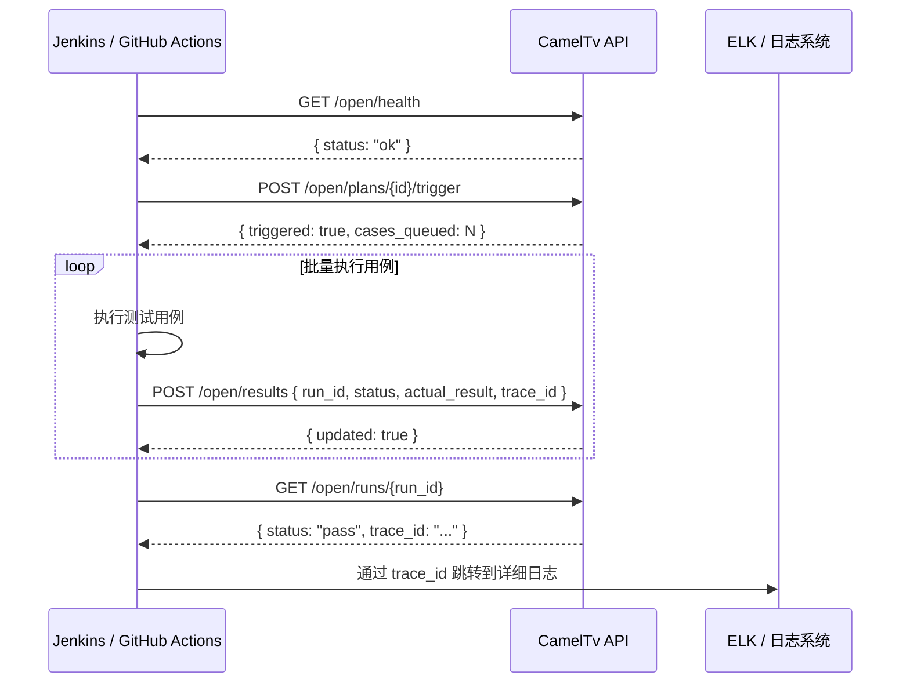

# CamelTv 测试平台 — CI 集成协议

> 版本：2.3.0 | 更新：2026-07-02

CI（Jenkins / GitHub Actions）可通过 API Token 触发测试计划执行、查询结果、回写结果。

---

## 鉴权方案

**Bearer Token**：`Authorization: Bearer tpat_xxxxxxxx`

- 令牌由平台管理员在「API Token 管理」页面创建
- Token 前缀固定为 `tpat_`，后续 43 字符随机生成
- 服务端仅存储 `SHA256(plain_token)` 哈希
- **Token 仅创建时返回一次明文，请妥善保管**
- 每个 Token 绑定一个项目，受项目隔离保护
- 频率限制：每 Token 60 次/分钟，超限返回 429

---

## API 端点

| 端点 | 方法 | 鉴权 | 说明 |
|------|------|------|------|
| `/api/v1/open/health` | GET | 无 | 连通性检查 |
| `/api/v1/open/plans/{plan_id}/trigger` | POST | Bearer Token | 触发计划执行 |
| `/api/v1/open/runs/{run_id}` | GET | Bearer Token | 查询执行结果 |
| `/api/v1/open/results` | POST | Bearer Token | 回写执行结果 |

---

### 1. 健康检查

```http
GET /api/v1/open/health
```

**响应：**
```json
{
  "code": 0,
  "message": "success",
  "data": {
    "status": "ok",
    "version": "2.3.0"
  }
}
```

---

### 2. 触发测试计划

```http
POST /api/v1/open/plans/{plan_id}/trigger
Authorization: Bearer tpat_xxx
```

**响应：**
```json
{
  "code": 0,
  "data": {
    "triggered": true,
    "plan_id": 1,
    "plan_name": "回归测试-Sprint 12",
    "cases_queued": 45,
    "triggered_by": "CI Token"
  }
}
```

> 触发后每个计划用例生成一条 `TestExecution` 记录（状态 `pending`）。记录 ID 即为 `run_id`。

---

### 3. 查询执行结果

```http
GET /api/v1/open/runs/{run_id}
Authorization: Bearer tpat_xxx
```

**响应：**
```json
{
  "code": 0,
  "data": {
    "run_id": 42,
    "plan_case_id": 15,
    "case_id": 100,
    "status": "pass",
    "actual_result": "登录成功，返回 JWT token",
    "notes": "[CI 自动触发] token=CI Token",
    "trace_id": "trace-abc123",
    "executed_at": "2026-07-02T10:30:00+00:00"
  }
}
```

---

### 4. 回写执行结果

```http
POST /api/v1/open/results
Authorization: Bearer tpat_xxx
Content-Type: application/json

{
  "run_id": 42,
  "status": "pass",
  "actual_result": "登录成功，返回 JWT token",
  "trace_id": "trace-abc123",
  "notes": "Jenkins build #123"
}
```

| 字段 | 类型 | 必填 | 说明 |
|------|------|------|------|
| `run_id` | int | 是 | 执行记录 ID（由 trigger 返回或从列表获取） |
| `status` | str | 是 | `pass` / `fail` / `skip` / `block` / `pending` |
| `actual_result` | str | 否 | 实际执行结果描述 |
| `trace_id` | str | 否 | ELK 链路追踪 ID |
| `notes` | str | 否 | 备注（如 Jenkins build 编号） |

**响应：**
```json
{
  "code": 0,
  "data": {
    "run_id": 42,
    "status": "pass",
    "updated": true
  }
}
```

> 回写 `pass` 或 `fail` 状态后自动触发通知（Webhook/邮件），同步更新 `plan_case.last_status`。

---

## 错误码

| HTTP | code | 说明 |
|------|------|------|
| 401 | 401 | Token 缺失、无效或已禁用 |
| 403 | 403 | 无权访问（项目隔离） |
| 404 | 404 | 计划/执行记录不存在 |
| 429 | 429 | 请求频率超限（60次/分钟） |

---

## 完整 CI 流程



---

## API 版本策略

当前 `/open/*` 路径不含版本号，使用 `/api/v1/open/` 前缀。
后续如有 Breaking Change，将通过以下方式之一管理：
1. **Header 版本**：`Accept: application/vnd.cameltv.v2+json`
2. **路径版本**：`/api/v2/open/plans/{id}/trigger`

当前 v2.3 阶段无需版本化。
