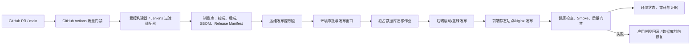

# ADR-0015：采用统一运维发布控制面交付测试平台

## 状态

🟡 提议中

## 日期

2026-07-30

## 背景

测试平台已经物理分离为 React 前端、FastAPI 后端和数据库迁移三类发布对象。现有 ADR-0008 规定 GitHub Actions 负责 PR 门禁、Jenkins 负责内网构建与部署，但当前交付方式仍存在以下缺口：

1. 前端、后端、Alembic 迁移没有一个不可分割、可追溯的发布单元。
2. test 与 production 可能分别重建镜像，无法证明生产运行的正是测试通过的制品。
3. 数据库备份、迁移、健康检查、应用切换和回滚没有统一编排与审批证据。
4. 环境配置、Secret、制品摘要、迁移 revision、执行日志和验收报告分散在 Jenkins、主机和人工记录中。
5. 生产服务器、域名、TLS、PostgreSQL、备份和回滚窗口尚未就绪，当前不能执行真实 production 发布。
6. 后续需要一个面向运维/QA/发布负责人的发布平台，而不是继续依赖在服务器上手工执行 Compose、SSH 或数据库命令。

如果不做该决策，测试环境通过与生产交付之间仍存在“重新构建、配置漂移、迁移顺序错误、回滚无证据”的断层。

## 决策

采用一个统一的“运维发布控制面”作为测试平台 test 和 production 环境的唯一 CD 入口。GitHub Actions 继续负责 PR/主干质量门禁；Jenkins 在过渡期作为构建和内网执行适配器，未来可被专用 Runner/GitOps 执行器替换。控制面负责发布编排、审批、环境状态、数据库迁移、回滚和审计，不在浏览器或 Git 中保存明文 Secret。

### 1. 不可变发布单元

一次发布生成唯一 `release_id`，绑定：

- Git 完整提交 SHA 与目标 `main` 合并记录；
- 前端镜像 digest；
- 后端镜像 digest；
- 数据库当前 revision、目标 revision 和唯一 Alembic head；
- 配置 schema 版本与所需 Secret 引用名；
- SBOM、依赖/漏洞报告、许可证报告；
- Batch QA 报告、A01–A12 证据和已接受风险；
- 发布说明、负责人、审批记录和回滚目标。

test 与 production 必须晋级同一个 release manifest 和镜像 digest。production 禁止从源码重新构建。

### 2. 发布控制面与执行面分离

控制面只保存环境元数据、Secret 引用和脱敏日志；实际凭据由 Vault、云 Secret Manager、Kubernetes Secret 或等价受控系统在执行时注入。

### 3. test 发布流程

1. 校验 release manifest、镜像签名/digest、唯一 Alembic head 和环境锁。
2. 生成并验证数据库备份；记录备份 ID，不输出连接串。
3. 在独占 migration job 中执行 `alembic upgrade <target>`，执行前后记录 `current`、`heads`、`check`。
4. 发布后端，等待进程、`/health`、OpenAPI 和数据库连接探针通过。
5. 发布前端，验证静态资源、前后端代理/直连配置和缓存失效。
6. 执行 Batch P0 smoke、真实后端路由矩阵、迁移后数据校验和关键业务闭环。
7. 成功后将 release 标记为 `TEST_VERIFIED`；失败则停止晋级并回滚应用制品，数据库使用预先批准的恢复或前向修复方案。

test 可以在 required checks 和自动化证据齐全时自动启动，但失败、阻塞和人工验收结果必须回写控制面。

### 4. production 发布流程

production 只接受状态为 `TEST_VERIFIED` 的同一 release：

1. 校验服务器/集群、域名、TLS、PostgreSQL、备份保留、监控告警和回滚窗口均已就绪。
2. 展示前端/后端 digest、迁移差异、影响范围、停机需求、已知风险和回滚方案。
3. 获得授权发布人的显式审批；审批只对当前 release、环境和窗口有效。
4. 冻结并发 production 发布，执行备份可恢复性检查。
5. 优先使用向后兼容的 expand/contract 迁移；破坏性迁移必须拆分版本并单独审批。
6. 先运行迁移，再发布兼容后端，最后切换前端；按健康、错误率、关键业务和数据一致性门禁决定继续或回滚。
7. 完成 production smoke 后记录 `PRODUCTION_VERIFIED`，保留操作者、时间、制品、迁移、探针、审批和证据索引。

当前 production 基础设施未就绪，因此该流程状态为 `DEFERRED`，不得调用现有脚本伪造 production 发布成功。

### 5. 数据库发布约束

- production 使用 PostgreSQL，`AUTO_CREATE_TABLES=false`，schema 只由 Alembic 管理。
- 同一环境一次只允许一个 migration job，使用环境锁和数据库 advisory lock 或等价机制。
- 发布前必须确认唯一 Alembic head、备份可读、目标 revision 可追溯。
- 应用回滚不自动执行 `alembic downgrade`。优先回滚到仍兼容新 schema 的应用镜像；需要恢复数据库时使用经演练的备份恢复或前向修复 migration。
- 真实旧数据库迁移必须用脱敏快照验证；空库升级不能替代历史数据兼容证据。
- migration 日志必须脱敏，不输出 DATABASE_URL、密码、个人数据或完整业务行。

### 6. 环境与权限模型

控制面至少包含：

- 环境：local（只登记，不由平台发布）、test、staging（可选）、production；
- 角色：开发者（查看/发起 test）、QA（确认验收结果）、运维/发布负责人（执行环境发布和回滚）、审计只读；
- 权限：制品构建、test 发布、production 审批、production 执行、数据库迁移、回滚、Secret 引用管理、审计查看相互独立；
- 同一 release 的审批、执行和状态变化均写入不可篡改审计链。

在单人仓库阶段不强制虚构第二审批人，但 production 仍必须有一次独立于 Git push 的明确发布授权；条件具备后可启用双人复核。

### 7. 分阶段实施

| 阶段 | 交付 | 退出条件 |
| --- | --- | --- |
| Phase 0 | 保持现有本地脚本；补齐 release manifest、环境清单和手工运行手册 | Batch 60 架构/验收记录完成，production 保持 DEFERRED |
| Phase 1 | Jenkins/Runner 接入统一发布 API/CLI；实现不可变制品、test 发布、迁移 job、探针和审计 | test 环境可从 main 的同一 digest 可重复发布并回滚 |
| Phase 2 | 新增运维发布平台 UI/API；实现环境看板、审批、发布记录、数据库变更预览、回滚和通知 | QA/运维不需登录服务器即可完成 test 发布和 production 预演 |
| Phase 3 | 接入正式基础设施、Secret Manager、镜像签名、渐进发布和 production 门禁 | 首次 production 发布演练、备份恢复演练和审计验收通过 |

专用运维平台优先编排成熟工具，不从零实现镜像仓库、Secret 系统、容器调度器或数据库备份引擎。

## 后果

### 正面影响

- ✅ test 与 production 使用同一不可变制品，消除重新构建漂移。
- ✅ 前端、后端、数据库迁移形成一个可追溯发布单元。
- ✅ 发布、审批、备份、探针、回滚和验收证据集中审计。
- ✅ 生产数据库迁移从手工命令变为独占、可预检的受控作业。
- ✅ 为未来新增运维发布平台提供清晰边界，不把 CD 逻辑塞进测试平台业务页面。

### 负面影响 / 权衡

- ⚠️ 需要维护制品库、执行器、环境连接器、Secret 集成和控制面自身的高可用与权限。
- ⚠️ release manifest、migration 兼容策略和应用健康探针成为新的强制契约。
- ⚠️ Jenkins 与新控制面并存阶段会有适配和迁移成本。
- ⚠️ production 尚未具备基础设施，本 ADR 在正式采纳前只能验证架构与 test 流程。

## 弃选方案

### 方案 A：继续由操作者手工 Compose/SSH/数据库迁移

- 优点：初期成本低。
- 缺点：不可审计、易漂移、回滚依赖个人经验、Secret 暴露面大。
- 放弃原因：无法达到生产级可追溯和数据库安全要求。

### 方案 B：只扩展 Jenkins 页面作为永久发布平台

- 优点：复用现有 Controller 和内网执行能力。
- 缺点：环境状态、制品晋级、数据库变更预览、细粒度审批和产品化 UX 较弱；Pipeline 与控制面职责耦合。
- 放弃原因：Jenkins 适合作为过渡执行器，不应成为长期唯一环境事实源。

### 方案 C：立即自研全部运维基础设施

- 优点：界面和流程完全可定制。
- 缺点：会重复实现制品库、Secret、调度、日志、备份等成熟能力，安全和维护风险最高。
- 放弃原因：先构建薄控制面并集成成熟执行系统，只有缺口明确后才自研必要部分。

### 方案 D：仅使用 GitHub Actions 直接发布 production

- 优点：配置集中在仓库。
- 缺点：内网连接、长期环境状态、数据库锁、Secret 边界和人工应急回滚能力不足。
- 放弃原因：可以承担 CI 和触发，但不能单独替代内网发布控制面。

## 关联

- ADR-0008：Jenkins + GitHub Actions 双通道 CI/CD
- ADR-0014：单一 main 主干与 AI Worktree 隔离
- `test-platform-v2/deploy/`
- `test-platform-v2/backend/alembic/README.md`
- `test-platform-v2/docs/operations/运维发布平台-架构与交付要求.md`
- `test-platform-v2/work-logs/batch-60-full-platform-execution-matrix.md`
