# CamelTv 测试平台 v2 —— 完整产品需求文档（PRD）

> 单一权威 PRD：整合「现状功能 + 架构流程图 + 改进路线」。
> 配套文档：《现状功能PRD.md》（字段级现状）｜《代码审查与产品重构PRD.md》（技术债与重构）｜《改进任务backlog.md》（可领取任务）。本文为三者的总览与索引。
> 对应版本：后端 `app_version 2.1.0`　｜　日期：2026-06-23
> 图示：所有流程/时序/状态图均含 Mermaid 源码 + 渲染后的 PNG 预览（`docs/diagrams/` 目录，共 18 张，文件名 `00-arch-*.png` ~ `17-timeline-*.png`）。
> 图示：所有流程/时序/状态图均为 Mermaid，支持的渲染器（GitHub / VS Code Mermaid / Obsidian）可直接预览。

---

## 0. 文档导航

| 章节 | 内容 |
|------|------|
| 1 | 产品概述（定位 / 用户 / 价值 / 成熟度全景） |
| 2 | 系统架构（架构图 / 技术栈 / 鉴权 / RBAC / 多项目） |
| 3 | 核心业务主链路（质量闭环全景图） |
| 4 | 13 个功能模块详述（每模块含 Mermaid 图 + 功能点 + 字段 + 现状） |
| 5 | 数据字典（核心枚举） |
| 6 | 非功能需求 |
| 7 | 改进路线图与任务 Backlog |

**成熟度标记**：✅ 生产可用｜🟡 能力有限｜🧪 演示态（数据为模拟/前端本地）

---

## 1. 产品概述

### 1.1 定位
一体化**测试管理平台**，覆盖「需求 → AI 生成用例 → 用例库 → 测试计划 → 执行 → 报告/缺陷」主链路，并提供工作台看板、定时任务，及音视频/UI/API 三个专项测试入口。支持多项目隔离与 RBAC。

### 1.2 用户与角色
| 角色 | 默认账号 | 职责 | 权限 |
|------|---------|------|------|
| 超级管理员 | admin/admin123 | 全局配置、用户/角色/项目 | `*` 通配 |
| 测试人员 | tester/tester123 | 需求/用例/计划/执行/缺陷/报告 | 按权限点 |
| 自定义角色 | — | 灵活配置 | 权限点 + 数据范围 global/project/self |

### 1.3 模块成熟度全景
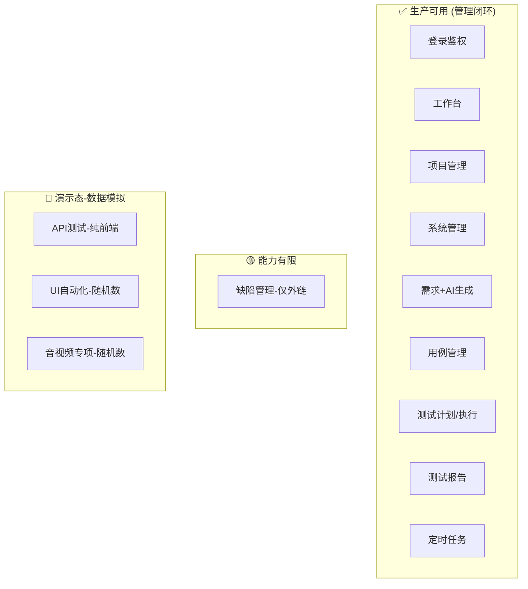

---

## 2. 系统架构

### 2.1 总体架构
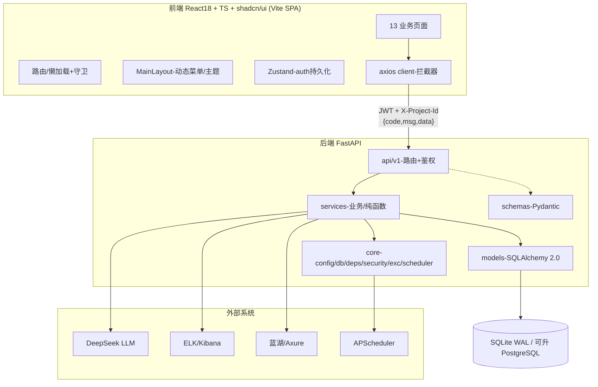

### 2.2 技术栈（实况）
> ⚠️ README 称「Ant Design 5」已过时，**实际 UI 库为 shadcn/ui (Radix + Tailwind)**。

| 层 | 技术 |
|----|------|
| 后端 | FastAPI 0.110+ · SQLAlchemy 2.0 · Pydantic v2 · Alembic · APScheduler · JWT+bcrypt |
| 数据库 | SQLite(WAL) 默认，`database_url` 可切 PostgreSQL |
| 前端 | React 18.3 · TS 5.6 · React Router 6 · Zustand 4 · shadcn/ui · TanStack Table 8 · Recharts · react-hook-form+zod · axios · sonner |

### 2.3 鉴权与会话时序
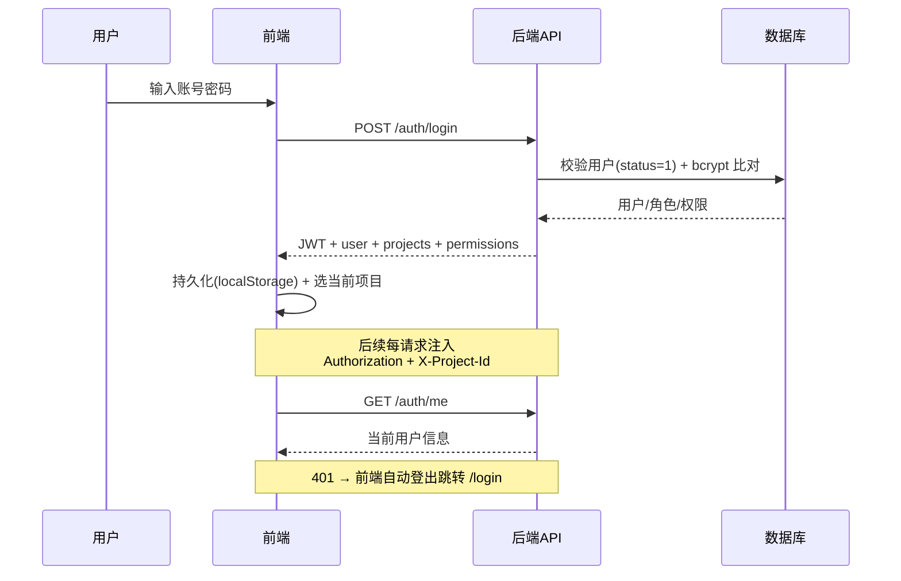

### 2.4 RBAC 权限模型
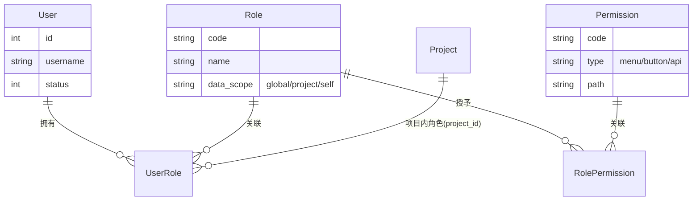
- 角色分「全局角色(project_id=0)」与「项目内角色」，按当前项目合并计算权限码。
- 前端 `hasPerm(code)` 控按钮显隐；后端 `require_permission('xxx')` 控接口访问；超管 `*` 放行。
- 菜单由后端 `/system/menus` 动态下发。

---

## 3. 核心业务主链路（质量闭环）

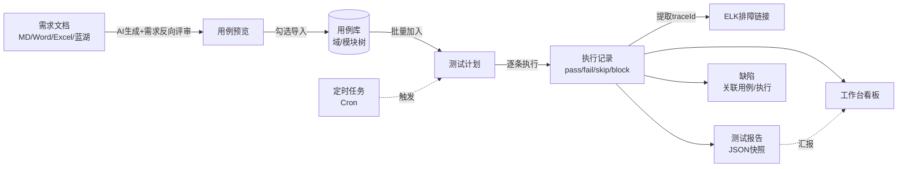
> 该主链路（需求→用例→计划→执行→报告/缺陷）是平台已跑通的核心价值，也是后续增强的主干。

---

## 4. 功能模块详述

### 模块 1　登录与鉴权 ✅
**目标**：身份认证与会话建立。详见 2.3 时序图。
**接口**：`POST /auth/login`、`GET /auth/me`。
**规则**：用户 `status≠1` 拒登；token 失效自动登出。
**现状/局限**：仅账号密码；无验证码/锁定/SSO/找回密码/刷新令牌。

---

### 模块 2　工作台看板 ✅
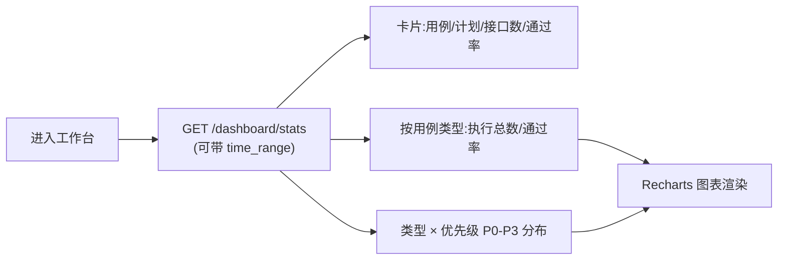
**现状/局限**：维度固定（类型/优先级）；无趋势曲线、缺陷收敛、个人/团队维度、自定义看板。

---

### 模块 3　项目管理 ✅
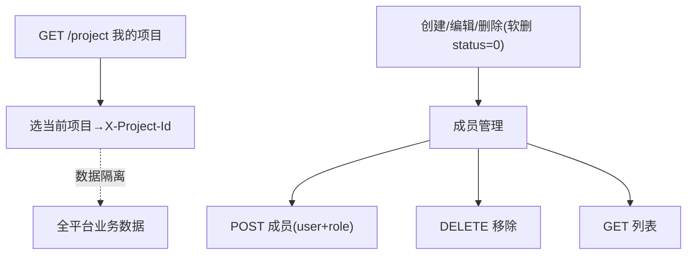
**接口**：`GET/POST/PUT/DELETE /project[/{id}]`、`/project/{id}/members`、`/project/current`、`/project/all`。
**现状/局限**：无模板/归档/克隆；成员无批量。

---

### 模块 4　系统管理 ✅
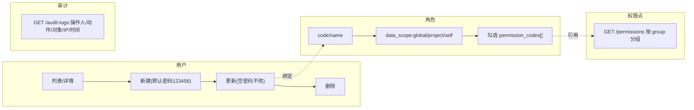
**现状/局限**：权限点与菜单混表；无组织/部门树；审计无导出、无前后值 diff。

---

### 模块 5　需求管理 + AI 用例生成 ✅（核心亮点）
```mermaid
sequenceDiagram
  participant U as 用户
  participant FE as 前端
  participant API as 后端
  participant AI as DeepSeek LLM
  participant DB as 用例库
  U->>API: POST /requirement/upload (MD/Word/Excel/蓝湖)
  Note over API: 自动识别 file_type;<br/>Excel 可直接解析为用例
  U->>API: POST /requirement/{id}/generate
  API->>AI: ①需求分析 ②用例生成 (两段式)
  AI-->>API: 需求项+问题清单 / functional_cases / api_cases
  API-->>FE: AIGenerateResult (预览 AiResultModal)
  U->>API: POST /{id}/import (indices[])
  API->>DB: 选择性写入用例
  API-->>FE: {imported, skipped, total}
```
**特色**：AI 不仅生成用例，还**反向评审需求文档**（指出 high/medium/low 问题 + 建议）。
**接口**：`GET /requirement`、`/upload`、`/{id}/generate`、`/{id}/import`、`/{id}/cases`、`DELETE /{id}`。
**现状/局限**：强依赖 DeepSeek（端点/Key 写死）；蓝湖路径硬编码；导入无事务；无生成历史对比。

---

### 模块 6　用例管理 ✅
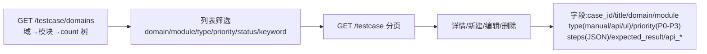
**现状/局限**：无评审流、版本历史、脑图编辑、Xmind 导入导出、批量操作、回收站、需求双向追溯。

---

### 模块 7　测试计划与执行 ✅（管理闭环核心）
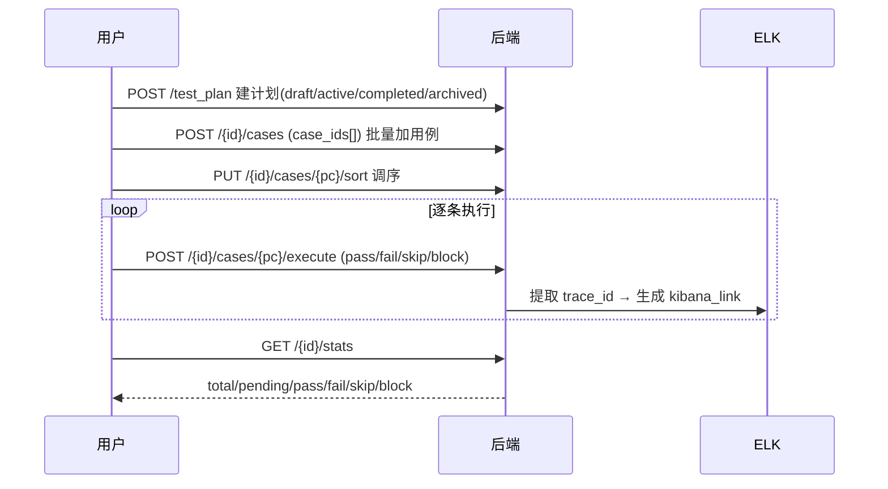
**接口**：计划 CRUD、`/{id}/cases`(增删序)、`/{id}/cases/{pc}/execute`、`/{id}/executions`、`/{id}/stats`。
**现状/局限**：手工逐条执行；无批量执行、执行指派、自动化结果自动回填。

---

### 模块 8　测试报告 ✅
```mermaid
flowchart LR
  P[选测试计划] --> G["POST /report 生成快照"]
  G --> SNAP["JSON 快照:执行统计<br/>编号 RP-YYYYMMDD-NNN"]
  SNAP --> V[GET /report/{id} 详情]
  SNAP --> D[DELETE /report/{id}]
  V -. 待补 .-> EXP["导出 PDF/Excel (规划)"]
```
**现状/局限**：仅单计划快照；无趋势、质量门禁、导出、自定义模板、分享链接。

---

### 模块 9　定时任务 ✅
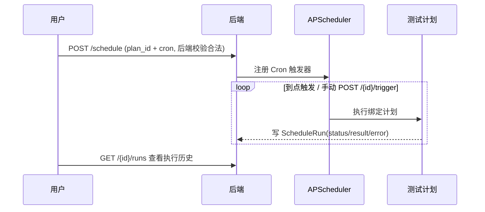
**现状/局限**：失败无重试/无告警通知；执行能力受限于计划本身。

---

### 模块 10　缺陷管理 🟡
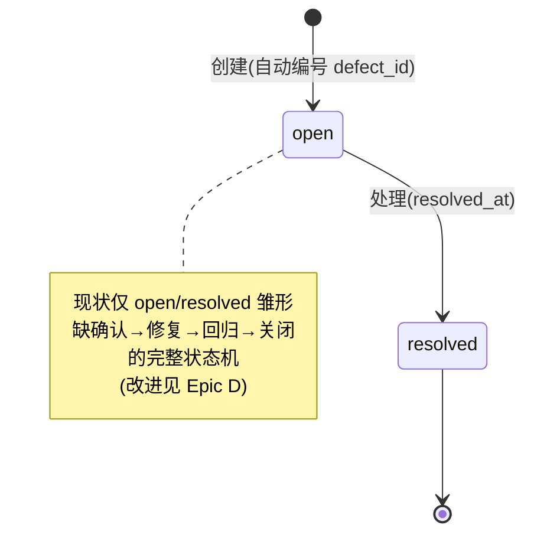
**字段**：severity(P0-P3)、status、case_id、execution_id、assignee、external_id/url、creator。
**接口**：`/defect/stats`、CRUD。
**现状/局限**：无内建工作流；无评论/附件/变更历史；与禅道/Jira 仅外链非双向同步。

---

### 模块 11　API 测试 🧪（演示态）
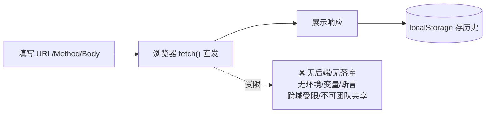
**改进入口**：升级为服务端 API 测试引擎（用例化 + 环境/变量 + 断言 + 数据驱动 + 可被计划/定时/CI 触发）。

---

### 模块 12　UI 自动化 🧪（演示态）
```mermaid
flowchart LR
  C["创建任务:test_spec(Playwright)<br/>browser:chromium/firefox/webkit"] --> T["POST /{id}/trigger"]
  T --> MOCK["⚠️ random.randint/uniform<br/>伪造 total/pass/duration"]
  MOCK --> RUN["运行记录:screenshots[]/video/trace (占位)"]
  RUN --> H[GET /{id}/runs 历史]
```
**关键现状**：**未真实驱动 Playwright，结果为随机数**。
**改进入口**：对接真实 Playwright 执行器，产出真实结果与产物。

---

### 模块 13　音视频专项 🧪（演示态）
```mermaid
flowchart LR
  C["创建任务:stream_url<br/>protocol:HLS/FLV/WebRTC/DASH"] --> T["POST /{id}/trigger"]
  T --> MOCK["⚠️ random.uniform<br/>伪造指标 value"]
  MOCK --> M["指标:起播时延/卡顿率...<br/>value vs threshold → pass"]
  M --> G[GET /{id}/metrics]
```
**关键现状**：**未真实拉流探测，指标为随机数**。
**改进入口**：接入真实拉流/探测能力替换随机值。

---

## 5. 数据字典（核心枚举）

| 域 | 枚举 |
|----|------|
| 用例类型 case_type | manual(功能) / api(接口) / ui(自动化) |
| 优先级/严重度 | P0 / P1 / P2 / P3 |
| 用例来源 source | manual / migration / ai |
| 计划状态 | draft / active / completed / archived |
| 执行结果 | pass / fail / skip / block（计划内用例初始 pending） |
| 缺陷状态 | open →（resolved，工作流待完善） |
| 数据范围 data_scope | global / project / self |
| 权限点类型 | menu / button / api |
| 音视频协议 | HLS / FLV / WebRTC / DASH |
| 浏览器 | chromium / firefox / webkit |
| 需求解析类型 parsed_type | requirement / test_cases |
| 需求项类型 | functional / ui / data / integration |

---

## 6. 非功能需求（NFR）

| 类别 | 要求 |
|------|------|
| 安全 | 密钥全部外置；JWT 强密钥；默认口令强制初始化；审计覆盖关键写操作 |
| 性能 | 统一分页+索引，消除 N+1；大列表虚拟滚动；权限码缓存 |
| 可靠 | 批量/导入事务原子化；定时任务失败重试+告警 |
| 可维护 | 后端 BaseService/Provider 抽象、前端 usePaginatedList/常量库；关键路径单测 |
| 可移植 | AI/ELK/蓝湖 Provider 化、支持本地 mock；SQLite↔PostgreSQL 平滑切换 |
| 可观测 | 前端 ErrorBoundary + 错误上报；后端结构化日志 + traceId 贯通 |

---

## 7. 改进路线图与任务 Backlog

### 7.1 路线图
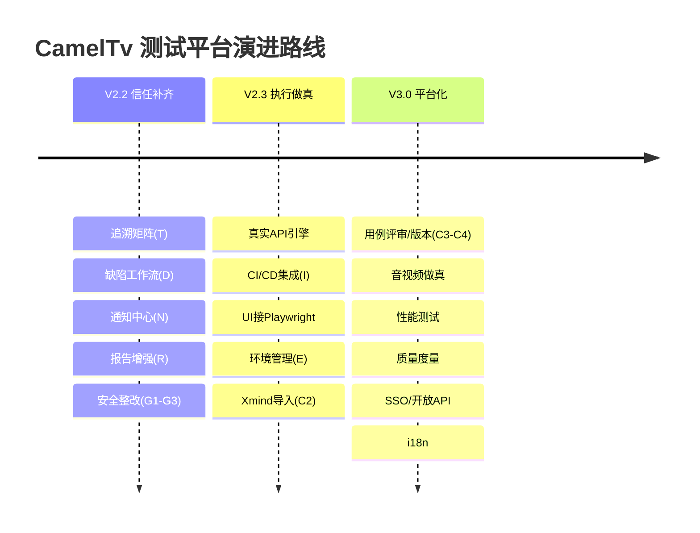

### 7.2 任务 Backlog（来自《改进任务backlog.md》，22 切片）
| Epic | 改进项 | 关键切片 | 批次 |
|------|--------|---------|------|
| G 工程化基线 | ⑧ | G1密钥外置 · G2消除N+1 · G3事务 · G4测试基建 · G5文档对齐 | 一 |
| T 追溯矩阵 | ① | T1覆盖率接口 · T2矩阵页 | 一 |
| D 缺陷工作流 | ② | D1状态机 · D2流转记录 · D3评论附件 | 二 |
| N 通知中心 | ③ | N1方案 · N2Webhook · N3邮件 · N4扩展事件 | 二 |
| R 报告增强 | ④ | R1导出 · R2趋势 · R3门禁 · R4模板 | 二 |
| E 环境/变量 | ⑦ | E1环境变量管理 | 三 |
| C 用例增强 | ⑤ | C1批量 · C2导入导出 · C3评审 · C4版本 · C5脑图 | 三 |
| I CI/CD | ⑥ | I1协议 · I2触发API · I3回写报告 | 三 |

> 完整 AC（验收标准）、依赖图与 HITL/AFK 标注见《改进任务backlog.md》。

### 7.3 一页纸决策结论
1. **保**：AI 生成用例 + 需求→用例→计划→报告主链路 + RBAC 多项目底座 —— 护城河。
2. **修**：先堵 P0（密钥/N+1/事务），再补复用抽象（BaseService / usePaginatedList / TanStack Query）。
3. **真**：API/UI/音视频三个演示外壳 —— 短期标注 Beta，中期逐个接真引擎，否则是信任地雷。
4. **增**：追溯矩阵、通知、缺陷工作流、CI/CD —— 让平台从「数据库」变「团队工作台」。
5. **不做**：三个执行模块做真之前，不再横向铺新专项模块。

---

*本文为单一权威 PRD，随平台演进更新。字段级现状见《现状功能PRD.md》，技术债与重构细节见《代码审查与产品重构PRD.md》，可领取任务见《改进任务backlog.md》。*

---

## 附录 A　Jenkins CI/CD 部署

### A.1 架构

```
deploy/jenkins/
├── docker-compose.yml   # Jenkins Controller + Docker-in-Docker
├── Dockerfile           # 预装 Python 3.12 + Node 18 + Docker CLI
├── casc.yaml            # Configuration as Code (免手动配置)
└── README.md            # 完整部署指南

项目根 /Jenkinsfile      # 11 阶段 Pipeline 定义
```

### A.2 一键启动

```bash
# 1. 进入目录
cd F:\CamelTv\deploy\jenkins

# 2. 启动（首次 3~5 分钟，拉取镜像+构建+自动配置）
docker compose up -d

# 3. 查看日志，等待 "Jenkins is fully up and running"
docker compose logs -f jenkins
```

### A.3 访问与登录

| 项目 | 值 |
|------|-----|
| 地址 | `http://localhost:8080` |
| 用户名 | `admin` |
| 密码 | `cameltv123` |

CasC 自动完成安全配置——跳过安装向导、跳过插件安装、用户账号已就绪。

### A.4 预配 Job

| Job | 触发 | 说明 |
|-----|------|------|
| **CamelTv-Platform** | SCM 轮询 / 每日 03:00 / 手动 | 完整 11 阶段 Pipeline |
| **CamelTv-API-Regression** | 每日 02:00 | 后端 pytest 全量回归 |
| **CamelTv-Prod-Smoke** | 每日 08:00 | 生产环境健康检查 |

### A.5 Pipeline 流程

```
Checkout ──→ Backend Lint ──→ Backend Test ──→ Frontend TypeCheck ──→ Frontend Test+Build
                                                                              │
     ┌────────────────────────────────────────────────────────────────────────┘
     ▼                  ▼                        ▼
  Docker Build     Docker Push(main)     Deploy Test(docker compose up)
                                               │
                                          Smoke Test(curl health + login)
                                               │
                                          Quality Gate
```

| # | 阶段 | 产出 |
|---|------|------|
| 1 | Checkout | |
| 2 | Backend: Lint + Security Check | 编译无误 + 密钥已配置 |
| 3 | Backend: Test | `test-report.html` + `test-results.xml` |
| 4 | Frontend: TypeCheck | tsc 无错误 |
| 5 | Frontend: Test + Build | `dist/` 产物 |
| 6 | Docker: Build | `cameltv-tp-backend:latest` `cameltv-tp-frontend:latest` |
| 7 | Docker: Push | (仅 main 分支) |
| 8 | Deploy: Test | `docker compose up -d` |
| 9 | Smoke Test | curl health + login API |
| 10 | Quality Gate | 汇总通过/失败 |

### A.6 常用管理命令

```bash
docker compose ps                    # 查看状态
docker compose logs -f jenkins       # 实时日志
docker compose restart jenkins       # 重启（casc.yaml 修改后）
docker compose down                  # 停止
docker compose down -v               # 停止并清数据（重新开始）
docker compose exec jenkins bash     # 进入容器
```

### A.7 排障

| 问题 | 解决 |
|------|------|
| `docker: command not found` | 安装 Docker Desktop |
| 端口 8080 被占用 | 改 `docker-compose.yml` ports 为 `9090:8080` |
| 插件安装失败 | `docker compose down -v && docker compose up -d` |
| CasC 未生效 | `docker compose logs jenkins \| grep -i casc` |
| 首次启动超时 | 等待或配置 Docker 镜像加速 |

> 完整部署指南见 `deploy/jenkins/README.md`。
