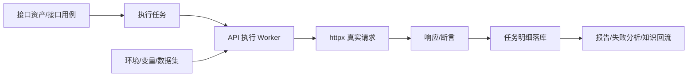
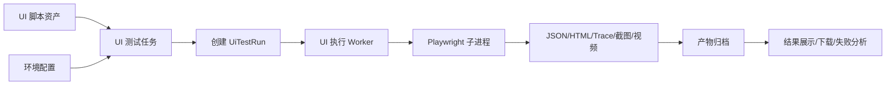

# DEV-接口测试与 UI 自动化真实化检查与落地方案

## 1. 检查目标

本次检查聚焦测试平台两块能力：

1. 接口测试模块是否仍为纯前端、localStorage、模拟执行或不可落地能力。
2. UI 自动化模块是否仍为 random 模拟结果，是否真实驱动 Playwright，是否具备可落地执行、回看和运维能力。

最终目标：

```text
去掉虚假模拟行为 -> 形成真实执行引擎 -> 执行结果可追溯 -> 报告产物可回看 -> 可纳入任务/计划/CI
```

## 2. 总体结论

### 2.1 结论摘要

| 模块 | 当前是否仍为模拟数据 | 当前真实度 | 主要结论 |
| --- | --- | --- | --- |
| 接口测试 | 否 | 已接入真实服务端 HTTP 执行 | 已不是纯前端 localStorage 模拟，但还存在执行快照缺失、任务取消不生效、生产保护/报告能力不足等落地缺口 |
| UI 自动化 | 否，不再是 random 模拟 | 已接入 Playwright 子进程真实执行 | 已不是随机数模拟，但目前仍是同步阻塞执行、脚本资产管理弱、环境配置弱、产物回看弱，因此还不能算生产级可落地 |

### 2.2 重要说明

现有部分文档仍记录旧状态：

- `CLAUDE.md` 仍写 API 测试为“纯前端 fetch + localStorage”。
- `CLAUDE.md` 仍写 UI 自动化为“结果为 random 模拟”。
- `docs/现状功能PRD.md`、`docs/CamelTv测试平台-完整PRD.md`、`docs/代码审查与产品重构PRD.md` 中也仍有旧描述。

但从当前代码看，这些文档已经滞后。当前代码里：

- 接口测试已经通过后端 `httpx` 发真实 HTTP 请求。
- UI 自动化已经通过 `npx playwright test` 执行真实 Playwright 脚本。
- 没有发现接口测试和 UI 自动化主执行链路继续使用 `random` 伪造结果。

因此整改方向不是“从 0 写真实引擎”，而是：

```text
把已经接入的真实引擎补齐为生产可落地能力，并同步修正文档成熟度。
```

## 3. 接口测试模块检查结果

### 3.1 已具备的真实能力

| 能力 | 当前实现 | 结论 |
| --- | --- | --- |
| 服务端发请求 | `backend/app/services/api_execution_service.py` 使用 `httpx.Client().request(...)` | 真实 HTTP 请求，不是模拟 |
| 即时调试 | `POST /apitest/api-execute` 调用 `quick_execute` | 真实执行 |
| 用例执行 | `execute_api_case` 从 `TestCase` 读取接口方法、URL、Header、Body、断言 | 真实执行 |
| 批量任务 | `POST /apitest/tasks` 创建 `ApiExecutionTask` 和 `ApiExecutionTaskItem` | 有任务模型 |
| 执行结果落库 | `ApiExecutionTaskItem` 保存状态、耗时、响应、断言结果 | 已部分落库 |
| 环境变量 | 支持 `Environment.base_url` 和变量替换 | 可用 |
| 数据驱动 | 支持 dataset 行数据替换 `${column_name}` | 可用 |
| 断言 | 支持 status_code、response_time、jsonpath、regex、header、json_schema、type、array_length | 可用 |

### 3.2 当前不可落地/不完整问题

#### P0-1：执行结果缺少完整请求快照

问题：

- 批量任务执行时写入 `item.request_snapshot = result.get("request_snapshot", {})`。
- 但 `api_execution_service._do_execute()` 当前返回值里没有 `request_snapshot`。
- 导致任务详情里请求快照为空，失败后无法复现请求。

影响：

- 测试报告可信度下降。
- 失败排查困难。
- Agent 后续学习也缺少真实请求证据。

整改：

- `_do_execute()` 返回完整请求快照：
  - method
  - original_url
  - resolved_url
  - headers 脱敏后
  - body 脱敏后
  - environment_id
  - dataset row index

#### P0-2：任务取消只是改状态，不会中断执行循环

问题：

- `POST /apitest/tasks/{task_id}/cancel` 只把 task 改为 `cancelled`。
- `_execute_task_async()` 循环执行 item 时没有检查 task 是否已取消。

影响：

- 用户以为取消了，实际后端仍继续打接口。
- 对生产环境或写接口风险较高。

整改：

- 每执行一条 item 前重新读取 task 状态。
- 如果 task 已 `cancelled`，剩余 item 标记 `skipped`。
- 对长请求增加超时和取消状态提示。

#### P0-3：生产环境保护不足

问题：

- 当前执行引擎能选择环境，但缺少统一的生产环境保护策略。
- 写方法 `POST/PUT/PATCH/DELETE` 在生产环境执行应强制二次确认和权限校验。

整改：

- 后端增加 `apitest:execute_prod` 权限校验。
- 生产环境执行写接口必须传 `confirm_prod=true`。
- 批量任务默认禁止生产环境执行破坏性用例。

#### P1-1：URL 拼接规则不统一

问题：

- 调试面板希望支持 `环境地址 + 服务名 + 路由`。
- 当前通用 `_resolve_url()` 只支持 `环境 base_url + url`。
- 前端 `quickExecute` 类型里有 `service_name/query_params`，但实际请求没有传到后端。

整改：

- `QuickExecuteRequest` 增加：
  - `service_name`
  - `query_params`
  - `path_params`
- 后端统一拼接：

```text
final_url = environment.base_url + service_name/default_base_path + endpoint.path + query_string
```

#### P1-2：批量任务调度依赖 FastAPI BackgroundTasks，可靠性不足

问题：

- `BackgroundTasks` 适合轻量异步，不适合大量接口回归任务。
- 服务重启后任务状态不可恢复。
- 无 worker 并发控制、重试、排队、超时治理。

整改：

- 第一阶段可保留 BackgroundTasks，但要补状态恢复和取消检查。
- 第二阶段引入独立执行 worker：
  - APScheduler/RQ/Celery/Arq 均可。
  - 任务状态落库，worker 按状态拉取执行。

#### P1-3：断言和响应体处理仍偏轻量

问题：

- JSON Schema 校验是轻量手写实现，覆盖不完整。
- 响应体截断固定 500KB，报告中缺少“已截断”结构化标记。
- 错误响应没有统一标准化。

整改：

- 引入 `jsonschema` 正式校验。
- 响应体保存：
  - preview
  - truncated
  - size_bytes
  - content_type
- 大响应体落文件或对象存储，DB 只存摘要和路径。

#### P1-4：用例和接口资产关联不够稳定

问题：

- 部分逻辑依赖 tags 解析服务名。
- `TestCase` 缺少稳定的 `api_endpoint_id/api_service_id` 字段。

整改：

- 给 `TestCase` 增加：
  - `api_endpoint_id`
  - `api_service_id`
  - `api_module`
  - `api_title`
- 生成用例、执行用例、报告回溯均使用稳定 ID。

## 4. UI 自动化模块检查结果

### 4.1 已具备的真实能力

| 能力 | 当前实现 | 结论 |
| --- | --- | --- |
| 脚本列表 | 扫描 `backend/tests/playwright/**/*.spec.ts/js` | 真实读取 |
| 触发执行 | `trigger_job()` 调用 `run_playwright_test()` | 真实执行入口 |
| Playwright 检查 | `_check_playwright_installed()` 调 `npx playwright --version` | 真实检查 |
| 脚本执行 | `subprocess.run([npx, "playwright", "test", test_spec, "--project", browser, "--reporter", "json"])` | 真实 Playwright 执行 |
| 结果落库 | `UiTestRun.result` 保存 total/pass/fail/skip/duration | 已落库 |
| 产物采集 | 扫描 png/webm/zip | 有基础产物采集 |

### 4.2 当前不可落地/不完整问题

#### P0-1：执行是同步阻塞，接口请求会等 Playwright 跑完

问题：

- `trigger_job()` 直接同步调用 `run_playwright_test()`。
- Playwright 默认超时 300 秒，触发接口可能阻塞 5 分钟。

影响：

- 前端体验差。
- 多人触发时后端线程被占用。
- 失败时很难做排队、取消、重试。

整改：

- 触发接口只创建 `UiTestRun`，立即返回 run_id。
- 后台 worker 异步执行。
- 前端轮询 run 状态或使用 WebSocket/SSE。

#### P0-2：任务状态未在执行开始时稳定标记 running

问题：

- 当前 `run_playwright_test()` 创建 run 为 running。
- 但 job 状态没有在触发后立即稳定变为 running。
- 如果执行器异常退出，状态可能不一致。

整改：

- 创建 run 时统一设置：
  - `job.status = running`
  - `run.status = running`
  - `run.started_at = now`
- 所有异常路径都必须落库 `fail`，不能只 return error。

#### P0-3：脚本资产管理不可控

问题：

- 脚本来自后端目录扫描。
- 页面只能选择脚本路径或手动输入。
- 没有脚本上传、版本、分支、标签、参数、负责人、适用环境。

影响：

- 无法团队协作管理 UI 自动化资产。
- 不知道脚本对应哪个业务模块、哪个需求、哪个用例。

整改：

- 新增 UI 脚本资产表：
  - script_key
  - name
  - spec_path
  - module
  - repo_url
  - branch
  - version
  - owner
  - tags
  - status
- UI 任务绑定脚本资产，而不是只保存路径字符串。

#### P0-4：环境/baseURL 不可配置

问题：

- Playwright 配置里默认 `baseURL = process.env.BASE_URL || 'https://cameltv.com'`。
- 平台任务没有选择环境。
- 执行时没有把测试平台环境注入到 Playwright 进程。

影响：

- 同一脚本不能稳定跑测试环境、预发环境、生产环境。
- 不符合测试平台环境管理模型。

整改：

- `UiTestJob` 增加 `environment_id`。
- 执行时读取 `Environment.base_url`，通过 env 注入：

```text
BASE_URL=<环境地址> npx playwright test ...
```

#### P1-1：产物采集和访问不可靠

问题：

- 当前 `_collect_artifacts()` 扫描整个 Playwright 目录下的 png/webm/zip。
- 可能采集到其他任务的历史产物。
- 返回的是相对路径，不是可下载 URL。

整改：

- 每次执行生成唯一产物目录：

```text
backend/storage/ui-runs/{run_id}/
```

- Playwright `outputDir` 指向该目录。
- run 表保存：
  - artifact_dir
  - report_json_path
  - html_report_path
  - trace_paths
  - screenshot_paths
  - video_paths
- 提供下载接口：

```http
GET /api/v1/ui-tests/runs/{run_id}/artifacts/{artifact_id}
```

#### P1-2：JSON 报告解析不稳定

问题：

- 命令行使用 `--reporter json`，从 stdout 解析。
- 项目 `playwright.config.ts` 也配置了 json/html/list reporters。
- stdout 和文件报告混用，容易受 reporter 输出影响。

整改：

- 统一使用报告文件：

```text
npx playwright test <spec> --project <browser> --reporter=json
```

并设置：

```text
PLAYWRIGHT_JSON_OUTPUT_NAME=<run_dir>/report.json
```

或使用配置生成固定 `report.json` 后读取文件。

#### P1-3：无法取消运行中的 UI 测试

问题：

- 当前没有保存 Playwright 子进程 PID。
- 无取消接口。

整改：

- `UiTestRun` 增加：
  - process_id
  - cancel_requested
- 执行器使用 `subprocess.Popen`。
- 增加取消接口：

```http
POST /api/v1/ui-tests/runs/{run_id}/cancel
```

#### P1-4：缺少真实业务脚本

问题：

- 当前 `backend/tests/playwright/specs/example.spec.ts` 是示例：
  - 首页可访问
  - 登录页面正常加载
- 注释中也写了“替换为实际测试逻辑”。

整改：

- 按核心业务新增真实脚本：
  - 登录
  - 首页
  - 直播详情
  - 赛程/比分
  - 搜索
  - 新闻详情
  - 异常页
- 脚本要有稳定选择器、断言和失败截图。

## 5. 推荐目标架构

### 5.1 接口测试目标架构



### 5.2 UI 自动化目标架构



## 6. 落地实施路线

### M1：纠偏文档和成熟度标记

目标：

- 明确当前模块不是纯模拟，但仍不是完全生产级。

改动：

- 更新 `CLAUDE.md`。
- 更新 `docs/现状功能PRD.md`。
- 更新 `docs/CamelTv测试平台-完整PRD.md`。

成熟度建议：

| 模块 | 新成熟度 |
| --- | --- |
| 接口测试 | 🟡 真实执行，能力待生产化 |
| UI 自动化 | 🟡 真实执行，能力待生产化 |

验收：

- 文档不再错误描述 API 测试为纯前端 localStorage。
- 文档不再错误描述 UI 自动化为 random 模拟。
- 文档明确剩余生产化缺口。

### M2：接口测试执行可信化

目标：

- 让每次接口执行都可复现、可审计、可报告。

必须改动文件：

- `backend/app/services/api_execution_service.py`
- `backend/app/api/v1/apitest.py`
- `backend/app/models/api_asset.py`
- `backend/app/schemas/api_asset.py`
- `frontend/src/pages/apitest/components/TaskTab.tsx`
- `frontend/src/pages/apitest/components/ApiDebugPanel.tsx`

交付：

- `request_snapshot` 完整落库。
- `response_snapshot` 增加 body 截断标记。
- 任务取消真正停止后续 item。
- 生产环境写接口执行保护。
- 任务详情展示请求、响应、断言、错误、耗时。

验收：

- 执行失败后能复制完整 curl 复现。
- 取消任务后未执行 item 标记为 skipped。
- 生产环境 POST/PUT/PATCH/DELETE 无二次确认不能执行。

### M3：接口测试任务 Worker 化

目标：

- 批量执行不依赖 FastAPI 请求生命周期。

改动：

- 新增 `backend/app/services/api_task_worker.py`。
- 或接入现有 APScheduler 定时任务体系。
- `POST /apitest/tasks` 只创建任务，不直接执行。

交付：

- pending 任务被 worker 拉取。
- 支持并发上限。
- 支持失败重试。
- 支持任务恢复。

验收：

- 后端重启后 pending/running 任务能恢复为 failed 或继续执行。
- 同时发起多个任务不会压垮服务。

### M4：UI 自动化异步真实执行

目标：

- UI 自动化从“同步触发执行”升级为“创建 run + worker 异步执行”。

必须改动文件：

- `backend/app/models/ui_test.py`
- `backend/app/schemas/ui_test.py`
- `backend/app/api/v1/ui_test.py`
- `backend/app/services/ui_test_service.py`
- `backend/app/services/playwright_executor.py`
- `frontend/src/pages/uitest/index.tsx`

交付：

- 触发接口立即返回 run。
- run 状态从 pending/running/done/fail/cancelled 流转。
- 前端支持刷新/轮询。
- 失败路径全部真实落库。

验收：

- 触发 UI 自动化接口响应小于 1 秒。
- Playwright 运行中页面显示 running。
- 脚本失败时 run.status=fail，result 中有错误信息。

### M5：UI 环境、脚本资产和产物归档

目标：

- 让 UI 自动化具备团队可管理、可回看能力。

交付：

- `UiTestJob.environment_id`。
- `UiTestScript` 脚本资产表。
- 每次 run 独立产物目录。
- 截图、视频、trace、HTML report 可下载。
- 执行时注入 `BASE_URL`。

验收：

- 同一脚本可选择测试环境/生产环境执行。
- 每次执行产物互不污染。
- 平台能打开或下载 trace、截图、视频。

### M6：真实业务脚本和 CI 接入

目标：

- 从示例脚本升级为真实业务自动化套件。

交付：

- 新增核心业务 Playwright specs。
- 增加 CI 触发入口：

```http
POST /api/v1/open/ui-tests/{job_id}/trigger
```

- 支持把 UI 自动化结果回写测试报告。

验收：

- 至少 5 条真实业务 UI 自动化脚本可稳定运行。
- Jenkins/GitLab CI 能触发 UI 测试任务。
- 测试报告能展示 UI 自动化通过率和失败产物。

## 7. 数据表调整建议

### 7.1 API 执行任务明细增强

表：`api_execution_task_item`

新增或确认字段：

| 字段 | 说明 |
| --- | --- |
| request_snapshot | 完整请求快照，必须包含 resolved_url |
| response_snapshot | 响应快照，包含 headers/body/status/body_size/truncated |
| error_type | timeout/connect_error/assertion_failed/runtime_error |
| retry_count | 重试次数 |
| started_at | 单条开始时间 |
| finished_at | 单条结束时间 |

### 7.2 UI 脚本资产表

新增表：`ui_test_script`

| 字段 | 说明 |
| --- | --- |
| id | 主键 |
| project_id | 项目 ID |
| name | 脚本名称 |
| script_key | 稳定唯一键 |
| spec_path | Playwright spec 路径 |
| module | 业务模块 |
| owner | 负责人 |
| tags | 标签 |
| status | active/disabled/deprecated |
| created_at/updated_at | 时间 |

### 7.3 UI 运行记录增强

表：`ui_test_run`

新增字段：

| 字段 | 说明 |
| --- | --- |
| environment_id | 执行环境 |
| browser | 浏览器 |
| base_url | 执行时 baseURL 快照 |
| process_id | 子进程 PID |
| artifact_dir | 产物目录 |
| report_json_path | JSON 报告路径 |
| html_report_path | HTML 报告路径 |
| stdout | 标准输出摘要 |
| stderr | 标准错误摘要 |
| error_message | 错误信息 |
| cancel_requested | 是否请求取消 |

## 8. API 调整建议

### 8.1 接口测试

```http
POST /api/v1/apitest/api-execute
GET  /api/v1/apitest/tasks/{task_id}
POST /api/v1/apitest/tasks/{task_id}/cancel
POST /api/v1/apitest/tasks/{task_id}/retry-failed
GET  /api/v1/apitest/tasks/{task_id}/items/{item_id}
```

`api-execute` 请求体增强：

```json
{
  "method": "GET",
  "url": "/ee/test/matchpush",
  "service_name": "camel-service",
  "query_params": [
    {"key": "matchId", "value": "2y8m4zh5dvvpql0", "enabled": true}
  ],
  "headers": "{}",
  "body": "",
  "assertions": "[]",
  "environment_id": 1,
  "confirm_prod": false
}
```

### 8.2 UI 自动化

```http
GET  /api/v1/ui-tests/scripts
POST /api/v1/ui-tests/scripts
GET  /api/v1/ui-tests
POST /api/v1/ui-tests
POST /api/v1/ui-tests/{job_id}/trigger
GET  /api/v1/ui-tests/{job_id}/runs
GET  /api/v1/ui-tests/runs/{run_id}
POST /api/v1/ui-tests/runs/{run_id}/cancel
GET  /api/v1/ui-tests/runs/{run_id}/artifacts
GET  /api/v1/ui-tests/runs/{run_id}/artifacts/{artifact_id}
```

## 9. 前端改造建议

### 9.1 接口测试

- 任务详情页增加“请求快照/响应快照/断言结果/错误详情”四个 tab。
- 失败 item 支持复制 curl。
- 批量任务增加取消、重跑失败、查看失败原因。
- 生产环境执行写接口弹确认框。
- 调试面板展示最终请求 URL。

### 9.2 UI 自动化

- 新建任务时选择：
  - 脚本资产
  - 环境
  - 浏览器
  - 超时时间
  - 是否开启 trace/video
- 运行详情展示：
  - 状态
  - 总数/通过/失败/跳过
  - 耗时
  - stdout/stderr 摘要
  - 截图/视频/trace/HTML report
- 运行中支持刷新或自动轮询。
- 失败测试项可展开错误堆栈。

## 10. 验收清单

### 10.1 接口测试验收

- [ ] 接口调试发出的请求来自后端 `httpx`，不是浏览器 fetch。
- [ ] 执行结果包含真实 HTTP status、headers、body、duration。
- [ ] 任务明细包含完整 `request_snapshot.resolved_url`。
- [ ] 执行失败后可以复制 curl 复现。
- [ ] 批量任务取消后不会继续执行剩余用例。
- [ ] 生产环境写接口必须二次确认和权限校验。
- [ ] 数据驱动执行每一行都有独立结果。
- [ ] 大响应体有截断标记，不会撑爆数据库。

### 10.2 UI 自动化验收

- [ ] 执行结果来自真实 `npx playwright test`，没有 random 伪造。
- [ ] 触发接口立即返回 run_id，不阻塞等待脚本执行完成。
- [ ] run 状态可从 pending/running 变为 done/fail/cancelled。
- [ ] 任务可选择环境，执行时注入 `BASE_URL`。
- [ ] 每次 run 有独立产物目录。
- [ ] 截图、视频、trace、HTML report 可从平台下载或查看。
- [ ] 脚本不存在时 run 真实失败并落库。
- [ ] 至少 5 条真实业务 Playwright 脚本稳定运行。

## 11. 优先级建议

### 本周必须完成

1. 修正文档成熟度，避免继续误导 DEV/测试。
2. 接口测试补 `request_snapshot`。
3. 接口测试任务取消真正生效。
4. UI 自动化触发改为异步 run。
5. UI 自动化执行失败路径全部落库。

### 下个迭代完成

1. UI 环境注入。
2. UI 产物归档和下载。
3. UI 脚本资产管理。
4. 接口测试生产保护。
5. 接口测试失败重跑和 curl 复现。

### 后续增强

1. 独立 worker 队列。
2. CI 触发入口。
3. 测试报告聚合。
4. 失败分析 Agent。
5. 知识库回流。

## 12. 最终判断

接口测试和 UI 自动化当前已经不属于“纯模拟假功能”，但也不能直接宣布“生产可用”。

更准确的状态是：

```text
接口测试：真实 HTTP 执行已具备，但任务治理、快照、生产保护、报告复现还需补齐。
UI 自动化：真实 Playwright 执行已具备，但异步执行、环境注入、脚本资产、产物归档还需补齐。
```

DEV 的落地重点应该是把这两块从“真实引擎雏形”升级为“可团队使用、可审计、可回看、可接 CI 的真实测试能力”。
