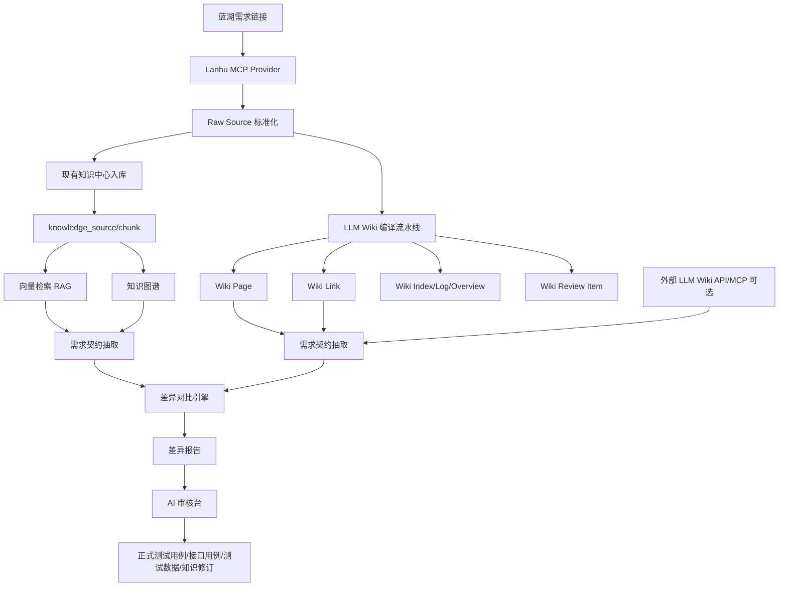

# LLM Wiki 知识库差异对比能力落地方案

> 版本：v1.0  
> 日期：2026-07-10  
> 适用范围：测试平台 v2 知识中心、需求文档、Agent 工作台、蓝湖需求解析链路  
> 目标：在现有 RAG/知识图谱/Agent 持续学习能力之上，引入 LLM Wiki 思路，形成“蓝湖需求 -> 原始知识 -> 结构化 Wiki -> 跨知识库差异对比 -> 测试资产补齐”的闭环。

---

## 一、背景与结论

当前平台已经开始建设 RAG、知识图谱和 Agent 持续学习能力，但它更偏“从原始切片中检索答案”。LLM Wiki 的价值不在于再加一个向量库，而是把知识先编译成一套可读、可链接、可维护的结构化 Wiki，再让 Agent 基于 Wiki 做查询、对比、补全和审查。

本次建议不要把 `nashsu/llm_wiki` 作为测试平台的核心运行时直接嵌入，也不要复制其源码到平台内。原因是该项目使用 GPLv3 许可证，直接复制代码进入内部平台可能带来发布和合规风险。推荐采用两层策略：

1. **平台内置 LLM Wiki 风格能力**：复用其方法论，新增 Raw Source、Wiki Page、Wiki Link、Review、Diff 等业务表和服务，和现有知识中心深度集成。
2. **可选外部 LLM Wiki 连接器**：如果本地运行了 LLM Wiki Desktop，则通过其 `127.0.0.1:19828` HTTP API/MCP 只读查询、搜索和读取图谱，用于和平台内知识库做对比。

最终要实现的用户能力：

> 输入一个蓝湖需求链接，平台通过 lanhu_mcp 抽取需求内容，同时沉淀到平台 RAG/图谱知识库和 LLM Wiki 风格知识库。用户可以选择“同一个需求”在两个知识库中的理解结果进行对比，平台输出缺失点、冲突点、版本差异、测试覆盖缺口，并可以一键生成待审测试用例或补充知识。

---

## 二、LLM Wiki 能力拆解

结合 `nashsu/llm_wiki` 的公开说明，本方案只吸收适合测试平台的能力：

| 能力 | LLM Wiki 原始思路 | 测试平台落地方式 |
|---|---|---|
| Raw Sources | 原始文档不可变，是事实来源 | 蓝湖链接、需求文档、Swagger、用例、缺陷、执行记录统一作为 raw source |
| Wiki | LLM 维护结构化 Markdown 页面 | 平台生成需求页、模块页、功能点页、接口页、规则页、对比页 |
| Schema | 定义 Wiki 结构和维护规则 | 每个项目配置测试域 schema，例如直播、赛事、支付、权限 |
| Ingest | 分析后生成 Wiki 页面并更新索引 | 采用“先分析，再生成”的两阶段 Agent 流水线 |
| Query | 搜索 Wiki + 图谱 + 来源，带引用回答 | 复用平台 RAG，并优先读取 Wiki Page 和关联来源 |
| Lint/Review | 发现矛盾、过期、孤立页面 | 形成“知识体检”和“差异待审项” |
| Graph | Wiki 链接形成知识网络 | 和现有 `knowledge_entity/relation` 双向同步 |
| Review | 需要人判断的项进入审核 | 复用 AI 审核台，增加知识差异审核类型 |

---

## 三、目标范围

### 3.1 本期目标

1. 蓝湖需求可以通过 `lanhu_mcp` 提取成可追溯的原始知识。
2. 同一份蓝湖需求可以同时进入：
   - 现有知识中心：`knowledge_source/chunk/vector/entity/relation`
   - LLM Wiki 风格知识库：`wiki_page/wiki_link/wiki_review`
3. 支持选择两个知识库或两个版本进行差异对比：
   - 平台 RAG 知识库 vs LLM Wiki 知识库
   - 当前迭代 Wiki vs 上一迭代 Wiki
   - 蓝湖当前版本 vs 已确认需求版本
   - 平台内 Wiki vs 外部 LLM Wiki Desktop 项目
4. 差异结果必须可追溯到蓝湖页面、知识切片、Wiki 页面或接口/用例资产。
5. 差异结果可以转为待审 AI 产物，后续导入正式测试用例、接口用例、测试数据或知识修订。

### 3.2 暂不做

1. 不做完整 Obsidian Vault 文件系统同步。
2. 不复制 `nashsu/llm_wiki` 桌面端 UI。
3. 不把外部 LLM Wiki Desktop 作为平台强依赖。
4. 不自动覆盖已确认需求或正式用例，所有写入正式资产前必须人审。

---

## 四、核心业务场景

### 场景 A：蓝湖需求导入后生成 Wiki

1. 用户在知识中心或需求文档模块输入蓝湖链接。
2. 平台调用 lanhu_mcp 解析：
   - docId、versionId、pageId
   - 文档名、模块/文件夹、页面名
   - 更新日志
   - 页面文本
   - 客户端范围，如 App、PC、H5
3. 平台保存原始需求为 Raw Source。
4. 平台生成 Wiki 页面：
   - `wiki/sources/蓝湖-xxx.md`
   - `wiki/modules/赛事模块.md`
   - `wiki/requirements/比赛推送.md`
   - `wiki/rules/比赛推送字段规则.md`
5. Wiki 页面写入来源引用、版本、可信度、待审状态。

### 场景 B：对比“平台 RAG 知识库”和“LLM Wiki 知识库”

1. 用户选择一个蓝湖需求或功能点。
2. 左侧选择“平台 RAG/图谱知识库”，右侧选择“LLM Wiki 知识库”。
3. 平台分别抽取标准化需求契约 JSON。
4. 差异引擎按维度对比：
   - 需求范围
   - 业务规则
   - 字段约束
   - 异常路径
   - 权限和角色
   - 接口依赖
   - 客户端差异
   - 测试覆盖
5. 输出缺失、冲突、变化、模糊四类差异。
6. 用户确认后生成待审测试资产。

### 场景 C：对比同一需求不同迭代

1. 用户选择需求 A 的 v1 和 v2。
2. 平台对比 Wiki 页面和关联知识图谱。
3. 输出：
   - 新增功能点
   - 删除或废弃功能点
   - 业务规则变化
   - 受影响接口和用例
   - 建议新增/修改/回归测试用例
4. 一键触发 Agent 生成变更用例。

### 场景 D：外部 LLM Wiki Desktop 作为对照知识库

1. 管理员配置外部 LLM Wiki API：
   - `base_url=http://127.0.0.1:19828`
   - token
   - project id
2. 平台通过只读 API 查询外部 Wiki：
   - 搜索同名需求
   - 读取 Wiki 页面
   - 获取图谱邻居
3. 平台将外部结果标准化后与平台内知识库对比。

---

## 五、总体架构



---

## 六、模块设计

### 6.1 Lanhu MCP Provider

现状：平台后端 `ai_service.py` 已存在蓝湖提取逻辑，但和 AI 生成流程强耦合。

调整：拆成独立 Provider，供需求模块、知识中心、Wiki 编译流水线复用。

建议新增：

```text
backend/app/services/external/lanhu_provider.py
backend/app/schemas/lanhu.py
backend/tests/test_lanhu_provider.py
```

核心输出结构：

```json
{
  "source_type": "lanhu",
  "source_ref": "https://lanhuapp.com/...",
  "doc_id": "e6b5ce...",
  "version_id": "26af...",
  "page_id": "2b4c...",
  "document_name": "CamelTv需求设计稿",
  "module_name": "赛事模块",
  "page_name": "比赛推送",
  "client_scope": ["App", "PC"],
  "changelog": {
    "raw": "版本更新日志..."
  },
  "pages": [
    {
      "page_id": "xxx",
      "name": "比赛推送",
      "folder": "赛事模块",
      "content_md": "页面文本..."
    }
  ],
  "content_hash": "sha256",
  "extraction_status": "success",
  "extraction_summary": "共提取 10 页，涉及 App/PC"
}
```

必须支持的状态：

| 状态 | 含义 | 前端提示 |
|---|---|---|
| `success` | 成功提取文本 | 可入库、可生成 Wiki |
| `partial` | 部分页面无文本 | 允许入库，但提示补充说明 |
| `image_only` | 原型为图片，无法提取文本 | 必须填写补充说明 |
| `auth_failed` | 蓝湖登录态失效 | 提示检查账号、Cookie 或 MCP 配置 |
| `permission_denied` | 无项目权限 | 提示联系设计/产品开权限 |
| `invalid_url` | 链接缺少 docId/pageId | 提示复制具体设计稿页面链接 |
| `failed` | 未知失败 | 展示 trace_id 和失败原因 |

### 6.2 Raw Source 层

现有 `knowledge_source` 可以继续作为平台事实来源，但 LLM Wiki 需要更细的来源粒度。建议增加 `wiki_raw_source`，和 `knowledge_source` 形成一对一或一对多绑定。

建议新增表：

```sql
wiki_raw_source (
  id,
  project_id,
  source_type,          -- lanhu/requirement/openapi/test_case/defect/execution/manual
  source_ref,
  business_ref_type,    -- requirement_document/api_endpoint/test_case...
  business_ref_id,
  knowledge_source_id,
  title,
  content_md,
  content_hash,
  immutable_version,    -- docId+versionId+pageId 或文件 hash
  metadata_json,
  status,               -- active/superseded/deprecated/failed
  created_at,
  updated_at
)
```

设计原则：

1. 原始来源不可被 LLM 改写。
2. 同一 `immutable_version + content_hash` 重复导入时跳过。
3. 内容变化时新建版本，旧版本标记 `superseded`。
4. 所有敏感信息走现有 `sanitize()` 脱敏管线。

### 6.3 Wiki Page 层

建议新增表：

```sql
wiki_page (
  id,
  project_id,
  wiki_space_id,
  page_type,            -- source/module/requirement/rule/api/entity/comparison/query/overview/index/log
  slug,
  title,
  content_md,
  frontmatter_json,
  source_refs_json,     -- raw_source_id / knowledge_source_id / lanhu page
  content_hash,
  version,
  review_status,        -- draft/pending/approved/rejected/superseded
  confidence,
  created_by_agent_run_id,
  created_at,
  updated_at
)
```

页面类型建议：

| page_type | 说明 | 示例 |
|---|---|---|
| `source` | 原始来源摘要 | 蓝湖设计稿摘要 |
| `module` | 业务模块页 | 赛事模块 |
| `requirement` | 功能需求页 | 比赛推送 |
| `rule` | 业务规则页 | 比赛推送字段规则 |
| `api` | 关联接口页 | `GET /ee/test/matchpush` |
| `entity` | 领域实体页 | 比赛、主播、房间、用户 |
| `comparison` | 差异对比页 | 比赛推送 v1 vs v2 |
| `query` | 保存的分析结果 | 回归范围分析 |
| `overview` | 项目知识总览 | CamelTv 测试知识总览 |
| `index` | 页面目录 | Wiki 索引 |
| `log` | 操作日志 | 导入/更新/删除记录 |

### 6.4 Wiki Link 层

建议新增表：

```sql
wiki_link (
  id,
  project_id,
  from_page_id,
  to_page_id,
  link_type,            -- mentions/depends_on/covers/affects/conflicts_with/source_of
  evidence_json,
  confidence,
  created_at
)
```

和现有图谱的关系：

1. `wiki_link` 偏页面级链接。
2. `knowledge_relation` 偏实体级关系。
3. 两者可以互相同步，但不强行合并。

### 6.5 Wiki 编译流水线

采用两阶段 Agent：

#### 阶段 1：Analysis

输入：Raw Source、现有 Wiki 索引、相关图谱实体、相关测试资产。

输出结构：

```json
{
  "source_summary": "来源摘要",
  "detected_modules": ["赛事模块"],
  "requirements": [
    {
      "stable_key": "lanhu:e6b5:2b4c:match_push",
      "title": "比赛推送",
      "description": "当比赛进行到指定分钟...",
      "client_scope": ["App"],
      "business_rules": [],
      "fields": [],
      "apis": [],
      "test_focus": []
    }
  ],
  "connections": [
    {
      "from": "比赛推送",
      "to": "GET /ee/test/matchpush",
      "type": "depends_on",
      "evidence": "页面中出现 matchId/minis"
    }
  ],
  "contradictions": [],
  "review_items": []
}
```

#### 阶段 2：Generation

输入：阶段 1 的结构化分析。

输出：

1. Wiki Markdown 页面。
2. Wiki Link。
3. Review Item。
4. Index/Overview/Log 更新。

生成规则：

1. 所有页面必须有 YAML frontmatter。
2. 所有关键结论必须引用 raw source。
3. 对不确定内容写入 Review Item，不允许编造成事实。
4. 对已有页面只做版本化更新，不覆盖审核通过版本。

### 6.6 差异对比引擎

建议新增：

```text
backend/app/services/wiki/compare_service.py
backend/app/services/wiki/contract_extractor.py
backend/app/services/wiki/diff_classifier.py
```

对比前先把两个知识库的内容抽取成统一“需求契约”。

需求契约结构：

```json
{
  "requirement_key": "match_push",
  "title": "比赛推送",
  "module": "赛事模块",
  "client_scope": ["App", "PC"],
  "summary": "",
  "business_rules": [
    {
      "id": "R1",
      "rule": "matchId 必填",
      "evidence": []
    }
  ],
  "fields": [
    {
      "name": "matchId",
      "location": "query",
      "type": "string",
      "required": true,
      "constraints": []
    }
  ],
  "apis": [
    {
      "method": "GET",
      "path": "/ee/test/matchpush"
    }
  ],
  "acceptance_criteria": [],
  "exception_paths": [],
  "test_cases": [],
  "source_refs": []
}
```

对比维度：

| 维度 | 对比内容 | 差异输出 |
|---|---|---|
| 需求范围 | 是否同一模块、同一功能点 | 范围不一致 |
| 客户端 | App/PC/H5/后台是否一致 | 端范围缺失或多余 |
| 业务规则 | 前置、触发、流转、状态、限制 | 规则缺失/冲突 |
| 字段 | 名称、类型、必填、边界、枚举 | 字段约束差异 |
| 接口 | method、path、参数、响应 | 关联接口缺失 |
| 异常路径 | 错误码、空数据、超时、权限失败 | 负向场景缺失 |
| 权限角色 | 管理员、普通用户、游客、主播等 | 角色覆盖缺失 |
| 数据依赖 | matchId、roomId、userId、token 等 | 测试数据缺口 |
| 验收标准 | Done 定义、验收口径 | 标准不一致 |
| 测试覆盖 | 功能用例、接口用例、回归用例 | 用例缺失 |
| 版本 | changelog 和当前页面内容 | 版本未同步 |
| 证据 | 来源引用是否充分 | 证据不足 |

差异类型：

| 类型 | 含义 |
|---|---|
| `missing_in_left` | 左侧知识库缺失 |
| `missing_in_right` | 右侧知识库缺失 |
| `conflict` | 两边说法冲突 |
| `changed` | 同一字段/规则发生变化 |
| `ambiguous` | 表述模糊，需要人审 |
| `coverage_gap` | 有需求但没有对应测试覆盖 |
| `stale` | 旧版本知识未被替换 |

差异严重级别：

| 级别 | 判定 |
|---|---|
| P0 | 会导致测试方向完全错误，如功能范围或接口路径冲突 |
| P1 | 会漏测主要流程、权限、字段边界或异常路径 |
| P2 | 会影响测试完整性，如验收标准不清 |
| P3 | 文档质量问题，如命名不一致、证据不足 |

### 6.7 Review 与产物导入

新增差异审核类型，复用 `ai_artifact` 或新增 `wiki_review_item`。

建议新增：

```sql
wiki_diff_task (
  id,
  project_id,
  title,
  compare_type,         -- rag_vs_wiki/wiki_vs_wiki/lanhu_version/external_llm_wiki
  left_ref_json,
  right_ref_json,
  status,               -- pending/running/success/failed
  summary_json,
  created_by,
  created_at,
  finished_at
)

wiki_diff_item (
  id,
  task_id,
  dimension,
  diff_type,
  severity,
  title,
  left_value,
  right_value,
  evidence_json,
  suggestion,
  review_status,        -- pending/accepted/rejected/resolved
  resolved_artifact_id,
  created_at
)
```

可转化的 AI 产物：

| 差异来源 | 产物 |
|---|---|
| 字段约束缺失 | 接口字段边界用例 |
| 异常路径缺失 | 负向接口用例/功能用例 |
| 权限规则缺失 | 权限矩阵用例 |
| 接口关联缺失 | 接口资产绑定建议 |
| 版本变化 | 回归测试范围 |
| 验收标准模糊 | 需求评审问题单 |

---

## 七、API 设计

### 7.1 蓝湖知识导入

```http
POST /api/v1/wiki/import/lanhu
```

请求：

```json
{
  "url": "https://lanhuapp.com/web/#/item/project/product?...",
  "description": "补充说明，可选",
  "target": {
    "ingest_knowledge": true,
    "build_wiki": true,
    "extract_graph": true
  }
}
```

响应：

```json
{
  "raw_source_id": 1,
  "knowledge_source_id": 12,
  "wiki_job_id": 3,
  "extraction_status": "success",
  "extraction_summary": "共提取 10 页"
}
```

### 7.2 Wiki 编译任务

```http
POST /api/v1/wiki/ingest-jobs
GET  /api/v1/wiki/ingest-jobs/{job_id}
POST /api/v1/wiki/ingest-jobs/{job_id}/retry
POST /api/v1/wiki/ingest-jobs/{job_id}/cancel
```

### 7.3 Wiki 页面

```http
GET  /api/v1/wiki/pages
GET  /api/v1/wiki/pages/{page_id}
POST /api/v1/wiki/pages/{page_id}/approve
POST /api/v1/wiki/pages/{page_id}/reject
GET  /api/v1/wiki/pages/{page_id}/links
GET  /api/v1/wiki/search
```

### 7.4 知识库差异对比

```http
POST /api/v1/wiki/diff/tasks
GET  /api/v1/wiki/diff/tasks
GET  /api/v1/wiki/diff/tasks/{task_id}
POST /api/v1/wiki/diff/items/{item_id}/accept
POST /api/v1/wiki/diff/items/{item_id}/reject
POST /api/v1/wiki/diff/items/{item_id}/create-artifact
```

请求：

```json
{
  "title": "比赛推送需求对比",
  "compare_type": "rag_vs_wiki",
  "scope": {
    "requirement_document_id": 10,
    "lanhu_doc_id": "e6b5ce1e",
    "lanhu_page_id": "2b4c4235"
  },
  "left": {
    "kb_type": "platform_rag",
    "source_ids": [12]
  },
  "right": {
    "kb_type": "platform_wiki",
    "wiki_page_ids": [21, 22]
  }
}
```

### 7.5 外部 LLM Wiki 连接器

```http
POST /api/v1/wiki/external-connections
GET  /api/v1/wiki/external-connections
POST /api/v1/wiki/external-connections/{id}/health-check
POST /api/v1/wiki/external-connections/{id}/search
GET  /api/v1/wiki/external-connections/{id}/files/content
GET  /api/v1/wiki/external-connections/{id}/graph
```

连接配置：

```json
{
  "name": "本地 LLM Wiki",
  "provider": "llm_wiki_local_api",
  "base_url": "http://127.0.0.1:19828",
  "token": "***",
  "external_project_id": "current",
  "enabled": true
}
```

---

## 八、前端页面设计

### 8.1 知识中心新增 Tab

建议在知识中心新增两个 Tab：

1. **Wiki 知识库**
2. **知识差异对比**

不要新建孤立菜单，先收在知识中心里，降低用户学习成本。

### 8.2 Wiki 知识库页面

布局：

```text
左侧：项目 Wiki 树
  - 总览
  - 来源摘要
  - 业务模块
  - 功能需求
  - 业务规则
  - 接口关联
  - 对比报告

中间：Wiki 页面预览
  - 标题、类型、状态、版本
  - Markdown 内容
  - 来源引用
  - 关联页面

右侧：操作与审查
  - 重新编译
  - 采纳/驳回
  - 生成测试用例
  - 查看来源
  - 查看图谱邻居
```

### 8.3 知识差异对比页面

布局：

```text
顶部：选择对比范围
  - 项目
  - 需求/蓝湖链接/功能点
  - 左侧知识库类型
  - 右侧知识库类型
  - 对比按钮

左侧：左知识库标准化视图
中间：差异列表
右侧：右知识库标准化视图
底部：建议生成资产
```

筛选：

1. 差异类型
2. 严重级别
3. 维度
4. 是否已处理
5. 是否可生成用例

批量操作：

1. 批量标记已确认
2. 批量忽略
3. 批量生成 AI 产物
4. 批量导出 Markdown/Excel

---

## 九、和现有功能的衔接

### 9.1 和需求文档模块

1. 需求文档上传蓝湖链接后，不仅保存 `requirement_document`，还要创建 `wiki_raw_source`。
2. 在需求列表增加“查看 Wiki”“发起知识对比”入口。
3. AI 生成用例时优先读取已审核 Wiki 页面，其次读取 RAG 切片。

### 9.2 和接口测试模块

1. 接口资产导入后生成 API 类型 Wiki 页面。
2. 接口字段规则进入 Wiki Rule 页面。
3. 知识对比发现字段约束缺失后，可生成接口边界、类型、幂等、异常测试用例。

### 9.3 和 Agent 工作台

新增 Agent 类型：

| agent_type | 说明 |
|---|---|
| `wiki_ingest` | Raw Source 编译为 Wiki |
| `wiki_lint` | 检查 Wiki 矛盾、过期、孤立页面 |
| `knowledge_diff` | 对比两个知识库的同一需求 |
| `coverage_gap` | 从差异中生成测试覆盖缺口 |
| `wiki_repair` | 基于人审结果修订 Wiki 页面 |

### 9.4 和 AI 审核台

AI 审核台增加 `artifact_type`：

| artifact_type | 说明 |
|---|---|
| `wiki_page_update` | Wiki 页面修订 |
| `knowledge_diff` | 知识差异报告 |
| `coverage_gap` | 测试覆盖缺口 |
| `test_case_patch` | 用例补丁 |
| `api_case_patch` | 接口用例补丁 |

---

## 十、权限与配置

### 10.1 权限

| 权限码 | 说明 |
|---|---|
| `wiki:view` | 查看 Wiki 页面和对比报告 |
| `wiki:manage` | 导入来源、触发编译、重试任务 |
| `wiki:approve` | 审核 Wiki 页面和差异处理 |
| `wiki:diff` | 发起知识库对比 |
| `wiki:external` | 管理外部 LLM Wiki 连接 |

Tester 默认建议拥有：

1. `wiki:view`
2. `wiki:diff`

管理员拥有全部权限。

### 10.2 配置开关

| 开关 | 默认值 | 说明 |
|---|---:|---|
| `wiki_enabled` | false | 是否启用平台内 Wiki 知识库 |
| `wiki_auto_ingest_enabled` | false | 是否导入知识后自动编译 Wiki |
| `wiki_diff_enabled` | false | 是否启用知识差异对比 |
| `external_llm_wiki_enabled` | false | 是否允许连接外部 LLM Wiki |
| `lanhu_mcp_enabled` | true | 是否启用蓝湖 MCP 提取 |
| `wiki_auto_create_artifact` | false | 差异是否自动生成待审产物 |

默认关闭，管理员在知识中心配置页逐步开启。

---

## 十一、实施计划

### 11.0 DEV 文件改造清单

建议按下面的文件边界落地，避免继续把蓝湖、AI、知识库、Wiki 对比逻辑揉在一个大服务里。

后端新增：

```text
backend/app/models/wiki.py
backend/app/schemas/wiki.py
backend/app/api/v1/wiki.py
backend/app/services/external/lanhu_provider.py
backend/app/services/wiki/raw_source_service.py
backend/app/services/wiki/ingest_service.py
backend/app/services/wiki/page_service.py
backend/app/services/wiki/link_service.py
backend/app/services/wiki/contract_extractor.py
backend/app/services/wiki/compare_service.py
backend/app/services/wiki/external_llm_wiki.py
backend/alembic/versions/20260710_0017_wiki_tables.py
```

后端改造：

```text
backend/app/main.py                         -- 注册 /api/v1/wiki 路由
backend/app/api/v1/requirement.py           -- 蓝湖上传后调用 Raw Source 入库
backend/app/api/v1/knowledge.py             -- 知识中心概览补充 Wiki 指标
backend/app/services/ai_service.py          -- 蓝湖提取逻辑迁移到 lanhu_provider 后仅保留调用
backend/app/services/knowledge/ingest_service.py -- 入库后可选触发 wiki_ingest
backend/app/seed.py                         -- 新增 wiki 权限和菜单/按钮授权
backend/app/core/config.py                  -- 新增 wiki 与外部 LLM Wiki 配置开关
```

前端新增：

```text
frontend/src/api/wiki.ts
frontend/src/pages/knowledge/components/WikiTab.tsx
frontend/src/pages/knowledge/components/WikiDiffTab.tsx
frontend/src/pages/knowledge/components/WikiImportDialog.tsx
frontend/src/pages/knowledge/components/WikiExternalConnectionDialog.tsx
frontend/src/pages/knowledge/components/WikiDiffDetailDrawer.tsx
```

前端改造：

```text
frontend/src/pages/knowledge/index.tsx       -- 增加 Wiki 知识库、知识差异对比 Tab
frontend/src/pages/requirement/index.tsx     -- 需求列表增加查看 Wiki/发起对比入口
frontend/src/api/knowledge.ts                -- 概览类型补充 Wiki 统计
frontend/src/types/index.ts                  -- 补充 Wiki 类型或迁移到 api/wiki.ts
```

测试新增：

```text
backend/tests/test_wiki_raw_source.py
backend/tests/test_wiki_ingest.py
backend/tests/test_wiki_diff.py
backend/tests/test_lanhu_provider.py
backend/tests/test_external_llm_wiki_connector.py
frontend/src/pages/knowledge/components/__tests__/WikiTab.test.tsx
frontend/src/pages/knowledge/components/__tests__/WikiDiffTab.test.tsx
```

### M1：蓝湖 Provider 化与 Raw Source 基座

目标：把蓝湖提取从 AI 生成流程中解耦出来，形成可复用标准来源。

任务：

1. 新增 `LanhuMcpProvider`，迁移 `ai_service.py` 中蓝湖提取相关逻辑。
2. 新增 `wiki_raw_source` 表和迁移。
3. 需求上传蓝湖链接时同步创建 raw source。
4. 知识中心增加蓝湖导入入口。
5. 增加蓝湖提取状态和错误提示。

验收标准：

1. 输入蓝湖链接后能看到 raw source 记录。
2. raw source 包含 docId、versionId、pageId、模块、页面、内容 hash。
3. 图片型原型、认证失败、权限不足都有明确状态。
4. 重复导入同内容不会重复入库。

### M2：平台内 LLM Wiki 编译能力

目标：从 raw source 生成结构化 Wiki 页面和链接。

任务：

1. 新增 `wiki_page/wiki_link/wiki_ingest_job` 表。
2. 新增 `wiki_ingest` Agent，两阶段生成 Wiki。
3. 生成 `index/overview/log` 页面。
4. Wiki 页面支持审核状态。
5. 知识中心新增 Wiki 知识库 Tab。

验收标准：

1. 蓝湖需求导入后能生成来源页、模块页、需求页、规则页。
2. 每个页面都有来源引用。
3. Wiki 页面之间有链接。
4. 未审核 Wiki 不参与正式用例生成。

### M3：知识库差异对比

目标：支持同一需求在两种知识库之间的差异识别。

任务：

1. 新增需求契约抽取服务。
2. 新增 `wiki_diff_task/wiki_diff_item` 表。
3. 支持 `platform_rag` vs `platform_wiki`。
4. 差异列表支持审核、忽略、生成 AI 产物。
5. 知识中心新增“知识差异对比”Tab。

验收标准：

1. 选择一个蓝湖需求，可以生成差异报告。
2. 差异至少覆盖业务规则、字段、接口、异常、权限、测试覆盖。
3. 差异项有证据引用和严重级别。
4. 接受差异后可生成待审用例产物。

### M4：外部 LLM Wiki 连接器

目标：可选连接本地 LLM Wiki Desktop，作为外部知识库对照。

任务：

1. 新增外部连接配置表。
2. 支持健康检查、搜索、读取页面、读取图谱。
3. 支持 `external_llm_wiki` vs `platform_wiki` 对比。
4. token 加密存储，操作写审计日志。

验收标准：

1. LLM Wiki Desktop 运行且 token 正确时，平台健康检查成功。
2. 可以搜索并读取外部 Wiki 页面。
3. 可以用外部页面参与差异对比。
4. 外部连接异常时不会影响平台内知识库。

### M5：知识体检与自动补全

目标：持续检查 Wiki 健康度，推动测试资产补齐。

任务：

1. 新增 `wiki_lint` Agent。
2. 检查孤立页面、过期页面、无来源结论、冲突规则、缺少测试覆盖。
3. 输出 Review Item。
4. 支持定时任务和迭代关闭时自动体检。

验收标准：

1. 可以对项目 Wiki 做一键体检。
2. 体检结果可转为知识修订或测试用例补充。
3. 迭代关闭时自动生成 Wiki 健康报告。

---

## 十二、测试方案

### 12.1 后端单元测试

新增测试文件：

```text
backend/tests/test_wiki_raw_source.py
backend/tests/test_wiki_ingest.py
backend/tests/test_wiki_diff.py
backend/tests/test_lanhu_provider.py
backend/tests/test_external_llm_wiki_connector.py
```

必须覆盖：

1. 蓝湖链接解析成功。
2. 蓝湖链接认证失败。
3. raw source 去重和 supersede。
4. Wiki 页面生成和来源引用。
5. Wiki link 生成。
6. 需求契约抽取。
7. 差异分类。
8. 差异转 AI 产物。
9. 外部 LLM Wiki API 401/503/连接失败。

### 12.2 前端测试

新增：

```text
frontend/src/pages/knowledge/components/__tests__/WikiTab.test.tsx
frontend/src/pages/knowledge/components/__tests__/WikiDiffTab.test.tsx
```

必须覆盖：

1. Wiki 空态。
2. Wiki 页面树和详情渲染。
3. 差异任务创建。
4. 差异筛选。
5. 批量生成产物。
6. 外部连接失败提示。

### 12.3 E2E 验收

验收链路：

1. 输入蓝湖链接。
2. 提取 raw source。
3. 编译 Wiki。
4. 发起 `platform_rag` vs `platform_wiki` 对比。
5. 发现字段或异常路径差异。
6. 接受差异并生成待审接口用例。
7. 审核通过后进入接口用例模块。

---

## 十三、风险与查漏补缺

### 13.1 许可证风险

`nashsu/llm_wiki` 使用 GPLv3。平台如果直接复制其代码，可能触发开源合规问题。建议：

1. 只借鉴架构思想。
2. 外部 LLM Wiki 通过 HTTP API/MCP 连接。
3. 如确需复用代码，先走法务和开源合规评估。

### 13.2 蓝湖内容质量风险

蓝湖原型可能只有图片，没有可提取文本。必须提供：

1. 补充说明入口。
2. OCR 可选能力。
3. 解析质量评分。
4. 人工确认后再生成 Wiki。

### 13.3 LLM 编造风险

Wiki 页面是 LLM 生成的，不能直接当事实。必须要求：

1. 每个结论带来源引用。
2. 低置信内容进入 Review。
3. 未审核页面不进入正式资产。
4. Diff 输出必须展示证据。

### 13.4 双知识库不一致风险

两个知识库不一致是正常现象，平台不能自动选择谁对谁错。处理策略：

1. 明确显示左右来源。
2. 标注证据质量。
3. 人审确认后再修订 Wiki 或生成用例。

### 13.5 性能风险

Wiki 页面和差异对比可能调用 LLM，成本较高。建议：

1. hash 去重。
2. 增量编译。
3. 任务队列串行或限流。
4. 大文档按模块分批处理。
5. 失败可重试，可取消。

---

## 十四、完成定义

本功能达到可验收，需要同时满足：

1. 蓝湖链接可以稳定提取为 raw source。
2. 同一蓝湖需求可以生成 Wiki 页面。
3. Wiki 页面和 raw source、knowledge_source 有明确绑定。
4. 可以发起至少一种真实差异对比：`platform_rag` vs `platform_wiki`。
5. 差异项包含类型、级别、维度、左右值、证据、建议。
6. 至少一种差异可以生成待审测试用例产物。
7. 人审通过后能导入正式测试资产。
8. 所有新增能力有权限控制、配置开关、审计日志。
9. 前端 build/typecheck 和后端核心测试通过。

---

## 十五、建议版本排期

| 版本 | 内容 | 优先级 |
|---|---|---|
| VNext-1 | Lanhu Provider 化 + Raw Source | P0 |
| VNext-2 | 平台内 Wiki 编译 | P0 |
| VNext-3 | RAG vs Wiki 差异对比 | P0 |
| VNext-4 | 差异转 AI 产物和测试资产 | P1 |
| VNext-5 | 外部 LLM Wiki 连接器 | P1 |
| VNext-6 | Wiki Lint 与迭代体检 | P2 |

推荐先做 VNext-1 到 VNext-3，跑通“蓝湖需求 -> 双知识库 -> 差异报告”主链路，再做外部 LLM Wiki 连接器。

---

## 十六、参考资料

1. nashsu/llm_wiki：`https://github.com/nashsu/llm_wiki`
2. nashsu/llm_wiki_skill：`https://github.com/nashsu/llm_wiki_skill`
3. 平台现有文档：`docs/RAG知识图谱与Agent持续学习能力落地执行文档.md`
4. 平台验收报告：`docs/知识中心与Agent持续学习功能验收报告-2026-07-10.md`

---

## 附：蓝湖证据包 OCR 导入（正式来源路径）

正式需求沉淀改走「蓝湖证据包」路径：全页面截图 + OCR + DOM 合并 → Word/JSON → Wiki Raw Source
（source_type=lanhu_evidence，immutable_version=lanhu-evidence:{docId}:{versionId}:{jobId}）。
原 lanhu-mcp 文本导入保留为快速预览/降级路径。运维与验收见
[蓝湖证据包OCR导入-运维与验收手册.md](蓝湖证据包OCR导入-运维与验收手册.md)。
