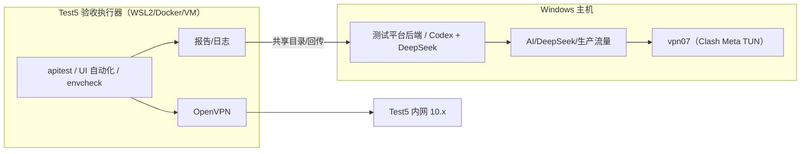

# Test5 验收执行器网络隔离方案（WSL/容器）

> 本方案**取代**已暂停的《生产测试平台固定配置与双VPN切换验收手册》中的「双 VPN 切换」模式，
> 解决「Test5 验收需要 OpenVPN、AI 需要 vpn07 全局」在同一主机上的互斥问题。

## 1. 背景与结论

### 1.1 问题

- Test5（`*.elelive.cn` 内网）验收必须通过 OpenVPN 访问；
- AI（DeepSeek）与生产访问依赖 vpn07（Clash Meta TUN，fake-ip DNS `198.18.0.2`）全局代理；
- 两者在同一台 Windows 主机上是两个「全局」隧道，默认路由/DNS 互相覆盖。

### 1.2 batch-64 实测结论

- 本机共存可行：OpenVPN 客户端加 `pull-filter ignore redirect-gateway`（+ `ignore dhcp-option`）
  可阻止其接管默认路由与 DNS；Test5 内网经 10/8 网段路由（网关 `10.7.7.1`）走 OpenVPN，
  AI 经 Clash fake-ip 走 vpn07；`curl https://api.deepseek.com` 实测返回真实服务器响应（401 鉴权，链路通）。
- **但**：依赖 Windows 路由表 + hosts 手工维护，敏感于 DNS 顺序与接口 metric 变化，不可作为长期生产方案。

### 1.3 本方案结论

**采用「执行器网络隔离」：Test5 验收在独立网络栈（WSL2 / 容器 / VM）内执行，
Windows 主机保持 vpn07 全局，仅承担 AI 与测试平台。** 两个网络域不再共享默认路由与 DNS。

## 2. 目标拓扑



- 主机 ↔ 执行器唯一交互：共享工作目录、产物回传、控制面指令；**不共享隧道**。

## 3. 执行器形态选型

| 形态 | 优点 | 缺点 | 结论 |
|------|------|------|------|
| **WSL2** | 已安装（本机存在 WSL 虚拟网卡）；Linux 工具链齐全；零额外成本 | tun 设备需确认；NAT 模式可能受 Clash 干扰 | **首选**，batch-66 实测 |
| **Docker Desktop（WSL2 后端）** | 环境可复现、可打包成执行器镜像 | 网络模式需 host/NAT 取舍；额外资源 | 备选，适合固化 |
| **独立 VM（Hyper-V）** | 网络栈完全独立，最稳 | 资源占用高、维护成本高 | 兜底 |

## 4. batch-66 实施步骤（执行器搭建与实测）

### 4.1 WSL2 准备

```bash
# 确认发行版与内核
wsl -l -v
uname -r

# 确认 tun 设备（OpenVPN 需要）
ls -l /dev/net/tun
# 缺失时补救：
sudo mkdir -p /dev/net
sudo mknod /dev/net/tun c 10 200
sudo chmod 600 /dev/net/tun
```

若 WSL2 NAT 下 OpenVPN 流量被 Clash 干扰，优先尝试 Windows 11 **mirrored 网络模式**
（`%UserProfile%\.wslconfig` 增加 `networkingMode=mirrored` 后 `wsl --shutdown`）。

### 4.2 OpenVPN（执行器内）

真实 CA 与凭据**不入库**；仓库只提供模板（`docs/operations/openvpn-template.example.ovpn`，后续批次补充）：

```ini
client
dev tun
proto udp
remote <vpn-server>.elelive.cn 1194
resolv-retry infinite
nobind
persist-key
persist-tun
auth-user-pass /etc/openvpn/test5.auth
pull-filter ignore redirect-gateway
```

### 4.3 验证矩阵（V1–V5，全部通过才算方案成立）

| # | 场景 | 命令/动作 | 预期 |
|---|------|-----------|------|
| V1 | 主机 AI（vpn07 开，执行器无关） | `curl -I https://api.deepseek.com` | 401（链路通） |
| V2 | 执行器内 Test5 内网（OpenVPN 开） | `ping <Test5内网IP>` | 通 |
| V3 | 执行器内 Test5 域名 | `curl -I https://camelive-g3-test5.elelive.cn` | 200 |
| V4 | 两者同时运行 | 主机跑一次 AI 用例生成，执行器跑 Test5 冒烟 | 双方正常 |
| V5 | 反向验证 | 关闭 vpn07，仅执行器跑 Test5 验收 | Test5 正常 |

### 4.4 执行器职责与产物

- 执行：对 Test5 的 apitest / UI 自动化 / 环境探活（复用 `tests/` 与平台执行引擎）；
- 产物：报告/日志写入共享目录或回传控制面（ADR-0015 Phase 1+）；
- 凭据：OpenVPN 账号密码、Test5 账号走执行器本地 `.env`，不写入仓库。

## 5. 回退路径

| 场景 | 动作 |
|------|------|
| WSL2 tun 不可用且 mknod 无效 | 切换 Docker 容器执行器 |
| Docker/WSL 均受 Clash 干扰 | 独立 Hyper-V VM |
| 执行器形态短期无法落地 | 临时使用 batch-64 已验证的本机共存法（pull-filter + hosts），并在 C 条件登记 |

## 6. 与 ADR-0015 / 0016 的关系

- 本执行器即 ADR-0015 的「环境执行器（Test5 域）」，由运维发布控制面调度；
- 执行器形态与代码归属遵循 ADR-0016 三仓边界（`test-platform-v2` / `deploy` / docs）；
- 本方案落地后，CI 的 `internal-network` runner 可逐步迁移到同一执行器模式。

## 7. 前置条件（需要用户/运维提供）

1. Test5 验收授权窗口与 VPN 账号；
2. Test5 内网网段/DNS 信息（执行器 OpenVPN 静态路由用）；
3. 执行器宿主选择确认（WSL2 发行版 or Docker）；
4. AI/OCR/蓝湖等平台验收凭据（见《外部前置条件清单》）。
