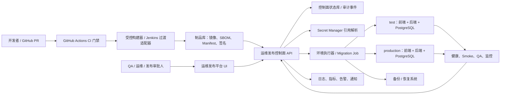
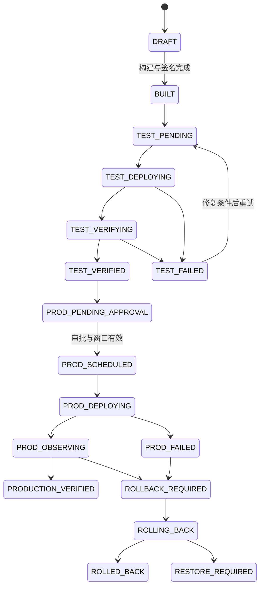

# 运维发布平台：架构与交付要求

## 1. 文档目的与当前结论

本文细化 [ADR-0015](../../../docs/adr/0015-operations-release-control-plane.md) 的实施契约，定义 CamelTv 测试平台从构建、test 验证到 production 晋级所需的统一运维发布控制面。目标不是再增加一套部署脚本，而是建立一个可追溯、可审批、可恢复、可审计的发布系统。

核心结论：

- React 前端、FastAPI 后端和 Alembic 数据库迁移必须属于同一个不可分割的 `release unit`。
- test 与 production 必须使用同一个 release manifest、同一前端镜像 digest 和同一后端镜像 digest；production 禁止重新从源码构建。
- 发布控制面是 test 和 production 的唯一 CD 入口；GitHub Actions 继续负责 CI，Jenkins 仅作为过渡期构建/内网执行适配器。
- production 当前缺少正式服务器/集群、域名、TLS、PostgreSQL、制品库、Secret Manager、备份恢复和发布窗口，因此 production 发布建设与验收状态统一为 `DEFERRED`，不得记为 `PASS` 或伪造发布记录。

## 2. 范围、边界与非目标

### 2.1 范围内

- 从已合并到 `main` 的提交生成不可变发布单元。
- 前端、后端、数据库迁移、配置 schema、SBOM 和 QA 证据的统一版本绑定。
- test 发布、验证和同 digest 晋级 production。
- 环境锁、发布审批、备份、迁移、应用切换、健康检查、观察、回滚和审计。
- Secret 引用、运行时注入和脱敏日志。
- 运维发布平台自身的 API、UI、RBAC、状态机、通知和可观测性。
- Jenkins 从“流水线事实源”过渡为“受控执行器”的兼容路径。

### 2.2 范围外

- 不自研镜像仓库、容器调度器、Vault/Secret Manager、数据库备份引擎或日志平台。
- 不把测试平台业务页面 `/environment` 当作测试平台自身的发布环境控制面；前者管理被测体育系统地址和变量，后者管理测试平台 test/production 实例。
- 不在浏览器、Git、release manifest、审计事件或聊天中保存明文 Secret。
- 不允许生产操作者绕过控制面直接 SSH、手工 Compose 或手工执行 Alembic；应急操作也必须有授权、命令摘要和事后审计回填。
- 不用应用回滚自动触发 `alembic downgrade`。
- 不把 local 开发环境包装成 production 发布证据。

## 3. 组件、责任与信任边界



### 3.1 最小组件

| 组件 | 责任 | 不得承担的责任 |
| --- | --- | --- |
| Release Builder | 从固定 SHA 构建一次；生成镜像、SBOM、签名和 manifest | 不决定 production 是否发布 |
| Artifact Registry Adapter | 按 digest 读取不可变制品；验证签名和保留策略 | 不接受可变 `latest` 作为发布输入 |
| Control Plane API | 状态机、审批、锁、编排、幂等、审计和查询 | 不持有目标环境明文 Secret |
| Control Plane UI | 发布列表、环境看板、差异、审批、日志、回滚和审计 | 不直接访问目标主机或数据库 |
| State/Audit Store | release、deployment、approval、event 和证据索引 | 不保存业务数据快照或完整 Secret |
| Secret Provider | 将引用解析为一次性运行时值 | 不向 UI/API 回传 Secret 明文 |
| Environment Executor | 备份、迁移、部署、探针和回滚 | 不自行改变 release manifest |
| Jenkins Adapter | 过渡期构建与内网执行；回写结构化状态 | 不成为长期环境事实源 |
| Health Verifier | 基础设施、应用、数据和业务门禁 | 不以单一 HTTP 200 代表发布成功 |
| Notification Adapter | 审批、失败、回滚和完成通知 | 通知失败不得丢失发布状态 |

### 3.2 信任边界

1. **源码边界**：只有受保护 `main`、required checks 和可验证提交 SHA 可进入构建器。
2. **供应链边界**：构建器只能向制品库写入；执行器只能按 digest 拉取并校验签名。
3. **控制边界**：UI 只调用控制面 API；所有写操作需要身份、权限、CSRF/重放保护和审计。
4. **Secret 边界**：控制面只保存引用名；执行器在目标环境内短时解析并注入。
5. **数据边界**：migration job 使用独立最小权限身份；应用身份不得拥有 schema 管理权限。
6. **环境边界**：test 和 production 使用独立网络、状态、Secret、数据库和发布锁；制品 digest 相同但配置引用不同。

## 4. 不可变 Release Unit 与 Manifest

一次构建只产生一个 `release_id`。release manifest 为不可变、可签名的 JSON/YAML；任何字段变化都必须创建新 release，禁止原地修改已验证 manifest。

### 4.1 必填字段

| 字段组 | 必填内容 |
| --- | --- |
| Identity | `schema_version`、`release_id`、`created_at`、`created_by`、manifest 摘要/签名 |
| Source | 仓库、完整 commit SHA、`main` 合并记录、PR、CI run、构建器身份 |
| Frontend | 镜像仓库、不可变 digest、Nginx/runtime 配置 schema、SBOM、签名、漏洞报告 |
| Backend | 镜像仓库、不可变 digest、OpenAPI 摘要、SBOM、签名、漏洞/许可证报告 |
| Database | Alembic 当前/目标 revision、唯一 head、迁移列表、兼容模式、预计锁/停机、回退策略 |
| Configuration | 配置 schema 版本、必需 Secret 引用名、非敏感配置摘要；不得含 Secret 值 |
| Quality | required checks、测试/构建结果、Batch QA 报告、A 门禁、已接受风险和证据索引 |
| Promotion | test deployment ID、验证时间、验证者、production 审批要求和允许窗口 |
| Recovery | 前一稳定 release、应用回滚 digest、备份策略、恢复/前向修复方案 |

### 4.2 规范示例

```yaml
schema_version: 1
release_id: rel-20260730-d15ed219
source:
  branch: main
  commit_sha: d15ed2197e41bbcecfac733f059160a912373317
  pr_number: 0
artifacts:
  frontend:
    image: registry.example.invalid/cameltv/test-platform-frontend
    digest: sha256:<immutable-digest>
    sbom_ref: artifact://sbom/frontend
  backend:
    image: registry.example.invalid/cameltv/test-platform-backend
    digest: sha256:<immutable-digest>
    openapi_sha256: <schema-digest>
    sbom_ref: artifact://sbom/backend
database:
  alembic_from: <current-revision>
  alembic_to: <unique-head>
  compatibility: expand
configuration:
  schema_version: 1
  required_secret_refs:
    - secret://test-platform/database-url
    - secret://test-platform/jwt-signing-key
quality:
  qa_report_ref: artifact://qa/batch-60
  gates_ref: artifact://qa/a01-a13
recovery:
  previous_release_id: <stable-release-id>
  strategy: application-rollback-or-forward-fix
```

示例中的域名、digest 和引用均为 schema 示意，不构成真实 production 配置。

## 5. test → production 同 Digest 晋级

1. `main` 固定 SHA 只构建一次前端和后端镜像。
2. test 部署必须记录实际拉取的 digest；tag 只能作为展示信息，不能作为校验依据。
3. test 验收通过后，控制面把同一 release 标记为 `TEST_VERIFIED`，并冻结 manifest。
4. production 只接受 `TEST_VERIFIED` release；审批页面必须展示 test 已运行 digest 与待发布 digest 的逐项相等结果。
5. production 执行器按相同 digest 拉取制品，不允许重新运行源码构建、重新安装依赖或生成新的静态前端。
6. 环境差异只能来自经 schema 校验的非敏感配置和 Secret 引用，不能通过修改镜像内容实现。
7. 前端必须使用同源 `/api/v1`，环境域名和反向代理由运行环境提供，避免 Vite 构建期写死 test/prod API 地址造成不同 digest。
8. 任一 digest、manifest、迁移 head、配置 schema 或 QA 证据发生变化，原审批立即失效并创建新 release。

## 6. 前端、后端与 Alembic 编排

三个交付对象是同一个 release unit，但按兼容顺序执行：

1. **预检**：校验身份、环境状态、环境锁、审批、发布窗口、manifest 签名、digest、Secret 引用、容量和健康基线。
2. **冻结并发**：获取环境发布锁；migration job 再获取数据库 advisory lock 或等价锁。
3. **备份**：生成发布前备份，验证备份可读和恢复元数据，记录 `backup_id`。
4. **迁移检查**：执行 `alembic current`、`heads`、`history` 和 `check`；确认唯一 head 和允许的 from/to revision。
5. **数据库迁移**：由独立 migration 身份执行 `alembic upgrade <target>`；日志脱敏。
6. **后端部署**：部署与新旧 schema 都兼容的后端，等待进程、数据库连接、`/health`、OpenAPI 和关键只读 API 通过。
7. **前端部署**：切换同一 release 的前端 digest，检查静态文件完整性、Nginx、同源代理、缓存头和旧资源回收。
8. **业务 Smoke**：执行登录、项目选择、核心 CRUD 只读/可恢复路径和 release 指定的 P0 smoke。
9. **观察门禁**：在观察窗口核对错误率、延迟、任务队列、数据库连接和告警。
10. **完成或恢复**：门禁全通过才标记环境已验证；失败时按状态机执行应用回滚、前向修复或已批准的数据库恢复。

默认采用 expand/contract：先增加兼容 schema，再发布兼容后端/前端，最后在后续 release 清理旧字段。破坏性迁移不得与依赖旧 schema 的应用镜像放入同一不可逆步骤。

禁止单独“临时更新前端”或“只换后端”而不生成 release manifest。紧急修复也必须形成新 release、兼容声明、审批和审计。

## 7. 备份、迁移与回滚

### 7.1 备份门禁

- production 每次发布前必须有应用一致性备份；test 的迁移演练也必须使用隔离备份/副本。
- 备份记录包含环境、数据库逻辑名、创建时间、工具版本、加密状态、保留策略、大小/摘要和恢复验证状态，不包含连接串。
- 未通过最近一次恢复演练的备份只能作为风险证据，不能解除 production 门禁。
- 最低基线：发布前备份 + 每日自动备份；production 恢复演练至少每季度一次，首次 production 发布前必须完成一次。

### 7.2 回滚策略

| 失败位置 | 默认动作 | 数据库动作 |
| --- | --- | --- |
| 迁移前 | 停止，无应用变更 | 无 |
| 迁移失败且事务已回滚 | 保持旧应用 | 核对 revision 和数据完整性 |
| 迁移成功、后端失败 | 回滚到仍兼容新 schema 的后端 digest | 不自动 downgrade；优先前向修复 |
| 前端失败 | 回滚前端到前一稳定 digest | 保持兼容后端/schema |
| 观察期业务失败 | 回滚应用或停止流量；按批准方案恢复 | 需要数据库恢复时进入独立 `RESTORE_REQUIRED` 审批 |

数据库恢复是高风险独立操作，必须展示数据损失窗口、RPO/RTO、备份 ID、校验步骤和业务负责人审批。恢复成功后必须重新执行迁移、数据一致性和业务 Smoke。

## 8. 健康与发布门禁

| 层级 | 最低检查 |
| --- | --- |
| 制品 | digest/签名一致、SBOM 存在、无未接受 high/critical 漏洞、许可证报告可追溯 |
| 基础设施 | 目标环境可达、容量充足、时间同步、DNS/TLS/证书有效、Secret 引用可解析 |
| 数据库 | 备份完成、唯一 Alembic head、目标 revision 正确、连接池/锁/复制状态正常 |
| 后端 | 进程就绪、`/health`、OpenAPI 摘要、数据库读写探针、后台任务依赖正常 |
| 前端 | 静态资源 200、无混合内容、API 同源代理正确、旧 chunk 不产生 404、关键页面可访问 |
| 业务 | 登录、项目选择、需求/用例/计划核心 smoke、审计写入、无跨项目泄露 |
| 观察 | 错误率、p95 延迟、5xx、任务失败、数据库连接、CPU/内存未越过 release 阈值 |

任一 required gate 为 `FAIL`、`BLOCKED`、`NOT RUN` 或 `DEFERRED` 时，不得标记 `PRODUCTION_VERIFIED`。允许接受的风险必须有批准人、期限、范围和补测触发条件，且不能豁免 Secret 泄露、数据损坏、无备份、digest 不一致或权限绕过。

## 9. RBAC、审批与审计

### 9.1 角色与权限

| 角色 | 主要权限 |
| --- | --- |
| 开发者 | 查看 release；发起构建和 test 部署；不得批准/执行 production |
| QA | 回填 test 验收、接受/拒绝质量证据；不得修改制品或 Secret |
| 运维/发布负责人 | 管理环境、执行 test/production、应用回滚；不得篡改 QA 结果 |
| DBA/数据负责人 | 审核 migration、备份恢复和破坏性数据操作 |
| Secret 管理员 | 管理引用绑定和轮换；看不到 release 业务审批 |
| 审计只读 | 查看 manifest、审批、事件、探针和证据；无写权限 |

权限必须细分为：`release:build`、`deploy:test`、`approve:production`、`deploy:production`、`migration:execute`、`rollback:application`、`restore:database`、`secret_ref:manage`、`audit:view`。后端必须强制校验，不能只依赖 UI 隐藏按钮。

单人仓库阶段不虚构第二审批人，但 production 仍需要一次独立于 Git push/PR 的明确发布授权。审批绑定 `release_id + environment + digest + migration target + window`；任何一项变化均使审批失效。

### 9.2 审计事件

所有读敏感详情和写操作至少记录：事件 ID、时间、操作者、原状态/新状态、release/environment/deployment ID、请求关联 ID、制品 digest、迁移 revision、审批 ID、结果、错误分类和脱敏证据引用。审计日志追加写、不可由普通管理员修改或删除，并能导出供 QA/安全复核。

## 10. Secret 引用与配置治理

- manifest、状态库和 UI 只保存 `secret://namespace/name@version` 一类引用。
- Secret Provider 在执行器所在信任域内解析；值只以进程环境、短期文件或原生 Secret volume 注入。
- UI 永不回显明文，只展示引用名、版本、最后轮换时间和可用性。
- 执行日志在进入控制面前完成字段级脱敏；禁止输出 `DATABASE_URL`、JWT key、Cookie、Token、私钥和完整业务行。
- test 与 production 使用不同 Secret 引用和最小权限身份；禁止把 test Secret 晋级到 production。
- Secret 轮换必须生成事件并验证新版本；不需要改变镜像 digest，但配置引用版本变化会创建新的 deployment revision 并使旧审批失效。
- 生产数据库应用身份、migration 身份、备份身份和只读探针身份分离。

## 11. 发布状态机与失败处理



补充终态：

- `CANCELLED`：未开始不可逆步骤前由有权限人员取消。
- `DEFERRED`：外部基础设施或授权未就绪；不是失败，也不是通过。
- `SUPERSEDED`：被新 release 替代，不能再晋级。

失败事件必须分类为 `VALIDATION`、`APPROVAL`、`SECRET`、`BACKUP`、`MIGRATION`、`DEPLOYMENT`、`HEALTH`、`BUSINESS_SMOKE`、`OBSERVABILITY` 或 `ROLLBACK`，并给出可重试性和恢复入口。所有命令必须支持幂等键；重试不得生成第二次迁移、重复审批或漂移的环境状态。

## 12. 最小 API 与 UI

### 12.1 API

| API | 用途 |
| --- | --- |
| `POST /ops/releases` | 登记不可变 manifest；重复 digest/幂等键返回同一结果 |
| `GET /ops/releases`、`GET /ops/releases/{id}` | 查询列表、详情、证据和状态 |
| `POST /ops/releases/{id}/deploy-test` | 获取 test 锁并创建 deployment |
| `POST /ops/releases/{id}/verify-test` | 回填 QA/健康结果，满足条件后进入 `TEST_VERIFIED` |
| `POST /ops/releases/{id}/request-production` | 生成 production 影响预览和审批请求 |
| `POST /ops/approvals/{id}/approve`、`reject` | 绑定当前 manifest 的显式审批 |
| `POST /ops/releases/{id}/deploy-production` | 仅允许同 digest 且审批有效的 release |
| `POST /ops/deployments/{id}/cancel` | 在允许阶段取消 |
| `POST /ops/deployments/{id}/rollback` | 触发应用回滚；数据库恢复另行审批 |
| `GET /ops/deployments/{id}/events` | 读取结构化实时状态/脱敏日志 |
| `GET /ops/environments`、`/{id}` | 环境状态、当前 release、锁和健康摘要 |
| `GET /ops/audit` | 审计检索与导出 |

所有写 API 需要 RBAC、CSRF/重放保护、`Idempotency-Key`、关联 ID 和审计。production API 在基础设施未登记或门禁未满足时返回明确 `DEFERRED/PRECONDITION_FAILED`，不得静默降级为 local/test。

### 12.2 UI

- Release 列表：SHA、版本、test/production 状态、digest 一致性和阻塞原因。
- Release 详情：manifest、前后端制品、迁移差异、QA/A 门禁、风险、审批和事件时间线。
- 环境看板：当前/目标 release、健康、锁、上次成功发布、备份和待办。
- 发布向导：预检 → 备份 → 迁移 → 后端 → 前端 → Smoke → 观察；每步显示结构化状态。
- 审批中心：只展示非敏感影响摘要，明确批准/拒绝、有效窗口和失效条件。
- 回滚中心：可选稳定 release、兼容性检查、数据影响和恢复审批。
- Secret 引用页：引用、版本、轮换和可用性；无明文查看/复制能力。
- 审计页：按 release、环境、操作者、状态和时间检索与导出。

UI 必须满足 WCAG 2.1 AA、键盘操作、状态实时播报、长日志虚拟化、移动端只读应急查看，以及失败状态下可理解且可恢复的操作指引。

## 13. Jenkins 过渡方案

### Phase 0–1 的职责

- GitHub Actions：PR/main required checks、变更分类、供应链和质量证据。
- Jenkins：受控构建器和内网 executor，通过服务账号调用控制面 API/CLI；不得绕过 release 状态机。
- 控制面：唯一 release/environment 状态源，签发短期执行令牌并接收结构化回调。

Jenkins Job 必须接收 `release_id` 和 digest，而不是 production 分支/源码目录。production Job 禁止 checkout 后重建；只允许拉取已在 test 验证的 digest。Console log 先脱敏再进入控制面，Jenkins build URL 仅作为审计引用。

Phase 2 后，Jenkins 可以保留为执行适配器，也可由专用 Runner/GitOps 控制器替换。替换执行器不得改变 manifest、状态机、审批或审计契约。

## 14. Phase 0–3 建设路线

| 阶段 | 建设内容 | 退出条件 | 当前状态 |
| --- | --- | --- | --- |
| Phase 0 架构与手工契约 | ADR、本文、release manifest schema、环境清单、手工 test 发布/回滚 runbook、A13 门禁 | 文档评审通过；可在不接触 production 的情况下生成 manifest 并完成 test 演练 | `IN PROGRESS`：ADR/本文已建立，其余待建设 |
| Phase 1 不可变 test 交付 | 构建/签名、制品库、Jenkins/Runner 适配、test 环境锁、备份、migration job、健康/Smoke、审计 | 同一 SHA 可重复部署同 digest；失败可回滚；test 状态可复核 | `PLANNED` |
| Phase 2 控制面产品化 | API/UI、RBAC、审批、环境看板、事件流、回滚、通知、Secret Provider | QA/运维无需登录服务器即可完成 test 发布和 production 预演 | `PLANNED` |
| Phase 3 production 接入 | 正式基础设施、Secret Manager、签名验证、渐进发布、监控、备份恢复演练、production 门禁 | 首次同 digest production 演练、恢复演练、安全与审计验收通过 | `DEFERRED` |

## 15. 验收标准

### 15.1 功能验收

- [ ] 一个 release 明确绑定前端、后端、Alembic、配置 schema 和 QA 证据，任何组成变化都会产生新 release。
- [ ] test 实际运行 digest 与 manifest 相等；production 晋级前逐项校验仍相等。
- [ ] production 路径无法从源码重新构建，也无法选择未通过 test 的 release。
- [ ] 编排顺序、环境锁、migration lock、备份和健康门禁可观察且幂等。
- [ ] 迁移/后端/前端/Smoke/观察任一步失败进入正确状态，并提供允许的重试、回滚或恢复动作。
- [ ] 无权限、越权审批、过期审批、重复请求、篡改 manifest、错误 digest 和跨环境 Secret 引用均被拒绝并审计。
- [ ] 应用回滚不自动 downgrade 数据库；恢复操作必须单独审批。
- [ ] 所有日志、事件、截图和导出均不含明文 Secret 或业务敏感行。
- [ ] production 未就绪时所有相关操作保持 `DEFERRED`，没有虚假成功记录。

### 15.2 非功能标准

| 类别 | 最低标准 |
| --- | --- |
| 安全 | TLS 1.2+；OIDC/企业身份优先；细粒度 RBAC；Secret 只引用；无 high/critical 未接受漏洞；镜像签名验证 |
| 可靠性 | 写 API 幂等；同环境单发布锁；迁移独占锁；控制面重启后可从持久事件恢复；不同环境可并行 |
| 可恢复性 | production 首发前完成恢复演练；基线 RPO ≤ 24h、RTO ≤ 60min，业务有更严要求时从严 |
| 审计 | 状态变化、审批、Secret 引用、迁移、回滚全量留痕；追加写；在线保留不少于 365 天或合规要求的更长期限 |
| 性能 | 排除外部执行耗时后，控制面查询 API p95 < 500ms；状态事件在 5 秒内可见；1 万条事件详情可分页/虚拟化 |
| 可用性 | Phase 2 后控制面月可用性目标 ≥ 99.9%；控制面故障不得破坏目标环境现有稳定服务 |
| 可观测性 | 统一 correlation ID；发布阶段、耗时、错误、回滚、锁和队列指标；告警链接到 release/deployment |
| 兼容性 | 至少保留前一稳定 release；expand/contract；前端旧 chunk 与后端新旧 API 在发布窗口兼容 |
| 可访问性 | UI 达到 WCAG 2.1 AA；键盘可完成审批、取消和回滚；状态变化可被辅助技术感知 |

## 16. Batch 60 A13 发布门禁

Batch 60 新增 `A13 运维发布与同制品晋级`，不改写 A01–A12 的既有结论。A13 只有在下列证据全部存在时才能 `PASS`：

1. 不可变 release manifest 及 schema 校验；
2. 前端/后端 digest 与 Alembic 目标 revision 的统一绑定；
3. test 环境同 digest 发布、迁移、健康、Smoke 和回滚演练；
4. RBAC、审批、幂等、失败状态机和审计证据；
5. Secret 引用/注入/脱敏验证；
6. production 同 digest 晋级演练与备份恢复演练。

由于 production 基础设施未就绪，Batch 60 的 A13 当前结论为 `DEFERRED`。架构文档完成只能证明 Phase 0 的一部分，不代表发布平台已建设或 production 可交付。

## 17. 关联资料

- [ADR-0015：采用统一运维发布控制面交付测试平台](../../../docs/adr/0015-operations-release-control-plane.md)
- [Batch 60 实施计划](../../../docs/superpowers/plans/2026-07-30-batch-60-sports-platform-production-validation.md)
- [Batch 60 全平台执行矩阵](../../work-logs/batch-60-full-platform-execution-matrix.md)
- [改进任务 Backlog](../改进任务backlog.md)
- ~~生产测试平台固定配置与双 VPN 切换验收手册~~（已删除，C65-2；双 VPN 验收以 `operations/test5-runner-isolation.md` 为准）
- [ADR-0008：Jenkins 与 GitHub Actions 双通道](../../../docs/adr/0008-jenkins-github-actions-dual-cicd.md)
