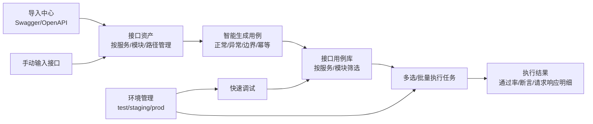

# CamelTv 测试平台 v2 - 接口测试模块优化 PRD

## 1. 背景与目标

当前接口测试页面已经具备服务端 HTTP 执行、环境变量替换、数据集批量执行和基础断言能力，但页面形态仍偏“单接口快速调试”。本次优化目标是把接口测试升级为“接口资产导入 -> 智能生成用例 -> 调试完善 -> 多选/批量任务执行 -> 报告沉淀”的完整闭环。

核心目标：

- 输入任意一个接口定义后，自动生成多条接口测试用例，覆盖字段校验、边界值、异常输入、返回值校验和幂等场景。
- 调试模式接近 JMeter/Postman 的常用体验，支持 Headers、Body、响应断言，并支持多种 Body/Headers 编辑格式。
- 提供导入入口，支持 Swagger/OpenAPI 文档导入接口资产和批量生成接口用例。
- 接口用例按项目下的不同服务区分，例如 account-service、camel-service、order-service。
- 接口用例支持多选执行、批量执行，并形成可追踪的执行任务。
- 增强环境选择，明确测试环境、预发环境、生产环境等环境类型，并对生产环境执行做保护。

## 2. 用户与场景

| 角色 | 主要诉求 |
| --- | --- |
| 测试人员 | 快速导入接口，生成覆盖充分的接口用例，批量执行回归。 |
| 测试负责人 | 按服务查看接口覆盖、执行通过率和失败原因。 |
| 后端开发 | 调试单个接口请求，复现接口问题，查看请求/响应/断言详情。 |
| 管理员 | 管理环境、变量、生产环境保护规则和执行权限。 |

## 3. 范围

### 3.1 本期范围

- 接口测试首页重构为四个页签：接口资产、快速调试、接口用例、执行任务。
- 新增接口导入中心，支持 OpenAPI 3.x / Swagger 2.0 的 URL 导入和文件导入。
- 新增服务分组维度，用于区分同项目下多个后端服务。
- 新增单接口用例生成能力，基于接口方法、URL、Headers、Query、Path、Body Schema、响应 Schema 生成测试用例。
- 新增批量执行任务，支持从用例列表多选发起任务。
- 增强调试器，支持 Headers 表格/JSON/批量文本，Body 支持 none、JSON、raw、form-data、x-www-form-urlencoded、GraphQL。
- 增强断言，支持状态码、响应时间、响应头、JSONPath、正则、字段存在、字段类型、数组长度、JSON Schema。
- 环境选择接入现有环境管理，支持 base_url + 变量替换，生产环境执行二次确认。

### 3.2 暂不纳入

- 压测能力不在本期实现，仅保留响应时间断言和批量串行/有限并发执行。
- Mock Server 不在本期实现。
- 复杂前后置脚本沙箱不在本期实现，可在后续版本增加。

## 4. 现状基线

现有可复用能力：

- `api_execution_service.py` 已支持服务端 HTTP 执行、环境变量替换、数据集逐行替换、状态码/响应时间/JSONPath/正则断言。
- `TestCase` 已有 API 字段：`api_method`、`api_endpoint`、`api_headers`、`api_body`、`api_assertions`。
- `Environment` 已支持项目级环境、环境类型、base_url、变量。
- `case_generation_service.py` 已有 OpenAPI 生成接口用例的雏形，但入口在版本任务页面，不在接口测试模块主流程。
- `test_plan_service.py` 已支持计划内 API 用例自动执行，但缺少接口测试模块内的独立执行任务视图。

主要缺口：

- 没有接口资产模型，接口文档导入后只能直接变成用例，缺少“接口清单/服务/版本/导入批次”管理。
- 用例生成规则过粗，只生成基础可用性用例，未覆盖字段边界、入参异常、幂等。
- 快速调试编辑器只支持简单 JSON 文本，不适合日常调试复杂请求。
- 接口用例列表缺少服务树、多选执行、执行任务和结果聚合。

## 5. 信息架构

## 6. 功能需求

### 6.1 接口资产与服务分组

新增“接口资产”页签，左侧为服务树，右侧为接口列表。

字段建议：

| 字段 | 说明 |
| --- | --- |
| service_name | 服务名称，例如 account-service、camel-service。 |
| module | 模块，优先取 OpenAPI tags，没有 tags 时从 path 第一段推断。 |
| method | GET/POST/PUT/PATCH/DELETE/HEAD/OPTIONS。 |
| path | 接口路径，例如 `/api/v1/users/{id}`。 |
| summary | 接口说明。 |
| request_schema | OpenAPI 中解析出的 path/query/header/body 参数结构。 |
| response_schema | OpenAPI 响应结构。 |
| auth_required | 是否需要认证。 |
| source | manual/swagger/openapi。 |
| import_batch_id | 导入批次。 |
| version | 接口文档版本。 |

业务规则：

- 同项目下 `service_name + method + path` 唯一。
- 重复导入时默认更新接口资产，不直接删除用户已维护的用例。
- OpenAPI tags 映射为 module；servers[0].url 可映射到环境 base_url 候选。
- 已废弃接口标记为 deprecated，不直接删除。

### 6.2 导入中心

入口位置：接口测试页面右上角“导入接口”。

支持方式：

- URL 导入：填写 Swagger/OpenAPI JSON 地址。
- 文件导入：上传 `.json`、`.yaml`、`.yml`。
- 文本导入：粘贴 OpenAPI JSON/YAML。

导入流程：

1. 用户选择服务名称、导入方式、目标环境。
2. 平台解析文档，展示预览：服务、接口数、新增数、更新数、跳过数、解析失败项。
3. 用户确认导入。
4. 平台生成接口资产，可选择“同时生成基础用例”。

验收标准：

- 能导入 Swagger 2.0 和 OpenAPI 3.x。
- 导入后接口资产按服务和模块展示。
- 导入失败时展示具体 path/method 和失败原因。
- 重复导入不产生重复接口资产。

### 6.3 任意接口生成测试用例

入口：

- 接口资产列表：单接口“生成用例”。
- 快速调试页：当前请求“生成用例”。
- 导入中心：导入后批量生成基础用例。

生成策略：

| 类型 | 生成内容 |
| --- | --- |
| 正向基础 | 合法请求，断言 HTTP 非 5xx、业务 code、核心字段存在、响应时间。 |
| 必填校验 | 必填字段缺失、null、空字符串。 |
| 类型校验 | 字符串传数字、数字传字符串、布尔传字符串、数组传对象。 |
| 长度边界 | 字符串 minLength-1/minLength/maxLength/maxLength+1。 |
| 数值边界 | minimum-1/minimum/maximum/maximum+1，覆盖 0、负数。 |
| 枚举校验 | 枚举合法值和非法值。 |
| 格式校验 | email、url、date、datetime、手机号等格式合法/非法。 |
| 特殊字符 | SQL 注入片段、XSS 片段、Emoji、空格、换行、超长文本。 |
| 参数组合 | 互斥字段同时传、依赖字段缺失、分页 page/page_size 组合。 |
| 认证权限 | 缺 token、无效 token、权限不足。 |
| 幂等 | 重复提交、重复删除、PUT/PATCH 重复更新、带 Idempotency-Key 重试。 |

生成数量控制：

- 默认每个接口生成 8-20 条，避免爆炸式生成。
- 用户可选择生成模板：基础集、边界集、异常集、幂等集、全量集。
- 对高风险方法 POST/PUT/PATCH/DELETE 的生产环境用例默认禁止自动执行。

生成后的用例字段：

- `domain` 固定为“接口测试”。
- `module` 默认等于服务名或 OpenAPI tag，可手动调整。
- `tags` 包含 `service:<service_name>`、`source:<source>`、`scenario:<scenario_type>`。
- `api_assertions` 自动填充断言规则。
- `priority`：正向基础与核心写接口为 P0，边界/异常为 P1，兼容性/性能轻断言为 P2。

### 6.4 快速调试模式

页面布局建议：

- 顶部：环境选择、服务选择、方法、URL。
- 请求区：Params、Headers、Auth、Body、前置变量（后续可扩展）。
- 响应区：Body、Headers、Cookies、断言结果、耗时、大小。
- 底部：历史记录、保存为用例、生成用例。

Headers 支持：

- 表格模式：key/value/enabled/description。
- JSON 模式：`{"Content-Type":"application/json"}`。
- 批量文本模式：兼容 `key: value` 粘贴。

Body 支持：

- none。
- JSON。
- raw text。
- form-data。
- x-www-form-urlencoded。
- GraphQL。

断言支持：

| 断言类型 | 示例 |
| --- | --- |
| 状态码 | `status_code eq 200` |
| 响应时间 | `response_time lt 3000` |
| 响应头 | `header.Content-Type contains application/json` |
| JSONPath | `$.data.id exists` |
| 字段类型 | `$.data.amount type number` |
| 数组长度 | `$.data.list length gte 1` |
| 正则 | `raw_body regex "success"` |
| JSON Schema | 响应体符合 schema |

保存能力：

- “保存为接口资产”：保存当前 method/path/schema。
- “保存为用例”：保存当前请求、断言、预期结果。
- “生成用例”：基于当前请求生成多条用例。

### 6.5 接口用例库

列表筛选：

- 服务、模块、方法、优先级、状态、来源、标签、关键字。

列表操作：

- 单条执行。
- 多选执行。
- 批量启用/归档/删除。
- 批量修改服务/模块/优先级。
- 加入测试计划。

详情抽屉：

- 基本信息。
- 请求配置。
- 断言配置。
- 生成来源。
- 最近 10 次执行结果。

### 6.6 执行任务

新增“执行任务”页签，用于承载接口用例的批量执行。

任务字段：

| 字段 | 说明 |
| --- | --- |
| task_id | 任务编号。 |
| name | 任务名称。 |
| environment_id | 执行环境。 |
| service_name | 服务筛选，可为空。 |
| case_ids | 被执行用例。 |
| status | pending/running/success/failed/cancelled。 |
| total/passed/failed/skipped | 汇总统计。 |
| started_at/finished_at | 起止时间。 |
| trigger_type | manual/schedule/ci。 |

执行规则：

- P0/P1 默认串行或小并发执行，避免对测试环境造成冲击。
- 支持失败后继续执行。
- 任务结果保留每条用例的请求、响应、断言详情。
- 生产环境执行写接口需要二次确认，且需要 `apitest:execute_prod` 权限。

### 6.7 环境选择与生产保护

环境类型沿用现有 `dev/test/staging/prod`。

新增规则：

- 页面默认选择 `test` 类型环境。
- 环境 base_url 与 URL 拼接规则：接口 path 以 `/` 开头时使用环境 base_url；完整 URL 则直接使用。
- 变量格式沿用 `${VAR_NAME}`。
- 生产环境执行 POST/PUT/PATCH/DELETE 时弹出确认，并展示影响用例数。
- 生产环境默认禁止批量执行破坏性用例，除非用户有额外权限并确认。

## 7. 权限需求

| 权限码 | 说明 |
| --- | --- |
| `apitest:view` | 查看接口测试模块。 |
| `apitest:execute` | 执行测试/调试请求。 |
| `apitest:execute_prod` | 执行生产环境接口测试。 |
| `apitest:import` | 导入 Swagger/OpenAPI。 |
| `apitest:generate` | 生成接口用例。 |
| `apitest:task` | 查看和管理执行任务。 |
| `apitest:asset_manage` | 管理接口资产。 |

## 8. 数据模型建议

### 8.1 api_service

项目下的后端服务。

- id
- project_id
- name
- display_name
- description
- default_base_path
- owner
- status

### 8.2 api_endpoint

接口资产。

- id
- project_id
- service_id
- module
- method
- path
- summary
- description
- request_schema
- response_schema
- auth_required
- deprecated
- source
- import_batch_id
- version

### 8.3 api_import_batch

导入批次。

- id
- project_id
- service_id
- source_type
- source_ref
- version
- status
- total_count
- created_count
- updated_count
- skipped_count
- error_detail

### 8.4 api_execution_task

批量执行任务。

- id
- project_id
- task_id
- name
- environment_id
- service_id
- status
- total
- passed
- failed
- skipped
- trigger_type
- creator_id
- started_at
- finished_at

### 8.5 api_execution_task_item

任务明细。

- id
- task_id
- case_id
- status
- duration_ms
- request_snapshot
- response_snapshot
- assertion_results
- error_message

## 9. API 设计草案

| 方法 | 路径 | 说明 |
| --- | --- | --- |
| GET | `/api/v1/apitest/services` | 服务列表。 |
| POST | `/api/v1/apitest/services` | 创建服务。 |
| GET | `/api/v1/apitest/endpoints` | 接口资产列表。 |
| POST | `/api/v1/apitest/endpoints` | 手动创建接口资产。 |
| POST | `/api/v1/apitest/import/preview` | 导入预览。 |
| POST | `/api/v1/apitest/import/confirm` | 确认导入。 |
| POST | `/api/v1/apitest/cases/generate` | 单接口/接口资产生成用例。 |
| POST | `/api/v1/apitest/cases/batch-generate` | 批量生成用例。 |
| POST | `/api/v1/apitest/api-execute` | 增强调试执行。 |
| POST | `/api/v1/apitest/tasks` | 创建批量执行任务。 |
| GET | `/api/v1/apitest/tasks` | 任务列表。 |
| GET | `/api/v1/apitest/tasks/{id}` | 任务详情。 |
| POST | `/api/v1/apitest/tasks/{id}/cancel` | 取消任务。 |

## 10. 验收标准

- 从 Swagger/OpenAPI URL 导入不少于 20 个接口时，能按服务和模块展示，重复导入不重复创建。
- 对任意一个包含 query/body schema 的接口，至少能生成正向、必填缺失、类型错误、边界值、枚举非法、幂等场景用例。
- 快速调试支持 JSON、form-data、x-www-form-urlencoded、raw body，并能保存为接口用例。
- 响应断言失败时，能展示失败断言、实际值、期望值。
- 接口用例列表可按服务筛选，多选 5 条以上用例发起执行任务。
- 执行任务能展示总数、通过数、失败数、每条用例响应和断言详情。
- 生产环境执行写接口必须二次确认；无权限用户不能执行生产环境批量任务。

## 11. 里程碑

| 阶段 | 目标 | 交付 |
| --- | --- | --- |
| M1 | 接口资产与导入 | 服务模型、接口资产、OpenAPI 导入预览/确认。 |
| M2 | 用例生成 | 字段校验、边界值、幂等模板，生成后导入用例库。 |
| M3 | 调试器增强 | Headers/Body 多格式、断言编辑器、保存为用例。 |
| M4 | 批量任务 | 多选执行、任务列表、任务详情、结果聚合。 |
| M5 | 生产保护与报表 | 环境保护、服务维度统计、执行质量趋势。 |

## 12. 风险与约束

- OpenAPI 文档质量参差不齐，生成用例需要允许用户补充字段约束。
- 幂等测试可能产生真实数据变更，需要强依赖测试环境和清理策略。
- 生产环境执行必须严控权限和方法，避免误操作。
- 大批量执行需要限制并发、超时和响应体大小，避免拖垮后端服务。
