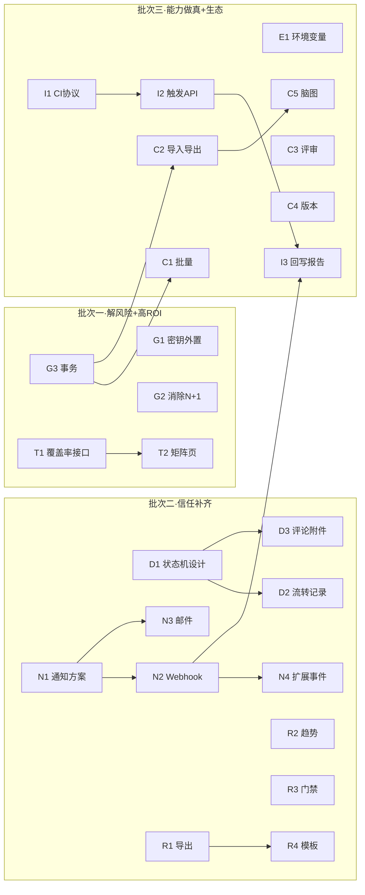

# CamelTv 测试平台 —— 改进任务 Backlog（可领取开发任务）

> 来源：《现状功能PRD.md》第 5.3 节「已知能力缺口」8 条改进项。
> 方法：tracer-bullet **纵切片**——每个任务穿透 schema→API→UI→测试全链路，可独立交付/验证。
> 说明：本工程未配置 issue tracker，故以本地 backlog 形式呈现；每条结构对齐标准 issue 模板，可直接复制到 GitHub Issues / Linear / 禅道。
> 标记：**AFK**=可独立实现合并｜**HITL**=需人工决策/评审。优先级 P0>P1>P2。
> 日期：2026-06-23

---

## Epic 索引（8 改进项 → 8 Epic → 22 切片）

| Epic | 对应改进项 | 切片数 | 建议批次 |
|------|-----------|--------|---------|
| G　工程化基线 | ⑧ | 5 | 批次一（先做，解风险） |
| T　追溯矩阵 | ① | 2 | 批次一（ROI 最高） |
| D　缺陷工作流 | ② | 3 | 批次二 |
| N　通知中心 | ③ | 4 | 批次二 |
| R　报告增强 | ④ | 4 | 批次二 |
| E　环境/变量管理 | ⑦ | 1 | 批次三 |
| C　用例能力增强 | ⑤ | 5 | 批次三 |
| I　CI/CD 集成 | ⑥ | 3 | 批次三 |

---

## Epic G　工程化基线（改进项 ⑧）

### G1　密钥外置与默认口令强制初始化　`AFK`　`P0`
**What**：移除源码中的硬编码敏感默认值，改为环境变量必填；首次启动若用默认口令则强制修改。
**AC**
- [ ] `config.py` 中 `secret_key/ai_api_key/admin_password` 默认值置空或占位
- [ ] 生产模式启动时校验上述项非空，缺失即拒绝启动并给出明确报错
- [ ] 已泄露的 DeepSeek Key 轮换、`.env.example` 补齐
- [ ] 默认 admin 口令首次登录强制修改
**Blocked by**：None

### G2　统一分页/查询工具 + 消除 N+1　`AFK`　`P0`
**What**：抽取通用分页器与列表查询基类，把循环内逐条 `db.get(User)` 改为批量 `in_()`。
**AC**
- [ ] 新增 `paginate()` 工具与 `BaseService.list_paginated()`
- [ ] defect/av_check/ui_test/test_plan 列表改用批量取关联人，消除 N+1
- [ ] 至少 4 处列表接口改造完成，行为不变（回归通过）
**Blocked by**：None

### G3　事务装饰器 + 批量导入原子化　`AFK`　`P0`
**What**：提供事务上下文/装饰器，将需求导入用例等批量写改为整体提交/回滚。
**AC**
- [ ] 提供 `@transactional` 或 `with unit_of_work()`
- [ ] `requirement.import_cases` 中途失败可整体回滚，无半成品
- [ ] 覆盖一个失败注入测试
**Blocked by**：None

### G4　测试基建与质量门禁　`HITL`　`P1`
**What**：落地后端 pytest + 前端 vitest 骨架与首批关键路径用例，约定 CI 门禁。
**AC**
- [ ] 后端 pytest 跑通，含 auth/用例/计划执行 至少 3 条关键路径
- [ ] 前端 vitest + 1 个通用 Hook 测试
- [ ] 约定 lint+typecheck+test 的本地/CI 门禁（HITL：确认 CI 平台）
**Blocked by**：None

### G5　文档与代码对齐　`AFK`　`P2`
**What**：修正 README 技术栈（Ant Design→shadcn/ui）、补 onboarding 与接口文档指引。
**AC**
- [ ] README/部署文档与实际技术栈一致
- [ ] 模块成熟度（演示态标注）写入 README
**Blocked by**：None

---

## Epic T　追溯矩阵（改进项 ①）

### T1　需求覆盖率聚合接口　`AFK`　`P0`
**What**：以需求为维度聚合「关联用例数 / 已执行 / 通过 / 失败 / 关联缺陷 / 覆盖率%」。
**AC**
- [ ] 新增 `GET /requirement/{id}/coverage` 与项目级 `GET /trace/matrix`
- [ ] 正确聚合 requirement↔testcase↔execution↔defect 关系
- [ ] 含分页与项目隔离
**Blocked by**：None（数据模型已具备）

### T2　追溯矩阵可视化页　`AFK`　`P1`
**What**：质量追溯页，需求×覆盖指标矩阵 + 下钻到用例/缺陷。
**AC**
- [ ] 新增 `/trace` 路由与菜单项
- [ ] 矩阵表格 + 覆盖率色阶 + 行下钻
- [ ] 空覆盖需求高亮提示
**Blocked by**：T1

---

## Epic D　缺陷工作流（改进项 ②）

### D1　缺陷状态机设计　`HITL`　`P1`
**What**：定义缺陷状态与合法流转（如 新建→确认→修复中→待回归→已关闭/已拒绝/重新打开）。
**AC**
- [ ] 产出状态机定义（状态、流转、各流转所需角色/字段）
- [ ] 与现有 `open/resolved` 字段的迁移方案
**Blocked by**：None

### D2　状态流转 + 流转记录　`AFK`　`P1`
**What**：按 D1 实现状态流转校验与流转历史时间线。
**AC**
- [ ] `PUT /defect/{id}/transition` 校验合法流转
- [ ] 记录每次流转（操作人/前后状态/时间/备注）
- [ ] 前端缺陷详情展示流转时间线
**Blocked by**：D1

### D3　缺陷评论与附件　`AFK`　`P2`
**What**：缺陷支持评论与附件上传。
**AC**
- [ ] 评论 CRUD + 附件上传/下载
- [ ] 详情页展示评论流
**Blocked by**：D1

---

## Epic N　通知中心（改进项 ③）

### N1　通知事件与渠道方案　`HITL`　`P1`
**What**：定义可通知事件清单与渠道优先级、消息模板。
**AC**
- [ ] 事件清单（执行完成/缺陷指派/状态变更/定时失败/报告生成）
- [ ] 渠道优先级（Webhook 优先）与模板草案
**Blocked by**：None

### N2　Webhook 通知打通（首渠道）　`AFK`　`P1`
**What**：企业微信/钉钉/飞书机器人 Webhook，先打通「执行完成」事件。
**AC**
- [ ] 通知渠道配置 CRUD（项目级）
- [ ] 测试计划执行完成触发 Webhook 推送
- [ ] 发送失败重试与记录
**Blocked by**：N1

### N3　邮件通知 + 通知偏好　`AFK`　`P2`
**What**：SMTP 邮件渠道 + 用户级通知开关。
**AC**
- [ ] SMTP 配置与发送
- [ ] 用户可订阅/退订事件
**Blocked by**：N1

### N4　扩展事件接入　`AFK`　`P2`
**What**：将缺陷指派、定时任务失败等事件接入通知中心。
**AC**
- [ ] 缺陷指派/状态变更触发通知
- [ ] 定时任务失败触发告警
**Blocked by**：N2

---

## Epic R　报告增强（改进项 ④）

### R1　报告导出 PDF/Excel　`AFK`　`P1`
**What**：报告详情一键导出 PDF 与 Excel。
**AC**
- [ ] `GET /report/{id}/export?format=pdf|excel`
- [ ] 导出含统计与用例执行明细
**Blocked by**：None

### R2　多计划趋势与缺陷收敛曲线　`AFK`　`P1`
**What**：跨计划/时间维度的通过率趋势与缺陷收敛图。
**AC**
- [ ] 趋势聚合接口
- [ ] 报告/看板渲染趋势与收敛曲线
**Blocked by**：None

### R3　质量门禁规则　`HITL`　`P2`
**What**：定义并实现报告通过门禁（如通过率≥X%、无 P0 缺陷）。
**AC**
- [ ] 门禁规则配置（HITL 确认规则维度）
- [ ] 报告生成时计算门禁结论并标红/绿
**Blocked by**：None

### R4　报告模板配置　`AFK`　`P2`
**What**：可配置报告包含的板块与字段。
**AC**
- [ ] 模板 CRUD 与生成时套用
**Blocked by**：R1

---

## Epic E　环境/变量管理（改进项 ⑦）

### E1　环境与全局变量管理　`AFK`　`P1`
**What**：项目级环境（dev/test/staging）与变量集中管理，供后续 API/UI 用例引用。
**AC**
- [ ] 环境/变量 CRUD（项目级，支持加密变量）
- [ ] 变量引用解析（`${var}`）
- [ ] 前端环境管理页
**Blocked by**：None（为 API/UI 引擎做真的前置）

---

## Epic C　用例能力增强（改进项 ⑤）

### C1　用例批量操作　`AFK`　`P1`
**What**：列表多选后批量编辑（优先级/域/模块/状态）、批量删除。
**AC**
- [ ] 批量更新/删除接口（事务）
- [ ] 前端多选 + 批量操作条
**Blocked by**：G3（依赖事务）

### C2　Xmind/Excel 用例导入导出　`AFK`　`P1`
**What**：用例库支持 Xmind 与 Excel 双向导入导出。
**AC**
- [ ] Excel/Xmind 导入（字段映射 + 校验 + 事务）
- [ ] Excel/Xmind 导出
**Blocked by**：G3

### C3　用例评审流　`HITL`　`P2`
**What**：用例提交评审→评审通过/驳回→归档的流程。
**AC**
- [ ] 评审状态机设计（HITL）
- [ ] 评审流转 + 记录 + 前端评审视图
**Blocked by**：None

### C4　用例版本历史与变更对比　`AFK`　`P2`
**What**：用例每次变更留版本，支持 diff 对比与回滚。
**AC**
- [ ] 变更快照存储
- [ ] 版本列表 + diff 视图 + 回滚
**Blocked by**：None

### C5　脑图编辑用例　`HITL`　`P2`
**What**：以脑图方式编辑用例（模块→用例→步骤），与列表视图双向同步。
**AC**
- [ ] 脑图编辑器选型与数据映射（HITL）
- [ ] 脑图↔用例库双向同步
**Blocked by**：C2

---

## Epic I　CI/CD 集成（改进项 ⑥）

### I1　CI 集成协议设计　`HITL`　`P1`
**What**：定义外部触发（计划/用例）与结果回写的接口契约与鉴权。
**AC**
- [ ] 触发/回写 API 契约 + Token 鉴权方案（HITL）
**Blocked by**：None

### I2　开放触发 API + Token　`AFK`　`P1`
**What**：Jenkins/GitHub Actions 可凭 Token 触发指定测试计划执行。
**AC**
- [ ] 项目级 API Token 管理
- [ ] `POST /open/plans/{id}/trigger` 鉴权触发
**Blocked by**：I1

### I3　结果回写与报告生成　`AFK`　`P1`
**What**：外部执行结果回写平台并自动生成报告 + 通知。
**AC**
- [ ] `POST /open/executions/callback` 回写结果
- [ ] 回写后自动生成报告并触发通知（接 Epic N）
**Blocked by**：I2, N2

---

## 依赖关系总览（Mermaid）

---

## 建议交付节奏

- **批次一（V2.2 起步）**：G1/G2/G3（健康度）+ T1/T2（追溯矩阵，最高 ROI）。
- **批次二（V2.2 主体）**：D 缺陷工作流 + N 通知中心 + R 报告增强 —— 让平台从「数据库」变「团队工作台」。
- **批次三（V2.3+）**：E 环境 + C 用例增强 + I CI/CD —— 配合三个演示态模块「做真」（API/UI/音视频引擎，见《代码审查与产品重构PRD.md》）。
