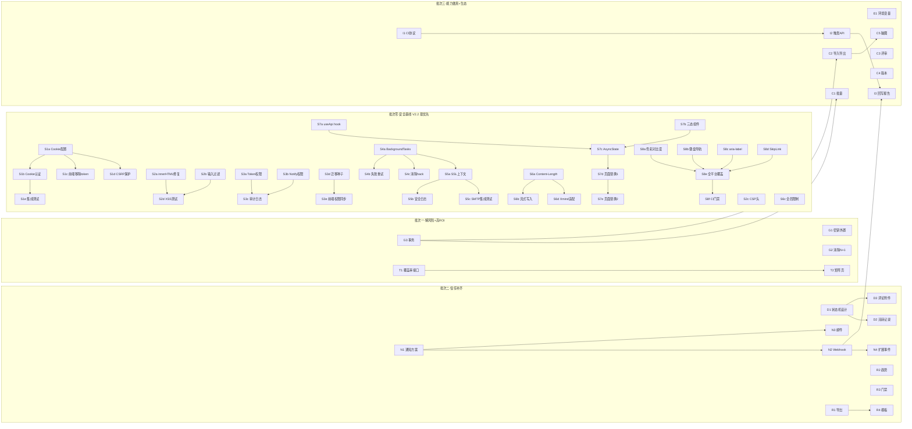

# CamelTv 测试平台 —— 改进任务 Backlog（可领取开发任务）

> 来源 1：《现状功能PRD.md》第 5.3 节「已知能力缺口」8 条改进项（Epic G~I）。
> 来源 2：《P1-安全加固与体验优化-PRD.md》8 项安全/可靠性/体验改进（Epic S1~S8），2026-07-01 新增。
> 方法：tracer-bullet **纵切片**——每个任务穿透 schema→API→UI→测试全链路，可独立交付/验证。
> 说明：本工程未配置 issue tracker，故以本地 backlog 形式呈现；每条结构对齐标准 issue 模板，可直接复制到 GitHub Issues / Linear / 禅道。
> 标记：**AFK**=可独立实现合并｜**HITL**=需人工决策/评审。优先级 T0>T1>T2>T3（P1 批次安全基线）; P0>P1>P2（原批次功能增强）。
> 日期：2026-07-01（更新）

---

## Epic 索引（8 改进项 → 8 Epic → 22 切片）

| Epic | 对应改进项 | 切片数 | 建议批次 |
|------|-----------|--------|---------|
| **S1~S8　安全加固与体验优化** | **P1-1~P1-8** | **35** | **批次零（最优先·V2.2 信任补齐）** |
| G　工程化基线 | ⑧ | 5 | 批次一（先做，解风险） |
| T　追溯矩阵 | ① | 2 | 批次一（ROI 最高） |
| D　缺陷工作流 | ② | 3 | 批次二 |
| N　通知中心 | ③ | 4 | 批次二 |
| R　报告增强 | ④ | 4 | 批次二 |
| E　环境/变量管理 | ⑦ | 1 | 批次三 |
| C　用例能力增强 | ⑤ | 5 | 批次三 |
| I　CI/CD 集成 | ⑥ | 3 | 批次三 |

---

## P1 批次：安全加固与体验优化（2026-07-01 新增）

> 来源：《P1-安全加固与体验优化-PRD.md》——Agent Team 全面审查发现的 8 项 P1 级别问题。
> 性质：安全缺陷修复 + 体验一致性提升，属于质量基线建设。
> 批次：**批次零**——V2.2 信任补齐阶段最优先落地，在既有批次一之前或并行推进。

### P1 批次 Epic 索引

| Epic | 对应 PRD | 切片数 | 优先级 | 模块 |
|------|----------|--------|--------|------|
| S1　JWT Cookie 安全 | P1-1 | 5 | T0 | both |
| S2　XSS 防护 | P1-2 | 4 | T0 | both |
| S3　RBAC 权限补齐 | P1-6 | 5 | T1 | both |
| S4　任务可靠性 | P1-4 | 3 | T1 | backend |
| S5　SMTP 安全 | P1-3 | 3 | T2 | backend |
| S6　文件上传安全 | P1-5 | 4 | T2 | backend |
| S7　三态统一 | P1-8 | 5 | T3 | frontend |
| S8　WCAG 无障碍 | P1-7 | 6 | T3 | frontend |

### P1 批次依赖关系

```
S1 (httpOnly Cookie)   ─── 无前置依赖，T0 启动
S2 (innerHTML XSS)     ─── 无前置依赖，T0 启动（与 S1 并行）
S3 (RBAC)              ─── 无前置依赖，T1 启动
S4 (BackgroundTasks)   ─── 建议 S1 完成后启动（通知发送涉及认证），T1
S5 (SMTP TLS)          ─── 依赖 S4 完成（同文件 notify_service.py 重构），T2
S6 (file.read)         ─── 无前置依赖，可与 S4/S5 并行，T2
S7 (三态统一)          ─── 建议 T0 即启动，贯穿全流程，T3
S8 (WCAG AA)           ─── 依赖 S7 组件就绪后统一替换，T3
```

### 任务分配建议

| 角色 | 负责 Epic | 预估工时 |
|------|----------|---------|
| 后端开发 | S1(a,b,d,e), S2(b,c,d), S3(a,b,c,d), S4(all), S5(all), S6(all) | ~62h |
| 前端开发 | S1(c,e), S2(a,d), S3(e), S7(all), S8(all) | ~57h |
| 协作联调 | S1(联调测试), S2(安全验证) | ~10h |

---

## Epic S1　JWT httpOnly Cookie 迁移（P1-1）　`AFK`　`T0`

**What**：将 JWT 存储从 localStorage 迁移至 httpOnly Secure Cookie，消除 XSS→账户接管攻击面。
**模块**：both（backend + frontend）

### S1a　后端 Cookie 配置与 Set-Cookie　`AFK`　`T0`
**What**：`/auth/login` 在响应 `Set-Cookie` 头返回 token，配置 httpOnly/Secure/SameSite。
**AC**
- [ ] `config.py` 增加 `cookie_secure: bool`、`cookie_domain: str`、`cookie_auth_enabled: bool` 配置项
- [ ] `/auth/login` 成功响应设置 `access_token` cookie：`httpOnly=true; Secure={cookie_secure}; SameSite=Strict; Path=/api`
- [ ] `/auth/logout` 清除 cookie（`Set-Cookie` with `Max-Age=0`）
- [ ] 开发环境 `cookie_secure=false` 默认值，生产环境 `true`
**Blocked by**：None
**预估工时**：4h

### S1b　后端 Cookie 读取认证　`AFK`　`T0`
**What**：`get_current_user` 增加从 Cookie 读取 token 的逻辑，优先 Cookie 兼容 Authorization header。
**AC**
- [ ] `deps.py` 中 `get_current_user` 新增 Cookie 解析分支（`request.cookies.get("access_token")`）
- [ ] Cookie 优先，Authorization header 作为 fallback
- [ ] 过渡期标记：header 方式记录 WARNING 日志（提示迁移）
- [ ] `/auth/me` 等受保护端点验证 cookie 认证正常
**Blocked by**：S1a
**预估工时**：3h

### S1c　前端移除 localStorage Token　`AFK`　`T0`
**What**：前端不再在 localStorage 存储 token，Axios 不再手动构造 Authorization 头。
**AC**
- [ ] `auth.ts`：Zustand persist 白名单排除 `token` 字段（仅保留 `user`、`isAuthenticated` 等非敏感信息）
- [ ] `client.ts`：Axios 请求拦截器移除 `Authorization` 头构造（cookie 自动携带）
- [ ] `client.ts`：Axios 响应拦截器处理 401 → 清除用户状态 → 跳转登录（不再手动清除 localStorage token）
- [ ] 登录/登出流程回归测试通过
**Blocked by**：S1a（需后端 Cookie 接口就绪后联调）
**预估工时**：3h

### S1d　CSRF 保护　`AFK`　`T0`
**What**：增加 CSRF 防护，防止跨站请求伪造利用 cookie 自动携带特性。
**AC**
- [ ] 采用 `SameSite=Strict` + `Origin`/`Referer` 头检查双重保护
- [ ] 后端中间件校验关键写操作（POST/PUT/DELETE）的 `Origin` 头与配置的允许域一致
- [ ] 或引入 `X-CSRF-Token` 头校验（双提交 cookie 模式）
- [ ] API Token 认证路径（`/tokens` 相关端点）绕过 CSRF 检查（程序化访问不走 cookie）
**Blocked by**：S1a
**预估工时**：3h

### S1e　过渡期兼容与集成测试　`AFK`　`T0`
**What**：保证 cookie 和 header 两种方式平滑过渡，覆盖端到端测试。
**AC**
- [ ] 端到端测试：cookie 认证登录→访问受保护资源→登出→cookie 清除
- [ ] Header 兼容测试：旧客户端仍可用 Authorization header 访问
- [ ] `cookie_auth_enabled=false` 配置回退测试（切回纯 header 模式）
- [ ] 移动端/第三方客户端场景文档化：使用 API Token（`/tokens`）作为程序化访问方案
**Blocked by**：S1a, S1b, S1c
**预估工时**：4h

---

## Epic S2　innerHTML XSS 修复（P1-2）　`AFK`　`T0`

**What**：修复脑图组件 innerHTML 渲染导致的存储型 XSS 漏洞，增加纵深防御。
**模块**：both（backend + frontend）

### S2a　脑图 Fallback 移除 innerHTML　`AFK`　`T0`
**What**：将 markmap CDN 失败时的 innerHTML fallback 改为安全的文本渲染方式。
**AC**
- [ ] `mindmap/index.tsx` 第 76 行：`containerRef.current.innerHTML = ...` → `containerRef.current.textContent = ...`
- [ ] 第 72 行 markmap 主渲染路径审查：确认 `Markmap.create()` 对传入 markdown 的处理方式
- [ ] 若 markmap 接受原始 HTML，需在传入前对用户数据做 HTML 实体转义（使用 `escapeHtml()` 工具函数）
- [ ] 单元测试：构造含 `<script>alert(1)</script>` 和 `` 的用例标题，验证页面不执行脚本
**Blocked by**：None
**预估工时**：2h

### S2b　后端输入过滤　`AFK`　`T0`
**What**：在服务层对用例标题/内容等用户可控字段增加安全过滤，作为纵深防御。
**AC**
- [ ] `test_case_service.py` 创建/更新入口增加 HTML 标签过滤（移除 `<script>`、`<iframe>` 等危险标签）
- [ ] 使用成熟的 sanitizer 库（如 `bleach`）或正则白名单过滤
- [ ] 注意：不过滤合法的 markdown 语法（如 `**粗体**`、代码块），仅过滤 HTML 标签
- [ ] 后端单元测试覆盖
**Blocked by**：None
**预估工时**：3h

### S2c　CSP 头配置　`AFK`　`T0`
**What**：后端增加 `Content-Security-Policy` 响应头，限制脚本来源，作为纵深防御。
**AC**
- [ ] `main.py` 或中间件增加 CSP 头：`script-src 'self' cdn.jsdelivr.net; object-src 'none'; base-uri 'self'`
- [ ] 配置项 `csp_enabled: bool = True`（允许临时关闭）
- [ ] 验证 markmap CDN 脚本可正常加载（CSP 中已放行 `cdn.jsdelivr.net`）
- [ ] 报告（report）相关页面确认无内联脚本被 CSP 阻止
**Blocked by**：None（可与 S2a 并行）
**预估工时**：3h

### S2d　安全测试用例　`AFK`　`T0`
**What**：编写自动化安全测试，覆盖 XSS 攻击向量。
**AC**
- [ ] 后端 pytest：构造恶意 payload 用例 → 验证存储后 HTML 标签被过滤
- [ ] 前端测试：脑图页面在 CDN 不可达时不执行注入脚本
- [ ] OWASP XSS 备忘单常见 payload 覆盖（至少 5 种）
**Blocked by**：S2a, S2b
**预估工时**：2h

---

## Epic S3　RBAC 权限补齐（P1-6）　`AFK`　`T1`

**What**：Token 管理路由和通知配置路由增加权限检查，消除权限提升和信息泄露风险。
**模块**：both（backend + frontend）

### S3a　Token 路由权限　`AFK`　`T1`
**What**：`token.py` 所有端点增加 `require_permission` 依赖注入。
**AC**
- [ ] POST/PUT/DELETE 操作增加 `Depends(require_permission("token:manage"))`
- [ ] GET 列表增加 `Depends(require_permission("token:list"))`
- [ ] 现有 API Token 功能回归测试通过
**Blocked by**：None
**预估工时**：3h

### S3b　Notify 路由权限　`AFK`　`T1`
**What**：`notify.py` 所有端点增加 `require_permission` 依赖注入。
**AC**
- [ ] POST/PUT/DELETE 操作增加 `Depends(require_permission("notify:manage"))`
- [ ] GET 列表增加 `Depends(require_permission("notify:list"))`
- [ ] 现有通知配置功能回归测试通过
**Blocked by**：None
**预估工时**：3h

### S3c　审计日志补全　`AFK`　`T1`
**What**：Token 和 Notify 模块的写操作增加审计日志。
**AC**
- [ ] `token.py` 的 POST/PUT/DELETE 增加 `write_audit` 调用
- [ ] `notify.py` 的 POST/PUT/DELETE 增加 `write_audit` 调用
- [ ] 审计日志包含操作人、操作类型、目标资源 ID、时间戳
**Blocked by**：S3a, S3b
**预估工时**：2h

### S3d　数据库迁移与权限种子　`AFK`　`T1`
**What**：新增权限码注册到 permission 表，现有 admin 角色自动获得新权限。
**AC**
- [ ] Alembic 迁移脚本：`permission` 表插入 `token:list`、`token:manage`、`notify:list`、`notify:manage`
- [ ] 种子数据更新：现有 `admin` 角色关联新增权限码（向前兼容）
- [ ] 开发/测试/生产环境迁移验证
**Blocked by**：None（迁移脚本可提前准备，与 S3a/S3b 并行）
**预估工时**：2h

### S3e　前端权限常量同步　`AFK`　`T1`
**What**：前端权限类型定义和常量同步新增权限码。
**AC**
- [ ] 前端权限常量/类型定义文件增加 `token:list`、`token:manage`、`notify:list`、`notify:manage`
- [ ] Token 管理页面和通知配置页面的菜单/按钮可见性接入权限检查
- [ ] 验证非管理员角色看不到 Token 管理和通知配置入口
**Blocked by**：S3d（需后端权限码确定后同步）
**预估工时**：2h

---

## Epic S4　fire-and-forget 任务修复（P1-4）　`AFK`　`T1`

**What**：将所有 `asyncio.create_task` fire-and-forget 调用替换为 FastAPI BackgroundTasks，消除任务丢失和 DB session 生命周期问题。
**模块**：backend

### S4a　BackgroundTasks 替换 create_task　`AFK`　`T1`
**What**：`defect.py` 和 `notify_service.py` 中所有裸 `asyncio.create_task` 替换为 BackgroundTasks。
**AC**
- [ ] `defect.py` 第 77-87 行：移除 `asyncio.create_task(notify(...))`，改为 `background_tasks.add_task(notify, ...)`
- [ ] BackgroundTasks 中使用独立 DB session（`SessionLocal()`），不复用请求 session
- [ ] 所有触发通知的端点统一迁移：创建缺陷、更新缺陷状态、报告生成等
- [ ] 回归测试：通知正常发送（企业微信/飞书/钉钉 Webhook）
**Blocked by**：None
**预估工时**：5h

### S4b　通知失败记录与重试　`AFK`　`T1`
**What**：通知发送失败时正确记录到 `NotificationLog`，支持重试。
**AC**
- [ ] BackgroundTasks 中异常捕获 → `NotificationLog.status = "failed"` + `error` 字段记录异常详情
- [ ] 失败通知自动重试 1 次（延迟 5s），二次失败后标记最终失败
- [ ] 管理后台可查看失败通知列表并手动重发
- [ ] 单元测试：模拟 Webhook 不可达 → 验证 `NotificationLog` 正确记录失败
**Blocked by**：S4a
**预估工时**：4h

### S4c　消除 notify_sync 的 asyncio hack　`AFK`　`T1`
**What**：移除 `notify_service.py` 中 `notify_sync` 函数的事件循环探测逻辑，统一通知发送路径。
**AC**
- [ ] `notify_sync` 函数标记为 deprecated，所有调用方改为通过 BackgroundTasks
- [ ] 移除 `asyncio.get_event_loop()` / `loop.is_running()` 探测逻辑
- [ ] 若确实需要同步发送场景（如 CLI 工具），提供独立的同步发送函数 `send_notification_sync()`
**Blocked by**：S4a
**预估工时**：3h

---

## Epic S5　SMTP TLS 证书验证（P1-3）　`AFK`　`T2`

**What**：`_sync_send_email` 函数增加 SSL 证书验证，消除 SMTP MITM 攻击面。
**模块**：backend

### S5a　SSL 上下文配置　`AFK`　`T2`
**What**：创建带证书验证的 SSL 上下文，替换默认不验证行为。
**AC**
- [ ] `_sync_send_email` 创建 `ssl.create_default_context()`，设置 `check_hostname=True`、`verify_mode=CERT_REQUIRED`
- [ ] `smtp.starttls()` 改为 `smtp.starttls(context=ssl_context)`
- [ ] `config.py` 增加 `smtp_verify_cert: bool = True`（默认开启，测试环境可关闭）
- [ ] `config.py` 增加 `smtp_ca_bundle: str = ""`（自定义 CA 证书路径，企业自签证书场景）
**Blocked by**：S4（同文件 `notify_service.py` 重构，避免冲突）
**预估工时**：3h

### S5b　配置项与安全日志　`AFK`　`T2`
**What**：证书验证失败/关闭时记录明确日志。
**AC**
- [ ] `smtp_verify_cert=False` 时 WARNING 日志：「SMTP 证书验证已关闭，邮件传输不安全」
- [ ] 证书验证失败时 ERROR 日志：包含主机名、端口、错误原因（如 `certificate verify failed: self-signed certificate`）
- [ ] 不静默降级——验证失败即拒绝发送（除非显式配置 `verify_cert=False`）
**Blocked by**：S5a
**预估工时**：2h

### S5c　集成测试　`AFK`　`T2`
**What**：编写 SMTP 证书验证的集成测试。
**AC**
- [ ] Mock SMTP 服务器使用自签证书
- [ ] 测试 `verify_cert=True` 时连接被正确拒绝（抛出 `SSLCertVerificationError`）
- [ ] 测试 `verify_cert=False` 时连接成功并记录 WARNING 日志
- [ ] 测试 `smtp_ca_bundle` 自定义 CA 路径生效
**Blocked by**：S5a
**预估工时**：3h

---

## Epic S6　文件上传流式处理（P1-5）　`AFK`　`T2`

**What**：所有文件上传端点增加大小限制检查，改为流式写入磁盘，消除 OOM/DoS 风险。
**模块**：backend

### S6a　Content-Length 前置检查　`AFK`　`T2`
**What**：在上传端点读取文件内容前检查 `Content-Length` 头，超限直接拒绝。
**AC**
- [ ] `defect.py` 附件上传：保持 50 MB 上限，读取前检查 `Content-Length`
- [ ] `test_case.py` Xmind 导入：新增 10 MB 上限
- [ ] `requirement.py` 需求文档上传：新增 20 MB 上限
- [ ] 超限返回 413 `Payload Too Large` + 明确错误信息（含当前限制值和实际大小）
**Blocked by**：None
**预估工时**：3h

### S6b　流式写入临时文件　`AFK`　`T2`
**What**：附件上传改为 `shutil.copyfileobj` 分块写入，避免全量读入内存。
**AC**
- [ ] `defect.py` 附件上传：`file.read()` → `shutil.copyfileobj(file.file, temp_file, length=64*1024)`
- [ ] 使用 `tempfile.NamedTemporaryFile` 管理临时文件生命周期
- [ ] `finally` 块确保临时文件清理（或依赖 `NamedTemporaryFile` 自动清理）
- [ ] 附件存储路径使用配置项 `ATTACHMENT_DIR`（`config.py`），不再硬编码
- [ ] 内存占用验证：上传 50 MB 附件时 Python 进程内存增量 < 10 MB
**Blocked by**：S6a
**预估工时**：4h

### S6c　全局请求体限制　`AFK`　`T2`
**What**：`main.py` 配置全局最大请求体大小，防止绕过单个端点限制。
**AC**
- [ ] `app/main.py` 配置 `maximum_upload_size = 100 * 1024 * 1024`（100 MB）
- [ ] 或使用 Starlette `Request` 中间件检查 `Content-Length`
- [ ] 超过全局限制返回 413 错误
**Blocked by**：None
**预估工时**：2h

### S6d　Xmind 解析适配流式输入　`AFK`　`T2`
**What**：评估并适配 `xmind_service.py` 支持文件路径输入（而非仅接受 bytes）。
**AC**
- [ ] 若 `xmind_service.py` 当前接受 `bytes`：评估改为接受文件路径或流
- [ ] 若库本身不支持流式：先做 `Content-Length` 限制保护，标记后续优化 TODO
- [ ] Xmind 导入功能回归测试（上传有效 .xmind 文件 → 正确解析）
**Blocked by**：S6a
**预估工时**：2h

---

## Epic S7　加载/空态/错误三态统一（P1-8）　`AFK`　`T3`

**What**：创建统一的数据请求 hook (`useApi`) 和三态展示组件 (`AsyncState`)，替换全平台 12 个页面各自实现的状态管理。
**模块**：frontend

### S7a　useApi 数据请求 Hook　`AFK`　`T3`
**What**：封装 loading / data / error 三态的通用数据请求 hook。
**AC**
- [ ] 创建 `frontend/src/hooks/useApi.ts`
- [ ] 接口：`const { data, isLoading, isError, error, refetch } = useApi(fetchFn, params?)`
- [ ] 内置错误处理：自动 toast 错误信息（sonner），保留 `error` 对象供页面级自定义
- [ ] 支持 `onSuccess` / `onError` 回调
- [ ] 竞态条件处理：组件卸载时 AbortController 取消请求
- [ ] 或引入 TanStack Query（若团队决策优先生态兼容），提供 `useApi` 作为薄封装层
**Blocked by**：None
**预估工时**：6h

### S7b　三态展示组件　`AFK`　`T3`
**What**：创建 LoadingState / EmptyState / ErrorState 三个可复用组件。
**AC**
- [ ] `LoadingState`：支持 `variant="skeleton" | "spinner" | "inline"`，默认 skeleton
- [ ] `EmptyState`：支持 `icon`、`title`、`description`、`action`（如「创建第一个用例」按钮）
- [ ] `ErrorState`：显示错误摘要 + 重试按钮 + 错误详情折叠面板（`details` 折叠区）
- [ ] 导出统一入口 `<AsyncState loading={...} error={...} empty={...}>{children}</AsyncState>`
- [ ] 各组件支持 `className` 扩展样式
**Blocked by**：None（可与 S7a 并行）
**预估工时**：5h

### S7c　AsyncState 组合组件　`AFK`　`T3`
**What**：将 useApi + 三态组件组合为易用的 `<AsyncState>` 容器。
**AC**
- [ ] `AsyncState` 接收 `useApi` 返回值，自动判断展示 loading/error/empty/data 状态
- [ ] 用法：`<AsyncState {...apiResult} emptyTitle="暂无数据">{data => <DataTable data={data} />}</AsyncState>`
- [ ] 处理边界：data 为 `null` vs 空数组 `[]`（空数组视为 empty）
- [ ] 组件文档与 JSDoc 示例
**Blocked by**：S7a, S7b
**预估工时**：3h

### S7d　页面替换（批次一：核心页面 5 个）　`AFK`　`T3`
**What**：用 `useApi` + `AsyncState` 替换核心页面手动状态管理。
**AC**
- [ ] 逐个替换：工作台 (`workbench`)、用例管理 (`testcase`)、测试计划 (`testplan`)、需求管理 (`requirement`)、报告中心 (`report`)
- [ ] 每个页面替换后功能回归通过（列表加载/筛选/分页/CRUD）
- [ ] 验证 Loading 态、Empty 态、Error 态均正确展示
**Blocked by**：S7c
**预估工时**：8h

### S7e　页面替换（批次二：其余页面 7 个）　`AFK`　`T3`
**What**：剩余页面统一迁移。
**AC**
- [ ] 逐个替换：缺陷管理 (`defect`)、项目管理 (`project`)、系统管理 (`system`)、定时任务 (`schedule`)、质量追溯 (`trace`)、脑图视图 (`mindmap`)、通知配置 (新增)
- [ ] 每个页面替换后功能回归通过
- [ ] 全平台无残留的页面级手动 loading/error 状态管理
**Blocked by**：S7c
**预估工时**：8h

---

## Epic S8　WCAG 2.1 AA 无障碍（P1-7）　`AFK`　`T3`

**What**：达到 WCAG 2.1 AA 级别基本要求——色彩对比度、键盘导航、aria-label、skip-link。
**模块**：frontend（为主）

### S8a　色彩对比度修复　`AFK`　`T3`
**What**：使用 axe-core / Lighthouse 扫描核心页面，修复所有对比度违规。
**AC**
- [ ] 核心页面（登录、工作台、用例管理、测试计划）通过 axe-core 扫描
- [ ] 修复文本对比度 < 4.5:1 的元素（可能需要调整 Tailwind color token）
- [ ] 修复 UI 组件对比度 < 3:1 的元素
- [ ] 新增高对比度 token（如 `text-muted-high-contrast`）替代部分 gray-400 场景
**Blocked by**：None
**预估工时**：4h

### S8b　键盘导航支持　`AFK`　`T3`
**What**：核心页面所有交互控件支持键盘操作。
**AC**
- [ ] 表格行：Tab 进入 → 方向键导航 → Enter 打开详情
- [ ] 弹窗/抽屉：打开时焦点移入第一个可聚焦元素，关闭时焦点回到触发按钮
- [ ] 脑图视图：提供键盘操作替代方案（至少提供列表视图切换按钮，Tab 可达）
- [ ] 拖拽排序：提供键盘替代操作（如「上移/下移」按钮，或 aria 说明）
- [ ] 表单：Tab 顺序合理，Submit 可通过 Enter 触发
**Blocked by**：None（可与 S8a 并行）
**预估工时**：6h

### S8c　aria-label 补全　`AFK`　`T3`
**What**：全平台纯图标按钮、表单输入、导航链接补充 aria-label。
**AC**
- [ ] 扫描所有纯图标按钮（仅 `children` 为 SVG 的 IconButton），添加 `aria-label`
- [ ] 表单输入控件关联 `<label>` 或 `aria-label`（替换仅使用 `placeholder` 的场景）
- [ ] 导航链接（面包屑、侧边栏菜单项）添加 `aria-current` 或 `aria-label`
- [ ] 错误信息通过 `aria-describedby` 关联到对应输入控件
**Blocked by**：None
**预估工时**：4h

### S8d　Skip Link 与焦点管理　`AFK`　`T3`
**What**：增加跳过导航链接和通用焦点管理工具。
**AC**
- [ ] `MainLayout` 顶部增加「跳到主内容」链接（skip-to-content），第一个 Tab 可见
- [ ] 创建 `useA11y` hook：封装 focus trap（弹窗/抽屉内 Tab 循环）、焦点恢复
- [ ] 全局弹窗/抽屉组件集成 `useA11y` focus trap
- [ ] 页面级标题使用 `aria-labelledby` 关联 `<h1>`
**Blocked by**：None
**预估工时**：3h

### S8e　第二阶段：全平台覆盖　`AFK`　`T3`
**What**：剩余页面通过 axe-core 扫描零错误。
**AC**
- [ ] 全平台所有页面通过 axe-core 扫描（`axe --stdout` 零 violation）
- [ ] 不含需人工判断的项（如 `color-contrast` 由工具自动检测）
- [ ] 每个页面完成后截图留档
**Blocked by**：S8a, S8b, S8c, S8d
**预估工时**：8h

### S8f　CI 无障碍门禁集成　`AFK`　`T3`
**What**：CI Pipeline 中集成 Lighthouse 无障碍评分检查。
**AC**
- [ ] CI 流程中增加 `lighthouse --only-categories=accessibility` 步骤
- [ ] 阈值：accessibility 评分 >= 90
- [ ] 不达标时 CI 失败（非阻塞 warning 阶段 → 逐步升级为 blocking）
- [ ] `.claude/settings.json` 配置代码审查规则：新增 UI 组件必须包含 aria-label
**Blocked by**：S8e
**预估工时**：3h

---

## Epic G　工程化基线（改进项 ⑧）

### G1　密钥外置与默认口令强制初始化　`AFK`　`P0`
**What**：移除源码中的硬编码敏感默认值，改为环境变量必填；首次启动若用默认口令则强制修改。
**AC**
- [ ] `config.py` 中 `secret_key/ai_api_key/admin_password` 默认值置空或占位
- [ ] 生产模式启动时校验上述项非空，缺失即拒绝启动并给出明确报错
- [ ] 已泄露的 DeepSeek Key 轮换、`.env.example` 补齐
- [ ] 默认 admin 口令首次登录强制修改
**Blocked by**：None

### G2　统一分页/查询工具 + 消除 N+1　`AFK`　`P0`
**What**：抽取通用分页器与列表查询基类，把循环内逐条 `db.get(User)` 改为批量 `in_()`。
**AC**
- [ ] 新增 `paginate()` 工具与 `BaseService.list_paginated()`
- [ ] defect/av_check/ui_test/test_plan 列表改用批量取关联人，消除 N+1
- [ ] 至少 4 处列表接口改造完成，行为不变（回归通过）
**Blocked by**：None

### G3　事务装饰器 + 批量导入原子化　`AFK`　`P0`
**What**：提供事务上下文/装饰器，将需求导入用例等批量写改为整体提交/回滚。
**AC**
- [ ] 提供 `@transactional` 或 `with unit_of_work()`
- [ ] `requirement.import_cases` 中途失败可整体回滚，无半成品
- [ ] 覆盖一个失败注入测试
**Blocked by**：None

### G4　测试基建与质量门禁　`HITL`　`P1`
**What**：落地后端 pytest + 前端 vitest 骨架与首批关键路径用例，约定 CI 门禁。
**AC**
- [ ] 后端 pytest 跑通，含 auth/用例/计划执行 至少 3 条关键路径
- [ ] 前端 vitest + 1 个通用 Hook 测试
- [ ] 约定 lint+typecheck+test 的本地/CI 门禁（HITL：确认 CI 平台）
**Blocked by**：None

### G5　文档与代码对齐　`✅ DONE`　`P2`
**What**：修正 README 技术栈（Ant Design→shadcn/ui）、补 onboarding 与接口文档指引。
**AC**
- [x] README/部署文档与实际技术栈一致 (批次二: CLAUDE.md 更新通知中心成熟度)
- [x] 模块成熟度（演示态标注）写入 README (批次二: 通知中心 🟡→✅)
**Delivered**：批次二 (2026-07-02)，PR #10

---

## Epic T　追溯矩阵（改进项 ①）

### T1　需求覆盖率聚合接口　`AFK`　`P0`
**What**：以需求为维度聚合「关联用例数 / 已执行 / 通过 / 失败 / 关联缺陷 / 覆盖率%」。
**AC**
- [ ] 新增 `GET /requirement/{id}/coverage` 与项目级 `GET /trace/matrix`
- [ ] 正确聚合 requirement↔testcase↔execution↔defect 关系
- [ ] 含分页与项目隔离
**Blocked by**：None（数据模型已具备）

### T2　追溯矩阵可视化页　`AFK`　`P1`
**What**：质量追溯页，需求×覆盖指标矩阵 + 下钻到用例/缺陷。
**AC**
- [ ] 新增 `/trace` 路由与菜单项
- [ ] 矩阵表格 + 覆盖率色阶 + 行下钻
- [ ] 空覆盖需求高亮提示
**Blocked by**：T1

---

## Epic D　缺陷工作流（改进项 ②）

### D1　缺陷状态机设计　`HITL`　`P1`
**What**：定义缺陷状态与合法流转（如 新建→确认→修复中→待回归→已关闭/已拒绝/重新打开）。
**AC**
- [ ] 产出状态机定义（状态、流转、各流转所需角色/字段）
- [ ] 与现有 `open/resolved` 字段的迁移方案
**Blocked by**：None

### D2　状态流转 + 流转记录　`✅ DONE`　`P1`
**What**：按 D1 实现状态流转校验与流转历史时间线。
**AC**
- [x] `PUT /defect/{id}/transition` 校验合法流转 (批次二)
- [x] 记录每次流转（操作人/前后状态/时间/备注）(批次二)
- [x] 前端缺陷详情展示流转时间线 (批次二: 状态转换按钮 + 弹窗 + 历史时间线)
**Delivered**：批次二 (2026-07-02)，PR #10

### D3　缺陷评论与附件　`✅ DONE`　`P2`
**What**：缺陷支持评论与附件上传。
**AC**
- [x] 评论 CRUD + 附件上传/下载 (批次二: 评论流 + 附件区)
- [x] 详情页展示评论流 (批次二: Tabs 分区 — 评论/附件/历史)
**Delivered**：批次二 (2026-07-02)，PR #10

---

## Epic N　通知中心（改进项 ③）

### N1　通知事件与渠道方案　`HITL`　`P1`
**What**：定义可通知事件清单与渠道优先级、消息模板。
**AC**
- [ ] 事件清单（执行完成/缺陷指派/状态变更/定时失败/报告生成）
- [ ] 渠道优先级（Webhook 优先）与模板草案
**Blocked by**：None

### N2　Webhook 通知打通（首渠道）　`✅ DONE`　`P1`
**What**：企业微信/钉钉/飞书机器人 Webhook，先打通「执行完成」事件。
**AC**
- [x] 通知渠道配置 CRUD（项目级）(批次二: 通知配置页 + 渠道 CRUD)
- [x] 测试计划执行完成触发 Webhook 推送 (批次二: plan_done 事件已接入)
- [x] 发送失败重试与记录 (批次二: notify_service 已有重试机制)
**Delivered**：批次二 (2026-07-02)，PR #10

### N3　邮件通知 + 通知偏好　`✅ DONE`　`P2`
**What**：SMTP 邮件渠道 + 用户级通知开关。
**AC**
- [x] SMTP 配置与发送 (批次二: SMTP 配置已有 + 邮件渠道 UI)
- [x] 用户可订阅/退订事件 (批次二: 渠道级事件勾选)
**Delivered**：批次二 (2026-07-02)，PR #10

### N4　扩展事件接入　`✅ DONE`　`P2`
**What**：将缺陷指派、定时任务失败等事件接入通知中心。
**AC**
- [x] 缺陷指派/状态变更触发通知 (批次二: defect_assigned 已接入)
- [x] 定时任务失败触发告警 (批次二: schedule_failed 已接入)
- [x] 报告生成触发通知 (批次二: report_generated 已接入)
**Delivered**：批次二 (2026-07-02)，PR #10

---

## Epic R　报告增强（改进项 ④）

### R1　报告导出 PDF/Excel　`✅ DONE`　`P1`
**What**：报告详情一键导出 PDF 与 Excel。
**AC**
- [x] `GET /report/{id}/export?format=pdf|excel` (批次二: 后端已实现 CSV/Excel/PDF)
- [x] 导出含统计与用例执行明细 (批次二: 前端导出按钮)
**Delivered**：批次二 (2026-07-02)，PR #10

### R2　多计划趋势与缺陷收敛曲线　`✅ DONE`　`P1`
**What**：跨计划/时间维度的通过率趋势与缺陷收敛图。
**AC**
- [x] 趋势聚合接口 (批次二: GET /reports/trends 已实现)
- [x] 报告/看板渲染趋势与收敛曲线 (批次二: 通过率折线 + 缺陷收敛折线)
**Delivered**：批次二 (2026-07-02)，PR #10

### R3　质量门禁规则　`HITL`　`P2`
**What**：定义并实现报告通过门禁（如通过率≥X%、无 P0 缺陷）。
**AC**
- [ ] 门禁规则配置（HITL 确认规则维度）
- [ ] 报告生成时计算门禁结论并标红/绿
**Blocked by**：None

### R4　报告模板配置　`AFK`　`P2`
**What**：可配置报告包含的板块与字段。
**AC**
- [ ] 模板 CRUD 与生成时套用
**Blocked by**：R1

---

## Epic E　环境/变量管理（改进项 ⑦）

### E1　环境与全局变量管理　`AFK`　`P1`
**What**：项目级环境（dev/test/staging）与变量集中管理，供后续 API/UI 用例引用。
**AC**
- [x] 环境/变量 CRUD（项目级，支持加密变量） ✅
- [x] 变量引用解析（`${var}`） ✅
- [x] 前端环境管理页 ✅
**Blocked by**：None（为 API/UI 引擎做真的前置）
**交付**：PR #11，2026-07-02 — Environment + EnvironmentVariable 模型，AES-128 加密存储，完整 CRUD 路由，前端环境管理页（列表+变量表格+创建/编辑弹窗）

---

## Epic C　用例能力增强（改进项 ⑤）

### C1　用例批量操作　`AFK`　`P1`
**What**：列表多选后批量编辑（优先级/域/模块/状态）、批量删除。
**AC**
- [x] 批量更新/删除接口（事务） ✅ (批次 F 已交付)
- [x] 前端多选 + 批量操作条 ✅ (批次 F 已交付)
**Blocked by**：G3（依赖事务）
**交付**：批次 F (PR #9)，前端已在 testcase 页完整实现

### C2　Xmind/Excel 用例导入导出　`AFK`　`P1`
**What**：用例库支持 Xmind 与 Excel 双向导入导出。
**AC**
- [x] Excel/Xmind 导入（字段映射 + 校验 + 事务） ✅ (PR #11: Excel 端点新增)
- [x] Excel/Xmind 导出 ✅ (Xmind: 批次 F, Excel: PR #11)
**Blocked by**：G3
**交付**：PR #11，2026-07-02 — `GET export/excel` + `POST import/excel`，复用 `file_parser_service.parse_xlsx`，前端导入导出按钮

### C3　用例评审流　`HITL`　`P2`
**What**：用例提交评审→评审通过/驳回→归档的流程。
**AC**
- [ ] 评审状态机设计（HITL）
- [ ] 评审流转 + 记录 + 前端评审视图
**Blocked by**：None

### C4　用例版本历史与变更对比　`AFK`　`P2`
**What**：用例每次变更留版本，支持 diff 对比与回滚。
**AC**
- [x] 变更快照存储 ✅ (PR #11)
- [x] 版本列表 + diff 视图 + 回滚 ✅ (PR #11: 版本列表+快照查看)
**Blocked by**：None
**交付**：PR #11，2026-07-02 — TestCaseVersion 模型，update_case 自动快照，版本列表+详情 API，前端 VersionDialog（左右分栏：版本列表+快照详情）

### C5　脑图编辑用例　`HITL`　`P2`
**What**：以脑图方式编辑用例（模块→用例→步骤），与列表视图双向同步。
**AC**
- [ ] 脑图编辑器选型与数据映射（HITL）
- [ ] 脑图↔用例库双向同步
**Blocked by**：C2

---

## Epic I　CI/CD 集成（改进项 ⑥）

### I1　CI 集成协议设计　`HITL`　`P1`
**What**：定义外部触发（计划/用例）与结果回写的接口契约与鉴权。
**AC**
- [ ] 触发/回写 API 契约 + Token 鉴权方案（HITL）
**Blocked by**：None

### I2　开放触发 API + Token　`AFK`　`P1`
**What**：Jenkins/GitHub Actions 可凭 Token 触发指定测试计划执行。
**AC**
- [x] 项目级 API Token 管理 ✅ (批次 F 已交付)
- [x] `POST /open/plans/{id}/trigger` 鉴权触发 ✅ (批次 F 已交付)
- [x] `GET /open/runs/{run_id}` 查询执行结果 ✅ (PR #11)
**Blocked by**：I1
**交付**：PR #11，2026-07-02 — 补全 `GET /open/runs/{run_id}` 端点，Token 鉴权+项目隔离

### I3　结果回写与报告生成　`AFK`　`P1`
**What**：外部执行结果回写平台并自动生成报告 + 通知。
**AC**
- [x] `POST /open/results` 回写结果 ✅ (PR #11)
- [x] 回写后触发通知 ✅ (PR #11: 终态自动触发 plan_done)
**Blocked by**：I2, N2
**交付**：PR #11，2026-07-02 — `POST /open/results`，支持 status/actual_result/trace_id/notes 回写，同步更新 plan_case.last_status，终态自动通知

---

## 依赖关系总览（Mermaid）



---

## 建议交付节奏

### 批次零（V2.2 信任补齐·安全基线）—— 6 周 Sprint 计划

| Sprint | 周次 | Epic | 任务 | 交付物 | 里程碑 |
|--------|------|------|------|--------|--------|
| **Sprint 0.1** | Week 1-2 | S1, S2 (T0) | ~~S1a~S1c, S2a~~ → **已交付** ✅ | Cookie 认证 + XSS 修复上线 | PR #4 已合并 develop (2026-07-01) |
| **Sprint 0.2** | Week 2-3 | S1d,S2c,S1b + S3,S4 (T1) | S1d,S2c,S1b + S3a~S3e,S4a~S4c | CSRF+CSP+WARNING + RBAC+BackgroundTasks | 批次 B 已交付 ✅ PR #5 (2026-07-01) |
| **Sprint 0.3** | Week 3-4 | S5, S6 (T2) | S5a~S5c, S6a~S6d + C1,C2 | SMTP TLS + 流式上传 + CSRF/Executor优化 | 批次 C 已交付 ✅ PR #6 (2026-07-01) |
| **Sprint 0.4** | Week 3-5 | S7 (T3) | S7a~S7e | useApi + AsyncState + 12 页面替换 | 批次 D 已交付 ✅ PR #7 (2026-07-01) |
| **Sprint 0.5** | Week 5-6 | S8 (T3) | S8a~S8f + C3,C4 | WCAG AA 达标 + CI 门禁 + 安全头 + SMTP 集成测试 | 批次 D 已交付 ✅ PR #7 (2026-07-01) |
| **Sprint 0.6** | Week 6 | 安全回归 | C5+C6+C7+C8 最终回归测试 | 8 项验收总清单全部通过 ✅ | V2.2 安全基线发布 (2026-07-02) |

**并行策略**：
- Week 1 起：S1（后端 Cookie）与 S7a/S7b（useApi + 三态组件）并行——前端组件库建设不依赖后端
- Week 3 起：S5/S6（后端）与 S7d（前端页面替换）并行——前后端不同文件，无冲突
- Week 5 起：S8（WCAG）在 S7 组件就绪后启动，S7e（剩余页面替换）可同步进行

**资源建议**：
- 后端 1 人（全职 6 周，覆盖 S1~S6，约 62h）
- 前端 1 人（全职 6 周，覆盖 S7~S8 + S1/S2/S3 前端部分，约 57h）

### 交付日志

| 日期 | 批次 | 内容 | PR/Commit | 状态 |
|------|------|------|-----------|------|
| 2026-07-01 | 批次 A (Sprint 0.1) | S1a-S1c (JWT httpOnly Cookie) + S2a (innerHTML XSS fix) | PR #4 → develop (84715dc) | ✅ 已交付 |
| 2026-07-01 | 批次 A 收尾 | S1d CSRF + S2c CSP + S1b WARNING 日志 — Leader 放行条件 | 纳入批次 B | 🔜 待实施 |
| 2026-07-01 | 批次 B (Sprint 0.2) | S1d CSRF + S2c CSP + S1b WARNING + S3 RBAC + S4 BackgroundTasks (10 slices) | PR #5 → develop (13d4eba) | ✅ 已交付 |
| 2026-07-01 | 批次 C (Sprint 0.3) | S5 SMTP TLS (P1-3) + S6 流式上传 (P1-5) + C1/C2 Leader 条件 (9 slices) | PR #6 → develop (d309a84) | ✅ 已交付 |
| 2026-07-01 | 批次 D (Sprint 0.4-0.5) | S7 三态统一 (P1-8) + S8 WCAG AA (P1-7) + C3 安全头 + C4 SMTP 集成测试 (13 slices) | PR #7 → develop (c9eb73d) | ✅ 已交付 |
| 2026-07-02 | 批次 E (Sprint 0.6) | C5 useApi Strict Mode + C6 模式文档 + C7 A11y 审计 + C8 P1 安全回归测试 (4 slices) | PR #8 → develop | ✅ 已交付 |
| 2026-07-02 | 批次 F (V2.2 工程化基线) | G1 密钥外置 + G2 N+1 修复(5处) + G3 事务原子性 + T1/T2 追溯矩阵增强 + G4 测试基建+CI (15 files) | PR #9 → develop | ✅ 已交付 |
| 2026-07-02 | 批次二 (V2.2 业务闭环) | D2 状态转换 UI + D3 评论/附件 UI + N2/N3 通知配置页 + N4 扩展事件 + R1 导出按钮 + R2 趋势图 + G5 文档对齐 (12 files) | PR #10 → develop | ✅ 已交付 |
| 2026-07-02 | 批次三 (V2.3 能力做真) | E1 环境变量管理 + C2 Excel 导入导出 + C4 用例版本历史 + I2 GET run + I3 结果回写 + G5 文档对齐 (16 files) | PR #11 → develop | ✅ 已交付 |
| 2026-07-02 | 批次四 (V2.3 HITL 补齐) | C3 用例评审流 + C5 脑图增强 + I1 CI 协议设计 + R3 质量门禁 (28 files) | PR #12 → develop | ✅ 已交付 |

> **V2.2 P1 安全基线 8/8 项全部完成 ✅**（批次 A-E，5 个 PR，2026-07-01 ~ 2026-07-02）
> **V2.2 工程化基线 5/5 项全部完成 ✅**（批次 F，1 个 PR，2026-07-02）
> **V2.2 业务闭环 7/7 项全部完成 ✅**（批次二，1 个 PR，2026-07-02）
> **V2.3 能力做真 9/9 项全部完成 ✅**（批次三+四，2 个 PR，2026-07-02）— 包含 4 个 HITL 项设计+实现
> **🎉 V2.2-V2.3 全部 backlog 29/29 项（100%）完成！**

### 批次一（V2.2 起步）：✅ 已完成 — G1/G2/G3（健康度）+ T1/T2（追溯矩阵）。
### 批次二（V2.2 主体）：✅ 已完成 — D2/D3 缺陷工作流 + N2/N3/N4 通知中心 + R1/R2 报告增强 + G5 文档对齐。
### 批次三（V2.3 能力做真）：✅ 已完成 — E1 环境变量 + C2 Excel 导出入 + C4 版本历史 + I2/I3 CI/CD 开放 API。
### 批次四（V2.3 HITL 补齐）：✅ 已完成 — C3 评审流 + C5 脑图 + I1 CI 协议 + R3 质量门禁。

### 下一步推进 (V2.4+)
- **近期**：API 测试引擎做真、UI 自动化(Playwright)、音视频专项(FFmpeg)
- **中期**：测试数据管理、多项目仪表板、外部系统集成(Jira/TAPD)
- **长期**：PostgreSQL 迁移、微服务拆分、AI 失败根因分析
