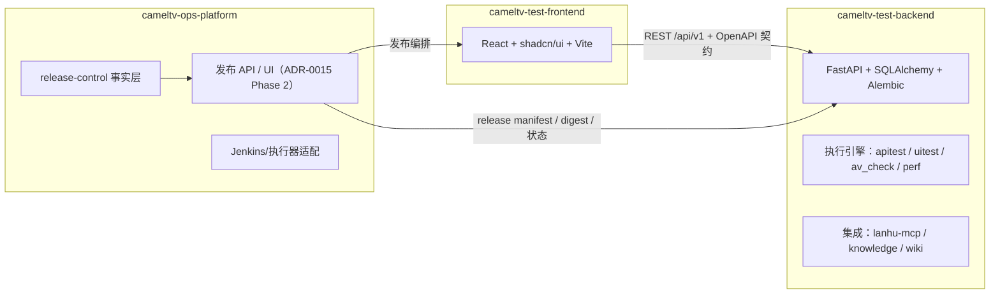

# Batch 64 — Design Spec（架构解析与仓库拆分基线）

> **Design (🎨)** | Date: 2026-08-02 | Status: 已验收（无 UI 变更）

## 0. 技术体系确认

- 本批**无前端/后端业务代码变更**，`cameltv-ui-conventions` 走查不适用（无组件/页面改动）；走查对象为**文档结构与边界清单契约**。
- 目标技术栈不变：后端 FastAPI + SQLAlchemy + Alembic；前端 React + shadcn/ui + Vite；运维平台按 ADR-0015 复用 `deploy/release-control` 事实层。

## 1. 目标架构（三仓分离，ADR-0016）

- 契约事实源：FastAPI `/openapi.json`（后端仓 CI 导出）→ 前端 `npm run gen:api` 生成 TS 类型。
- 版本模型：三仓各自 SemVer；对外产品版本以蓝湖「更新日志」手写版本为准；发布单元统一进 `release manifest`（ADR-0015 §4.1）。
- 依赖归属：`lanhu-mcp`（子模块）→ 后端仓；`tests/`（测试资产）→ 共享资产仓/目录；`deploy/` → 运维平台仓。

## 2. 仓库边界清单契约（repo-boundaries.json）

| 字段 | 类型 | 规则 |
|------|------|------|
| `schema_version` | int | 必须 = 1 |
| `description` | str | 清单用途说明 |
| `repositories` | object | 仓库名 → {description, paths[], rules[]} |
| `paths[]` | string[] | 相对仓库根路径；最长前缀优先；必须存在；跨仓不允许精确重复 |
| `rules[]` | string[] | 该仓约束（CI/人工核对用） |

- 归属语义：**最长前缀优先**（如 `test-platform-v2/frontend` 覆盖其下所有路径，但 `.../src/api/opsReleases.ts` 归属更具体的 `ops-platform`）。
- 校验器 `scripts/repo-split/validate_repo_boundaries.py`：
  - `--check`：基于 `git ls-files` 枚举已跟踪文件（无 git 时回退 os.walk + 排除清单），逐文件解析归属；任何无主路径/重复归属/schema 错误 → 非零退出。
  - `--selftest`：内置 6 组断言（有效/无效 schema、缺失路径、无主文件、精确重复、嵌套覆盖、未知仓库引用）。
  - 输出：仓库覆盖统计 + 未覆盖路径清单（上限 50 条，防刷屏）。

## 3. 文档结构规范

| 文档 | 目录 | 元数据（document-standards） |
|------|------|------|
| 架构解析报告 | `docs/architecture/batch-64-architecture-analysis.md` | title/owner/last_reviewed/status/expires/tags/related |
| 拆分决策 | `docs/adr/0016-three-repository-separation.md` | 遵循 ADR template |
| 生产交付清单 | `docs/production-delivery/生产环境交付清单.md` | title/owner/访问级别/更新日期 |
| 边界清单 | 仓库根 `repo-boundaries.json` | schema_version + description |

## 4. 设计 QA 走查发现

### ⚪ P3-01 根目录存在意外跟踪文件
`pective pipeline — Agent Team work-logs + 10 TypeScript fixes + domain CRUD API`（含尾随字符副本）为历史误提交产物（内容为 less/vim 会话残留）。本批不删除（对齐「死资产独立审计」规则），边界清单将其归入 `shared` 并标注待清理 → **建议**：batch-65 独立审计删除。

### ⚪ P3-02 V1 端口冲突文档过时
`docs/common-pitfalls.md` §4.3 仍称 v1/v2 前端均为 5173、后端 8000 —— 与 `docs/测试平台全功能验收文档-环境链接与账号汇总.md` §2.1 一致，无需变更；仅提示后续 V1 退役后可删除该节。

### ⚪ P3-03 生产清单来源分散
域名/数据库信息散布 5+ 文档 → 本批以 `docs/production-delivery/生产环境交付清单.md` 收敛，并在原文档中保留交叉引用（不删除原文档）。

## 5. 设计签核

**结论**：通过。无 P0/P1 阻断项；P3 项已纳入 C64 条件或后续批次跟踪。
