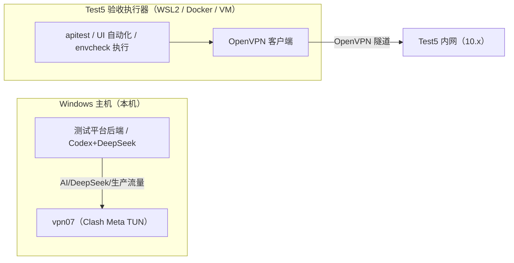

# Batch 65 — Design Spec（Test5 验收执行器隔离）

> **Design (🎨)** | Date: 2026-08-02 | Status: 已验收（无 UI 变更，走查对象为方案设计）

## 0. 技术体系确认

- 本批无前端/后端业务代码变更；`cameltv-ui-conventions` 不适用。
- 方案基于现有事实：vpn07 = Clash Meta（Mihomo）TUN 模式（fake-ip DNS 198.18.0.2）；
  Test5 = OpenVPN（TAP 10.7.7.3/24，10/8 网段）；batch-64 实测路由分流可共存但维护成本高。

## 1. 目标拓扑：网络域隔离



- **原则**：主机只负责 AI 与平台（vpn07 全局常开）；Test5 流量只出现在执行器网络栈内。
- 执行器与主机的交互仅限：共享工作目录 / 产物回传 / 控制面指令（ADR-0015 执行器契约），不共享网络隧道。

## 2. 执行器形态选型

| 形态 | 优点 | 缺点 | 结论 |
|------|------|------|------|
| WSL2（推荐起点） | 已有；Linux 工具链齐全；成本低 | tun 设备需确认（`/dev/net/tun`）；WSL2 NAT 可能受 Clash 影响 | 首选，batch-66 实测 |
| Docker Desktop（WSL2 后端） | 环境可复现、可打包 | 网络模式需 host/NAT 取舍 | 备选，适合固化执行器镜像 |
| 独立 VM（Hyper-V） | 网络栈完全独立 | 资源占用高、维护成本高 | 兜底，若 WSL/容器受 Clash 干扰 |

## 3. 关键网络设计

1. **WSL2 模式**：优先尝试 **mirrored 网络模式**（Windows 11 22H2+，`.wslconfig` 设 `networkingMode=mirrored`）；
   若不可用则 NAT 模式 + 执行器内独立 OpenVPN。
2. **tun 设备**：WSL2 内 `ls /dev/net/tun`；缺失时 `sudo mkdir -p /dev/net && sudo mknod /dev/net/tun c 10 200`
   （需 WSL2 内核含 tun 支持，batch-66 验证）。
3. **OpenVPN 配置模板**（入库仅模板，真实 CA/凭据不入库）：
   ```
   client
   dev tun
   proto udp
   remote <vpn-server>.elelive.cn 1194
   auth-user-pass
   pull-filter ignore redirect-gateway
   ```
4. **验证矩阵**（batch-66 执行器实测）：

   | # | 检查 | 预期 |
   |---|------|------|
   | V1 | 主机 `curl -I https://api.deepseek.com`（vpn07 开） | 401（通） |
   | V2 | 执行器内 `ping <Test5内网IP>` | 通（走 OpenVPN） |
   | V3 | 执行器内 `curl -I https://camelive-g3-test5.elelive.cn` | 200 |
   | V4 | 主机 AI 用例生成（执行器开着时） | 正常 |
   | V5 | 关闭 vpn07、仅执行器跑 Test5 验收 | Test5 正常 |

## 4. 与 ADR-0015 对齐

- 执行器 = 环境执行器（Test5 域），由运维发布控制面调度（Phase 1+）；
- 执行器不持有明文 Secret；OpenVPN 凭据由本地 .env / Secret 注入；
- 执行器产物（报告/日志）回写控制面状态库，不伪造验收证据。

## 5. 设计 QA 走查发现

### ⚪ P3-01 旧双 VPN 手册与新方案并存
`生产测试平台固定配置与双VPN切换验收手册.md` 仍存在且标注暂停 → 新方案文档明确「取代」，删除走独立审计批次（C64-2 同类流程）。

### ⚪ P3-02 WSL2 内核 tun 支持未验证
方案给出 mknod 补救与 Docker/VM 回退路径 → batch-66 实测前不承诺形态。

## 6. 设计签核

**结论**：通过。无 P0/P1 阻断项；执行器形态以 batch-66 实测结果定稿。
