# 测试平台模块联动方案 —— 需求驱动的全链路测试自动化

> 目标：让一份需求文档驱动「功能拆分 → 用例生成 → 接口测试 → UI 回归」全链路，帮助测试同学节省 70%+ 重复工作。

---

## 1. 核心概念：需求驱动的测试资产图谱

```mermaid
flowchart TB
  REQ["📄 需求文档<br/>MD/Word/Excel/蓝湖"] --> PARSE["🔍 功能拆分<br/>AI 提取 REQ-x 功能点"]

  PARSE --> FUNC["🧪 功能用例<br/>手动测试步骤"]
  PARSE --> API["🔌 接口用例<br/>依赖 Swagger 映射"]
  PARSE --> UI["🖥️ UI 回归用例<br/>关联已上线版本"]

  FUNC --> PLAN["📋 测试计划"]
  API --> PLAN
  UI --> PLAN

  PLAN --> EXEC["⚡ 执行"]
  EXEC --> REPORT["📊 报告"]

  SWAGGER["📎 Swagger 文档"] -.->|"接口映射引擎"| API
  RELEASE["📦 版本发布包<br/>release-bundles"] -.->|"回归范围筛选"| UI
```



---

## 2. 联动架构设计

### 2.1 总体数据流

```
需求文档
  │
  ├─1─→ AI 功能拆分 (requirement_analysis)
  │     ├── REQ-001: 用户登录 (functional)
  │     ├── REQ-002: 赛事列表 API (integration)
  │     ├── REQ-003: 直播播放器 (ui)
  │     └── REQ-004: 实时比分推送 (data)
  │
  ├─2─→ 功能用例生成 (functional_cases)
  │     └── 存入 TestCase (case_type=manual)
  │
  ├─3─→ 接口用例生成 (api_cases) ─── 需要 Swagger 增强 ───┐
  │     └── 存入 TestCase (case_type=api)                   │
  │                                                        ▼
  ├─4─→ UI 回归范围确定 ─── 需要 release-bundles 增强 ──┐  │
  │     └── 存入 TestCase (case_type=ui)                 │  │
  │                                                      │  │
  └─5─→ 测试计划自动创建                                 │  │
        └── 包含 func + api + ui 用例                     │  │
                                                         │  │
┌────────────────────────────────────────────────────────┘  │
│  Swagger 导入模块                                         │
│  ┌─────────────┐    ┌──────────────┐    ┌─────────────┐  │
│  │ 上传 Swagger │ → │ 解析 paths + │ → │ 映射到需求   │  │
│  │ JSON/YAML   │    │ schemas      │    │ 的 REQ 功能点│  │
│  └─────────────┘    └──────────────┘    └─────────────┘  │
│                                                           │
│  UI 回归模块                                              │
│  ┌──────────────┐   ┌───────────────┐   ┌────────────┐   │
│  │ release-bundle│ → │ 提取已上线     │ → │ 匹配 REQ    │   │
│  │ 版本功能列表   │   │ 功能模块列表    │   │ 生成回归用例 │   │
│  └──────────────┘   └───────────────┘   └────────────┘   │
└───────────────────────────────────────────────────────────┘
```

### 2.2 核心联动关系表

| 从 | 到 | 关联键 | 触发方式 | 产出 |
|----|-----|--------|---------|------|
| 需求文档 | 功能用例 | `requirement_id` | AI 生成 | `TestCase(case_type=manual)` |
| 需求文档 | 接口用例 | `api_endpoint` ↔ `Swagger path` | AI 生成 + Swagger 映射 | `TestCase(case_type=api)` |
| 需求文档 | UI 回归 | `功能模块名` ↔ `release-bundle modules` | 版本范围匹配 | `TestCase(case_type=ui)` |
| Swagger | 接口用例 | `operationId` | 解析导入 | `TestCase(case_type=api)` |
| release-bundle | UI 回归 | `module + version` | 版本筛选 | `TestCase(case_type=ui)` |
| 测试计划 | 报告 | `plan_id` | 执行完成 | `Report` |
| 测试计划 | 缺陷 | `execution_id` | 执行失败 | `Defect` |

---

## 3. 三大联动场景详解

### 🎯 场景一：需求文档 → 功能拆分 → AI 生成用例（已基本实现）

**现状**：✅ 已实现。上传需求 → AI 两段式生成（需求分析 + 用例生成）→ 预览 → 勾选导入。

**待增强**：
1. **导入后自动建测试计划**：可选"导入并创建计划"，自动生成一个 draft 计划
2. **REQ-功能点标签化**：每个用例打上 `source_req_id` 标签，建立需求→用例双向追溯
3. **功能拆分结果可视化**：将 AI 提取的 REQ-x 功能点以看板形式展示（类似 Jira backlog）

```
操作流程：
  上传需求文档 → AI 分析 → 展示功能点列表
    ├── 每个功能点可手动调整优先级/域/模块
    ├── 点击「生成用例」→ AI 为所有/选中功能点生成用例
    ├── 预览→勾选→导入用例库（标记 source_req_id）
    └── 可选：一键创建测试计划
```

### 🎯 场景二：Swagger 文档 → 接口用例映射 → 需求关联（核心新增）

**现状**：API 测试模块 (`/apitest`) 已有真实执行引擎，但**缺少 Swagger 导入和自动生成用例的能力**。

**设计方案**：

#### Step 1: Swagger 导入解析
```
POST /api/v1/apitest/swagger/import
Body: { file: SwaggerJSON/YAML, environment_id: x }

后端解析：
  1. 提取 paths (endpoint + method)
  2. 提取 request/response schemas
  3. 提取 parameters, headers, auth
  4. 为每个 operation 生成一条 ApiTestCase
    - api_method: GET/POST/PUT/DELETE
    - api_endpoint: /api/v1/matches
    - api_spec_ref: swagger operationId
    - request_body_schema: {...}
    - response_schema: {...}
```

#### Step 2: 需求-接口映射引擎（核心联动）
```
给定：
  - 需求文档解析出的功能点（含 integration 类型 REQ）
  - Swagger 解析出的 API 列表

AI 映射逻辑：
  1. 对每个 integration 类型的 REQ 功能点
  2. 在 Swagger paths 中搜索语义匹配的 endpoint
  3. 匹配维度：
    - 关键词相似度（"赛事列表" ↔ GET /matches）
    - 数据实体匹配（"用户" ↔ /users, /auth）
    - 操作类型匹配（"创建" ↔ POST, "查询" ↔ GET）
  4. 生成 api_cases，自动填充：
    - api_method + api_endpoint（从 Swagger）
    - request_body 示例（从 Swagger schema 生成）
    - expected_result（从 Swagger response schema 推导）
    - 关联 source_req_id + swagger_operation_id

结果：
  一份需求文档 → N 个功能用例 + M 个接口用例（自动关联）
```

#### Step 3: 接口用例增强
```
每个自动生成的接口用例自动包含：
  - 请求参数（从 Swagger schema 推断默认值）
  - 断言规则（status_code: 2xx, response_time < 2000ms, json_schema 校验）
  - 环境变量标记（base_url 引用环境管理中的配置）
  - 数据驱动模板（可绑定 dataset 中的测试数据）
```

**用户操作流程**：
```
1. 进入「需求管理」→ 上传需求文档 → AI 生成
2. 系统检测到 integration 类型功能点
3. 提示：「检测到 5 个接口相关功能点，需要关联 Swagger 文档吗？」
4. 用户上传/选择已有的 Swagger 文档
5. 系统自动映射 + 生成接口用例
6. 预览 → 确认 → 导入用例库（case_type=api）
```

### 🎯 场景三：UI 自动化回归 → 关联已上线版本功能（核心新增）

**现状**：UI 自动化 (`/uitest`) 已接入 Playwright 真实执行，但**只有 2 条用例**，且与需求/版本无关联。

**设计方案**：

#### Step 1: 回归范围锚定
```
基于 release-bundles 模块的数据：

给定当前版本号（如 v14.1.0）：
  1. 查找上一个生产版本（v14.0.0）
  2. 从 release-bundle 的 ModuleTree 中提取：
    - 上一版本已上线的功能模块列表
    - 各模块的页面/组件清单
  3. 与当前需求文档的 REQ 功能点做交集
    → 确定哪些功能需要做回归测试
```

#### Step 2: UI 用例自动生成
```
对每个需要回归的功能模块：
  1. 从「知识中心」的页面交互记录中获取：
    - 页面 URL
    - 关键交互元素（按钮/表单/导航）
    - 预期行为描述
  2. 从「用例库」中搜索已有的 manual 用例：
    - 同 module/domain 下的 P0/P1 用例
    - 提取核心操作步骤
  3. AI 生成 Playwright 测试脚本：
    - 包含 test.describe / test.beforeEach / test.step
    - 使用项目的 baseURL（从环境管理）
    - 添加截图 + trace 配置
  4. 存入 UI 自动化资产库
```

#### Step 3: 一次需求，全量回归
```
新需求文档 → AI 分析出：
  - 新增功能点：A1, A2, A3
  - 影响已有功能点：B1（修改）, B2（可能受影响）

测试策略自动生成：
  ├── 功能测试：A1, A2, A3, B1, B2 → 新建 manual 用例
  ├── 接口测试：A1(API), A2(API), B1(API) → 新建/更新 api 用例
  └── UI 回归：B2 所在模块的全部 P0/P1 → 从已有用例生成 UI 脚本
```

**用户操作流程**：
```
1. 进入「需求管理」→ 上传需求文档 → AI 生成
2. 在 AiResultModal 中看到三个 Tab：
   ├── 功能用例 (12 条)
   ├── 接口用例 (5 条，需 Swagger 增强)
   └── UI 回归建议 (8 条，基于上一版本功能)
3. 切换到「UI 回归建议」Tab
4. 查看推荐的回归范围：
   - 播放器模块 P0 用例 × 3
   - 赛事列表 P0 用例 × 2
   - 用户登录 P1 用例 × 2
   - 语言切换 P1 用例 × 1
5. 勾选 → 一键生成 Playwright 脚本
6. 脚本自动存入 /uitest 模块，可手动编辑调整
```

---

## 4. 数据模型增强方案

### 4.1 新增字段/表

```sql
-- 需求-用例追溯（增强已有数据）
ALTER TABLE requirements ADD COLUMN linked_swagger_id INTEGER;
ALTER TABLE requirements ADD COLUMN linked_release_bundle_id INTEGER;

-- 接口用例与 Swagger 关联
ALTER TABLE test_cases ADD COLUMN swagger_operation_id VARCHAR;
ALTER TABLE test_cases ADD COLUMN swagger_path VARCHAR;
ALTER TABLE test_cases ADD COLUMN swagger_method VARCHAR;

-- UI 用例与版本关联
ALTER TABLE test_cases ADD COLUMN regression_for_version VARCHAR;
ALTER TABLE test_cases ADD COLUMN regression_module VARCHAR;

-- 联动任务记录
CREATE TABLE linkage_tasks (
  id INTEGER PRIMARY KEY,
  requirement_id INTEGER NOT NULL,
  linkage_type VARCHAR(16) NOT NULL,  -- swagger_mapping / ui_regression / all
  status VARCHAR(16) DEFAULT 'pending', -- pending / running / completed / failed
  result_summary JSON,                 -- {func_count, api_count, ui_count, skipped}
  created_at DATETIME,
  created_by INTEGER
);
```

### 4.2 关联索引视图

```sql
-- 需求全链路视图
CREATE VIEW v_requirement_trace AS
SELECT
  r.id AS requirement_id,
  r.title AS requirement_title,
  rqa.req_id,
  rqa.req_type,
  rqa.description AS feature_desc,
  tc.case_id,
  tc.case_type,
  tc.title AS case_title,
  tc.api_endpoint,
  tc.regression_for_version,
  p.plan_id,
  e.status AS execution_status
FROM requirements r
LEFT JOIN requirement_analysis rqa ON rqa.requirement_id = r.id
LEFT JOIN test_cases tc ON tc.source_req_id = rqa.id
LEFT JOIN test_plan_cases tpc ON tpc.case_id = tc.id
LEFT JOIN test_plans p ON p.id = tpc.plan_id
LEFT JOIN executions e ON e.plan_case_id = tpc.id;
```

---

## 5. 落地路线图

### Phase 1：快速打通（2-3 周）—— MVP 联动

| 任务 | 工作内容 | 优先级 |
|------|---------|--------|
| 1.1 | Swagger 导入解析（上传→解析→展示 paths 列表） | P0 |
| 1.2 | 需求-API 语义映射（AI 匹配 integration REQ ↔ Swagger endpoint） | P0 |
| 1.3 | AiResultModal 增加 Tab 切换（功能/接口/UI） | P0 |
| 1.4 | 用例 `source_req_id` 追溯链补齐 | P1 |
| 1.5 | 导入后自动建测试计划选项 | P1 |

### Phase 2：增强联动（3-4 周）—— 回归自动化

| 任务 | 工作内容 | 优先级 |
|------|---------|--------|
| 2.1 | release-bundle ↔ 需求功能点交叉匹配 | P1 |
| 2.2 | UI 回归脚本自动生成（基于 manual 用例 + 页面交互记录） | P1 |
| 2.3 | 联动任务面板（LinkageTask 状态跟踪） | P1 |
| 2.4 | 全链路追溯矩阵增强（需求→用例→执行→缺陷→版本） | P2 |

### Phase 3：智能化（5-8 周）—— AI 全自动

| 任务 | 工作内容 | 优先级 |
|------|---------|--------|
| 3.1 | 需求变更自动识别受影响范围（增量回归） | P2 |
| 3.2 | AI 根据需求内容自动判断 case_type（manual/api/ui） | P2 |
| 3.3 | 测试数据自动生成（基于 Swagger schema + dataset） | P3 |
| 3.4 | 测试策略推荐引擎（按需求类型推荐测试深度） | P3 |

---

## 6. 用户故事示例

### 故事：测试同学小王拿到 v14.1.0 需求文档

**现在（无联动）**：
1. 看需求文档 → 手动分析功能点（30 min）
2. 手工写功能用例（2 hours）
3. 打开 Swagger，对着找相关接口（30 min）
4. 手工写接口用例，填 URL/参数/断言（2 hours）
5. 打开测试计划，把用例加进去（20 min）
6. 想一下上次上线了什么，收罗回归范围（30 min）
7. 手工创建 UI 自动化脚本（1 hour）
8. **总计：~6.5 hours**

**未来（联动后）**：
1. 上传需求文档 → AI 拆分 15 个功能点 → 确认调整（5 min）
2. 选择关联的 Swagger → AI 匹配 5 个接口功能点 → 自动生成接口用例（2 min）
3. 选择关联的上一版本 → AI 推荐 8 条 UI 回归范围（2 min）
4. 一键生成所有（功能 12 + 接口 5 + UI 8）→ 预览确认（5 min）
5. 一键导入 + 创建测试计划（1 min）
6. **总计：~15 min（节省 96%）**

---

## 7. 关键风险与对策

| 风险 | 影响 | 对策 |
|------|------|------|
| AI 语义映射不准（REQ ↔ Swagger） | 生成错误的接口用例 | 人工确认环节 + 置信度显示 + 反馈纠正 |
| Swagger 文档过时/不全 | 接口用例缺失/错误 | Swagger 版本记录 + 与 API 测试环境对比校验 |
| UI 回归范围过大 | 执行时间长 | P0 优先策略 + 可配置回归深度 |
| release-bundle 数据不准确 | 漏回归/多回归 | 与 CI/CD 实际部署记录交叉验证 |
| AI 生成的 Playwright 脚本不稳定 | 执行失败率高 | 预留人工编辑入口 + 脚本模板约束 |

---

*本方案为 proposal 阶段，需与团队评审后确定具体实施优先级和排期。*
